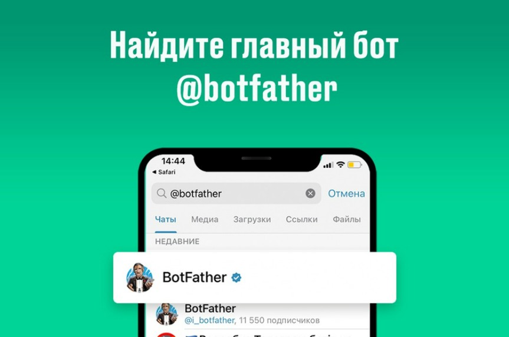
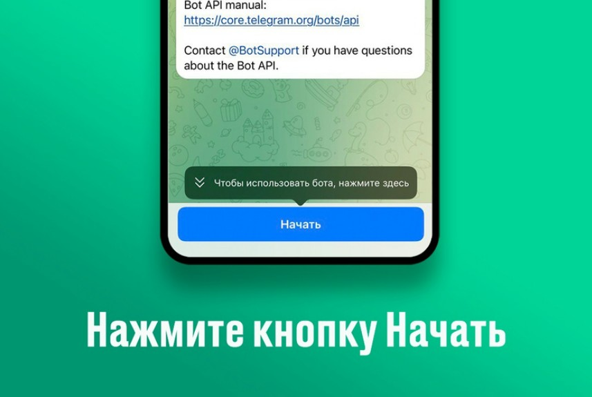
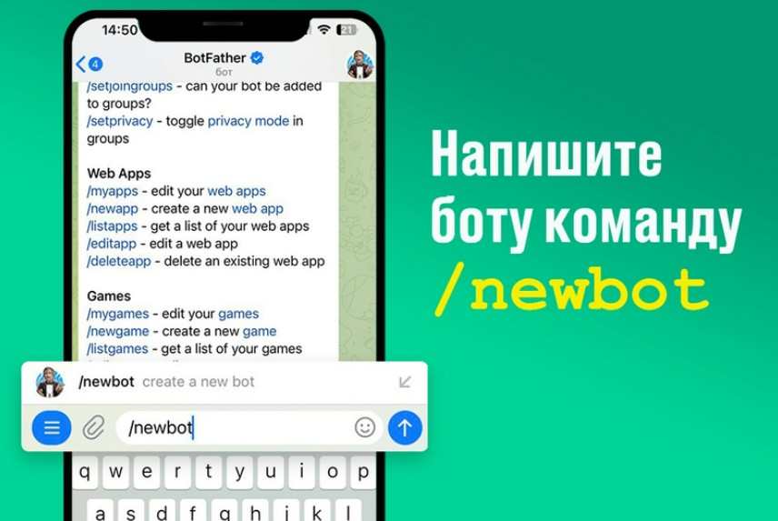
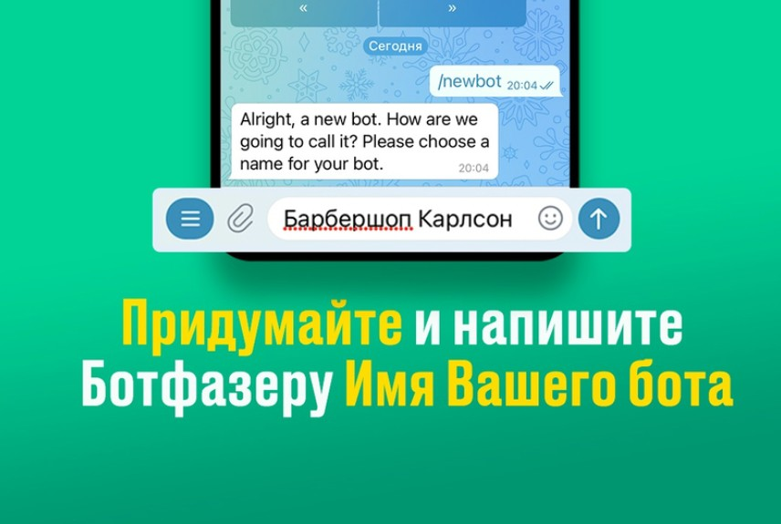
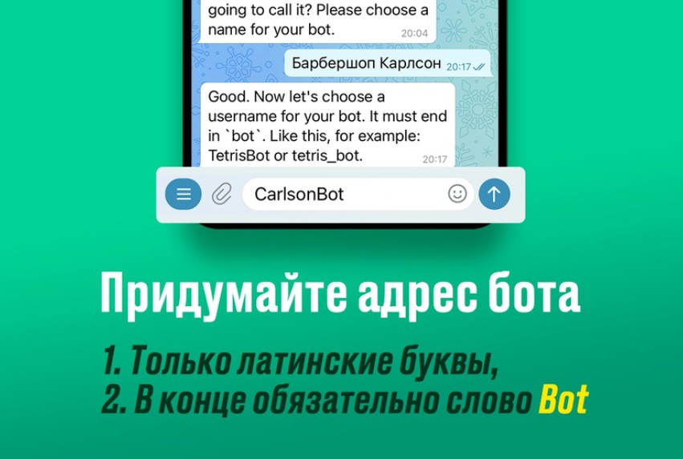
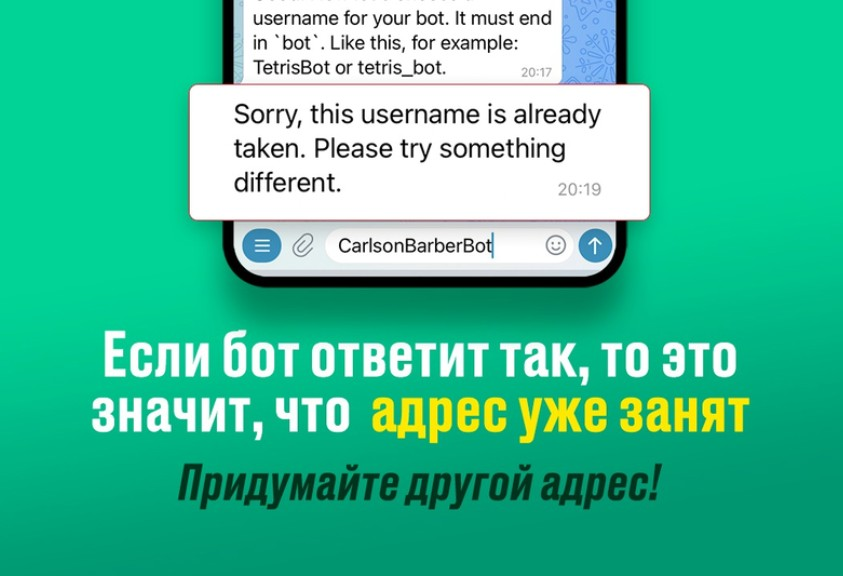
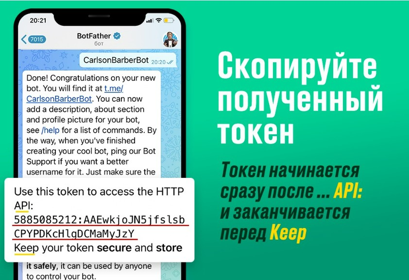

1. **В строке поиска по чатам наберите @botfather или перейдите по этой ссылке** [**https://t.me/botfather**](https://t.me/botfather) **(будьте внимательны у бота должна быть голубая галочка)**

   {width=863px height=572px}

2. **Запустите бот нажав кнопку начать (Start)**

   {width=857px height=575px}

3. **Для создания бота напишите команду /newbot**

   {width=856px height=573px}

4. **Придумайте и отправьте боту (ботфазеру) имя вашего бота.**

   *это имя будут видеть в списке диалогов поэтому оно должно быть понятным для ваших клиентов*

   {width=856px height=575px}

5. **Придумайте адрес вашего бота.**

   Только английские буквы и в конце Bot или *bot. Например CarlsonBot или carlson*bot

   {width=851px height=573px}

   **Адрес может быть уже занят!**

   *Если ботфазер ответит так же как на картинке ниже, придумайте другой адрес и отправьте ботфазеру*

   {width=843px height=576px}

6. **Done! Congratulations on your new bot.**

   Если видите такое сообщение значит всё прошло отлично и бот успешно создан.

   Скопируйте полученный токен и добавьте его в @NotibotRu при создании **Нового магазина**

   *Токен начинается сразу после... API и заканчивается перед Keep*

{width=842px height=576px}

**Теперь возвращайтесь в @NotibotruBot и создайте свой Магазин**