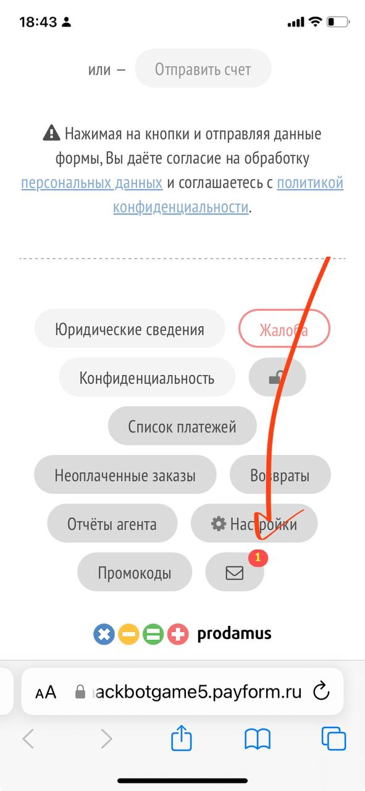
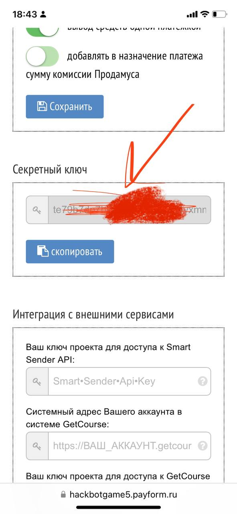
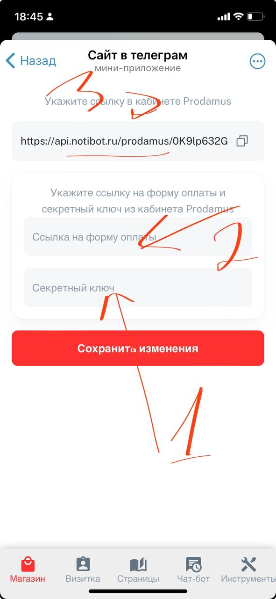
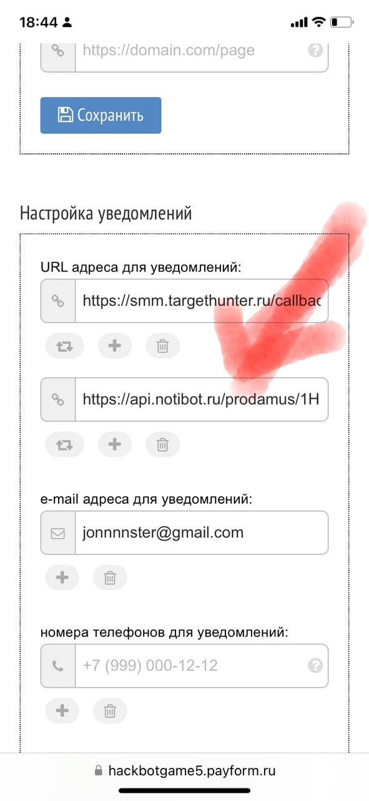

1. В личном кабинете Продамуса заходим в настройки формы

   {width=591px height=1280px}

2. В настройках копируем секретный ключ

   {width=591px height=1280px}

3. Переходим в нотибот: админка-магазин-прием оплат-автоматические способы-продамус

4. Копируем ссылку, чтобы потом ее указать в кабинете в Продамусе

   Ссылка на форму оплаты типа [name.payform.ru ](http://name.payform.ru)(ее вам давали, когда вы заключали договор с продамусом)

   Секретный ключ вставляем в определенное строчку

   {width=591px height=1280px}

5. Возвращаемся в продамус, и то что скопировали в предыдущем шаге в нотиботе, вставляем в раздел уведомления

   {width=591px height=1280px}