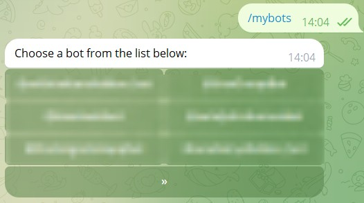
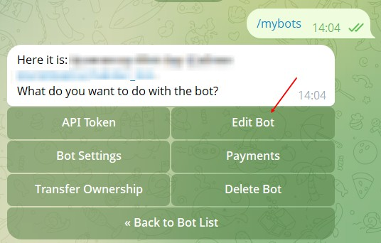
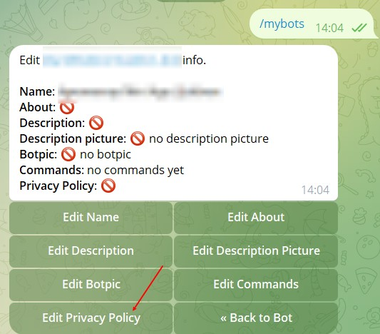
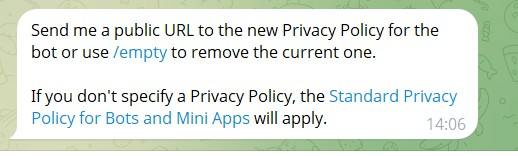
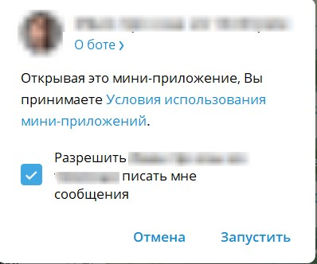

На данный момент 14.12.2025 г данную возможность телеграм убрал, если что-то изменится, сообщим

Прежде чем идти в BotFather, у вас должна быть готова новая версия вашей Политики конфиденциальности, размещенная в интернете по постоянной ссылке (URL).

### **Измените настройки бота в BotFather**

1. **Откройте чат с** [**BotFather**](https://t.me/botfather) в Telegram.

2. Отправьте команду `/mybots`. Вы увидите список ваших ботов.

   {width=526px height=294px}

3. **Выберите бота**, для которого вы хотите изменить политику конфиденциальности.

4. Перед вами откроется меню управления ботом. Нажмите `Edit bot`.

   {width=536px height=342px}

5. В следующем меню выберите пункт  `Edit Privacy Policy`.

   {width=533px height=468px}

6. BotFather предложит **прислать ссылку на вашу Политику конфиденциальности**.

   {width=518px height=156px}

7. **Отправьте BotFather URL-адрес** на новую версию вашего документа, который вы подготовили в Шаге 1.

   :::quote 

   **Пример:** [`https://gist.githubusercontent.com/your_username/your_gist_id/raw/`](https://gist.githubusercontent.com/your_username/your_gist_id/raw/)`...` или [`https://docs.google.com/document/d/.../edit?usp=sharing`](https://docs.google.com/document/d/.../edit?usp=sharing)

   :::

8. BotFather подтвердит, что ссылка была обновлена.

### **Что увидят пользователи?**

-  При первом запуске бота, рядом с кнопкой `START`, будет появляться надпись **"Политика конфиденциальности"**, ведущая на вашу страницу.

   {width=398px height=332px}