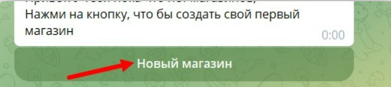

1. Клиент заходит в нотибот , стартует его и нажимает создать магазин

   {width=650px height=145px}

2. Вы даете ему токен созданного бота? он его вводит при создании магазина

3. Далее он отправляет команду /managers и добавляет вас менеджером магазина

   {width=671px height=188px}

4. Далее вы уже в боте клиента (который добавили в нотибот) делаете что надо

5. В конце передаете ему права на бота в ботфазере