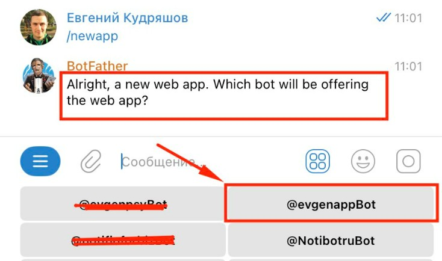
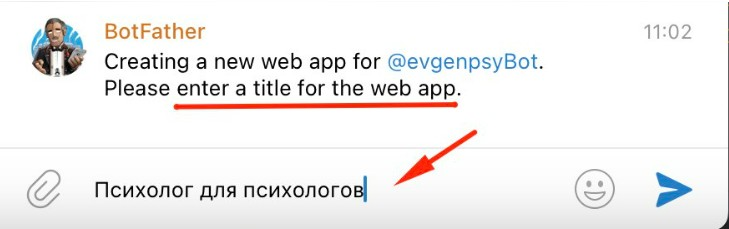
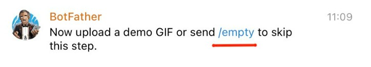
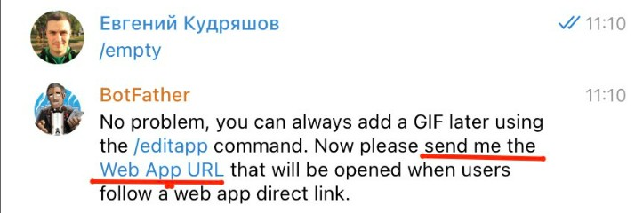
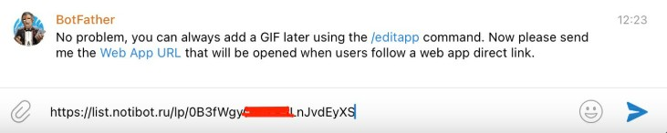
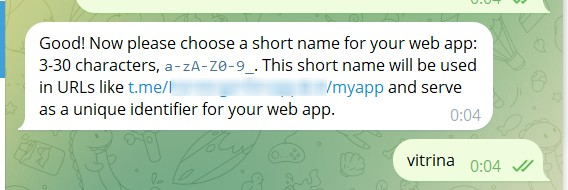

Чтобы ваша витрина могло запускаться как приложение за пределами вашего бота  необходимо создать еще один app через [@botfather](https://t.me/botfather)

1. **В строке поиска по чатам наберите @botfather или перейдите по этой ссылке** [**https://t.me/botfather**](https://t.me/botfather) **(будьте внимательны у бота должна быть голубая галочка) и пишем команду /newapp**

   {width=738px height=268px}

2. **Далее Botfather предложит выбрать бот для которого создаём app (приложение).**

   {width=734px height=434px}

3. **Далее botfather попросит отправить ему название вашего приложения.** Придумайте и отправьте

   {width=729px height=229px}

4. **Далее botfather попросит отправить ему короткое описание вашего app (приложения) .** Придумайте и отправьте

   {width=735px height=192px}

5. **Подготовьте картинку размером 640X360 и отправьте боту на этом шаге.** [Можете скачать нашу здесь](https://disk.yandex.ru/i/77sk9Q_uIChlWA)

   {width=740px height=408px}

6. **Далее бот попросит отправить ему GIF изображение , если у Вас сейчас нет gif, отправьте команду /empty**

   {width=724px height=131px}

7. **ВАЖНЫЙ ШАГ!!! Здесь необходимо отправить url с которым будет работать ваше приложение. Где его взять смотри в следующем пункте**

   {width=723px height=240px}

8. **Перейдите в Ваш бот (который подключили к @NotibotRu) и напишите команду /weburl. Далее скопируйте нужную ссылку - вебапп "витрина"**

   [image:./ssylka-na-vitrinu.jpeg:::0,65.28776978417267,100,34.71223021582734:::566px:556px]

9. **Отправьте скопированную ссылку botfather**

   {width=731px height=146px}

10. **Отправьте короткое название для ссылки, пишем слово vitrina. !!! ВАЖНО!!! именно vitrina**

    {width=568px height=190px}

11. **Получаем ссылку, которая будет запускать витрину внутри telegram за пределами нашего бота**