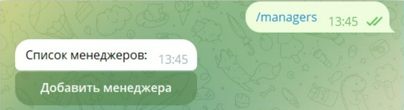
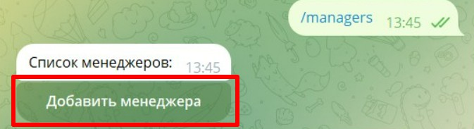
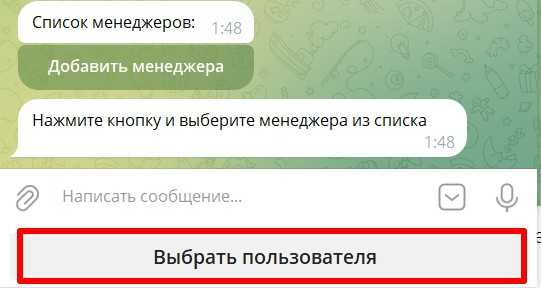

### Способ №1

1. Переходим в своего бота (который подключён к [@NotibotruBot](https://t.me/NotibotruBot)) и пишем команду /managers

   {width=677px height=185px}

2. Нажимаем кнопку «добавить менеджера»

   {width=673px height=183px}

3. Нажимаете кнопку “Выбрать пользователя” и находите человека, которого нужно добавить в менеджеры

   {width=541px height=288px}

   Человек, которого вы хотите добавить в менеджеры, должен быть в базе  [@NotibotruBot](https://t.me/NotibotruBot)

4. Пользователь добавлен в менеджеры

### Способ №2

1. Переходим в своего бота (который подключён к [@NotibotruBot](https://t.me/NotibotruBot)) и пишем команду /get_manager_url

2. Бот присылает вам ссылку

3. Вы эту ссылку отправляете человеку, которого хотите сделать менеджером

4. Человек переходит по ссылке и становится менеджером вашего магазина

После того как вы добавили менеджера, ему нужно перейти в вашего бота запустить его и отправить команду /admin

