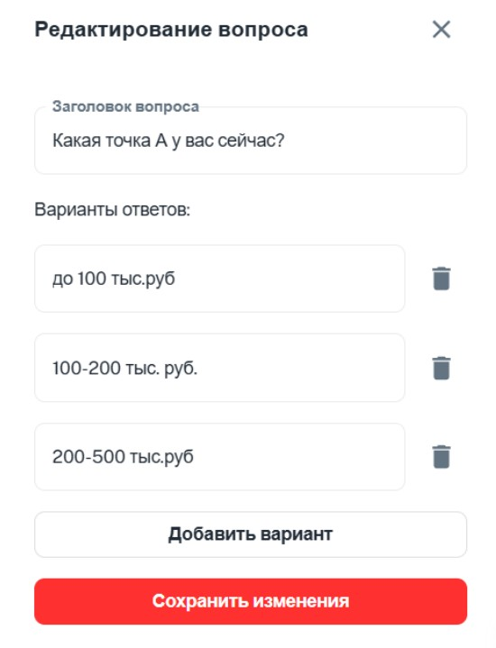
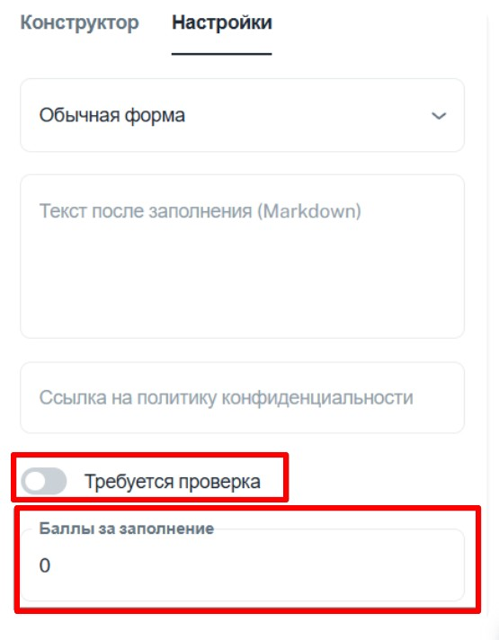

1. Переходим в своего бота (который подключён к [@NotibotruBot](https://t.me/NotibotruBot)) и нажимаем АДМИНКА

   {width=538px height=142px}

2. Выбираем вкладку ГЛАВНАЯ и ИНСТРУМЕНТЫ

   {width=477px height=818px}

3. Далее выбираем ФОРМЫ

   {width=465px height=662px}

4. Нажимаете СОЗДАТЬ ФОРМУ

   {width=480px height=259px}

5. Вводите название формы и нажимаете добавить вопрос

   {width=460px height=669px}

6. Выбираем необходимый нам тип вопроса

   {width=561px height=640px}

   Например выбираем ТЕЛЕФОН

   {width=574px height=635px}

   Вводим необходимый текст и сохраняем изменения

   {width=581px height=307px}

   Далее можно добавить еще вопрос, например ВЫБОР ИЗ СПИСКА

   {width=575px height=645px}

   Вводим заголовок вопроса и возможные варианты ответов и сохраняем изменения.

   {width=550px height=719px}

   Далее если необходимо делаем вопрос обязательным

   {width=555px height=751px}

   Вы также можете редактировать и удалять вопросы

   {width=527px height=367px}

7. Во вкладке НАСТРОЙКИ:

   Вы можете изменить вид формы.

   {width=522px height=678px}

   Ввести тест, который появится после заполнения данной формы.

   Для оформления текста используем язык разметки MARKDOWN

   {width=566px height=735px}

   И настроить нужна ли проверка данного теста и начислять ли баллы за заполнения формы.

{width=555px height=712px}