#### **1\. Создание меню**

1. **Перейдите в раздел:**

   *Главная --> Инструменты --> Ваше меню*

   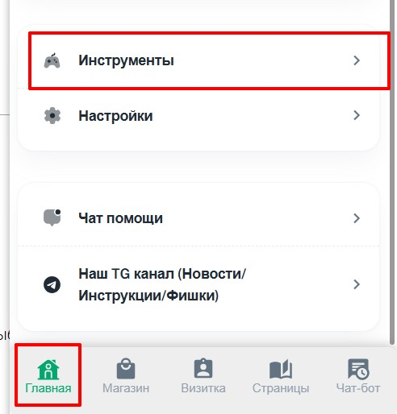{width=492px height=514px}

   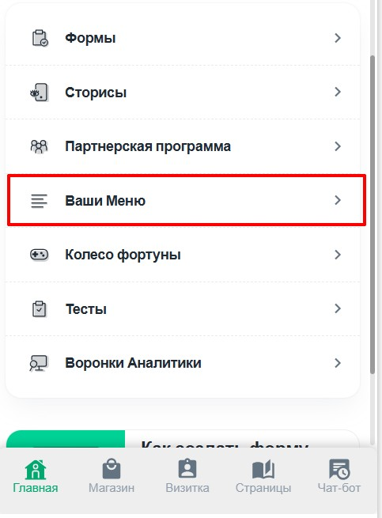{width=483px height=655px}

2. Нажмите **«Создать меню»**

   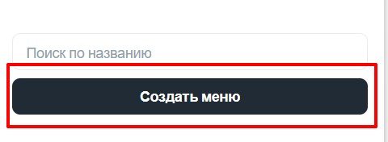{width=480px height=176px}

3. Введите **название меню** (например, «Главное меню»)

   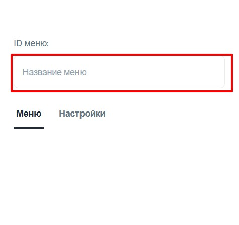{width=475px height=448px}

---

#### **2\. Добавление пунктов меню**

1. Нажмите **«Добавить пункт меню»**

   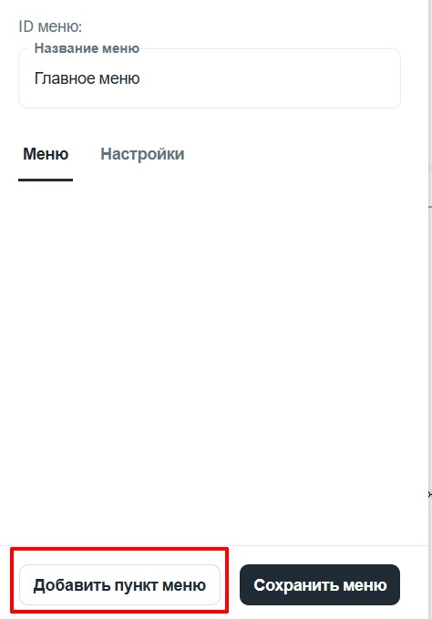{width=474px height=679px}

2. Для каждого пункта укажите:

   -  **Название** (например, «Каталог»)

      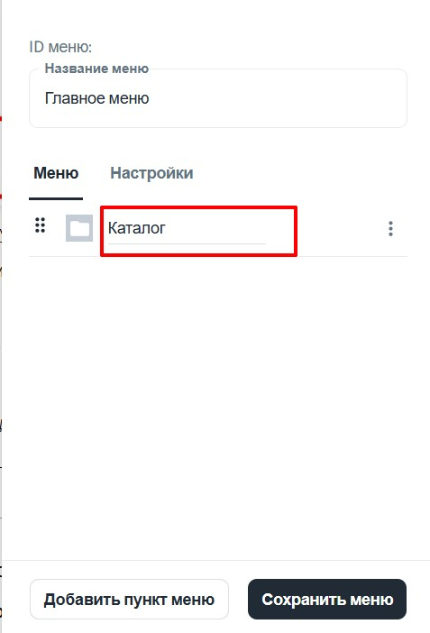{width=477px height=702px}

   -  **Иконку** (выберите из списка или введите код иконки с сайта <https://icon-sets.iconify.design/>)

      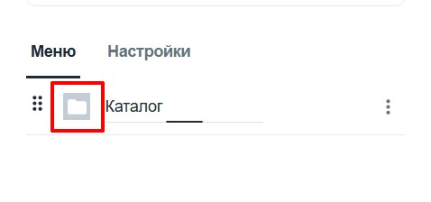{width=478px height=224px}

      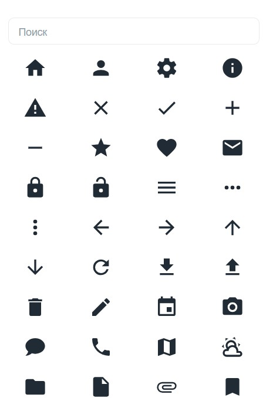{width=465px height=679px}

   -  **Ссылку** (нажмите `⋮` --> «Редактировать ссылку» --> выберите, что должно открываться)

      *Варианты: страница, товар или внешняя ссылка*

      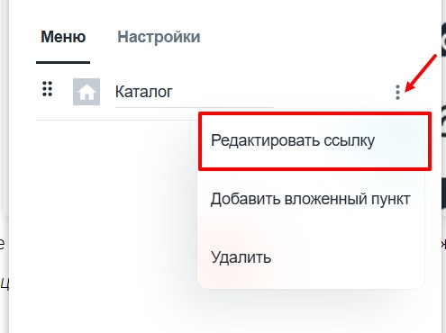{width=495px height=370px}

      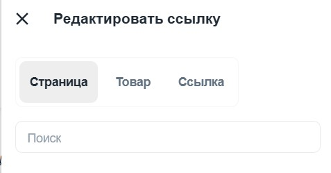{width=477px height=249px}

3. Повторите для всех нужных пунктов

4. Не забудьте сохранить меню

   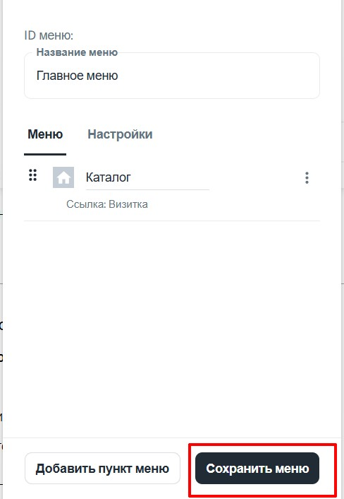{width=488px height=706px}

    

---

#### **3\. Настройка внешнего вида меню**

1. Перейдите в **«Настройки меню»**

   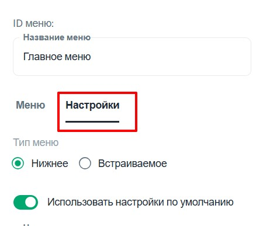{width=462px height=387px}

2. Выберите тип:

   -  **Нижнее меню** (фиксируется внизу экрана)

   -  **Встраиваемое** (отображается внутри страницы)

      {width=413px height=101px}

3. Дополнительные опции:

   -  **Цвет меню** (фон и текст)

   -  **Скругление углов меню**

   -  **Размер иконок**

   -  **Будет меню парящее или нет**

   -  **Настройки активного пункта**

      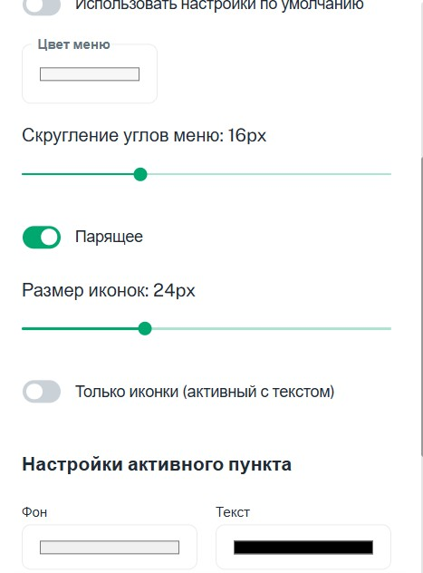{width=467px height=632px}

4. Не забудьте сохранить меню

---

#### **4\. Публикация меню**

1. **Для фиксированного меню (верхнего/нижнего):**

   -  Перейдите: *Главная --> Настройки --> Палитра*

      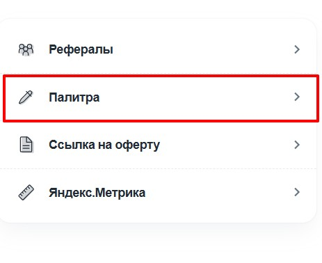{width=463px height=378px}

   -  Прокрутите вниз --> выберите созданное меню из списка **«Верхнее меню»** или **«Нижнее меню»**

      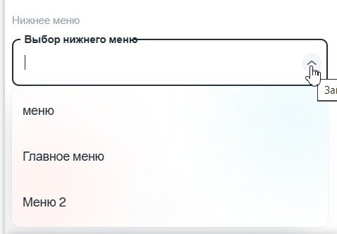{width=478px height=332px}

   -  Так же здесь вы можете выбрать  меню для **«Верхнее меню»** или **«Нижнее меню»**

      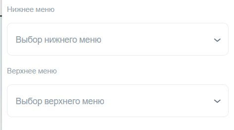{width=473px height=262px}

2. **Для встраиваемого меню на странице:**

   -  Скопируйте **ID меню** (из раздела *Инструменты --> Ваше меню*)

      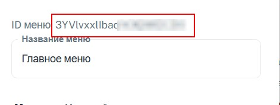{width=471px height=177px}

   -  Откройте нужную страницу --> в тексте напишите:

      ```
      menu#ID_вашего_меню  
      ```

   -  **Конвертируйте эту строку в цитату** (нажмите `⋮⋮` и выберите Цитата)

      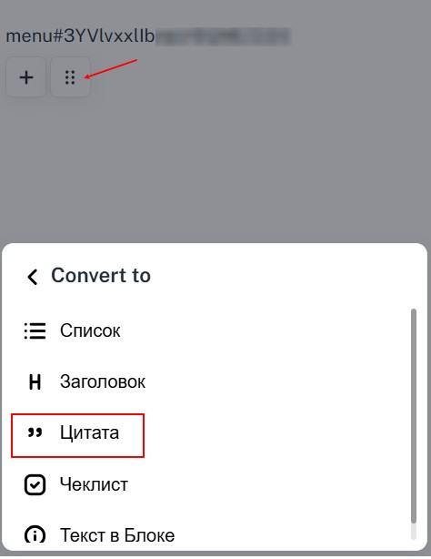{width=474px height=614px}

---

**Готово!** Меню появится в выбранном месте. Для проверки откройте страницу в режиме предпросмотра.