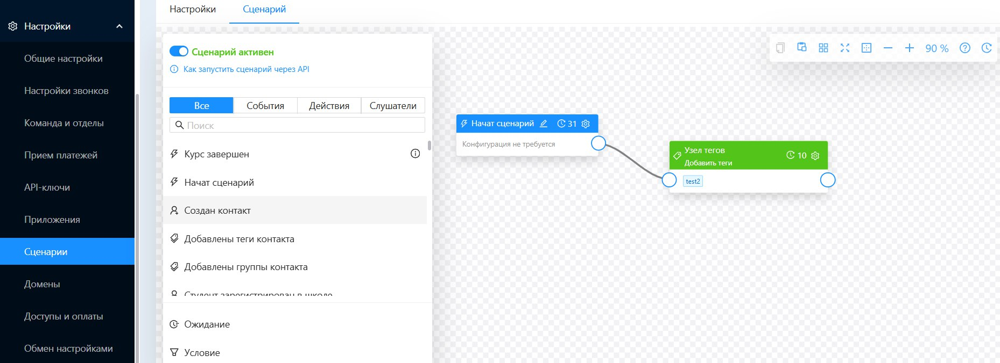
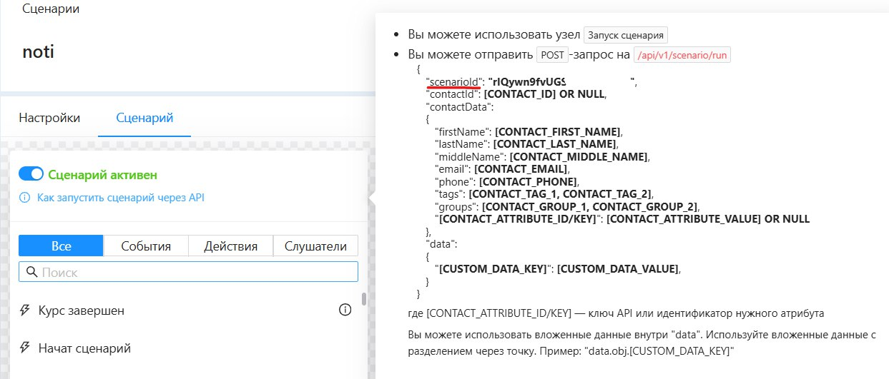
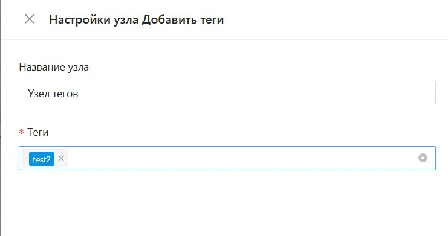
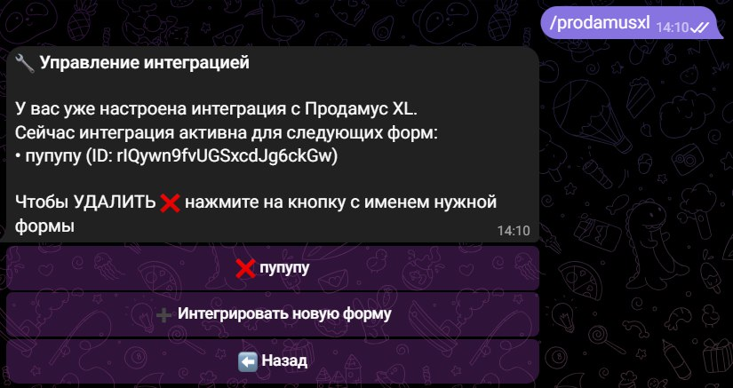
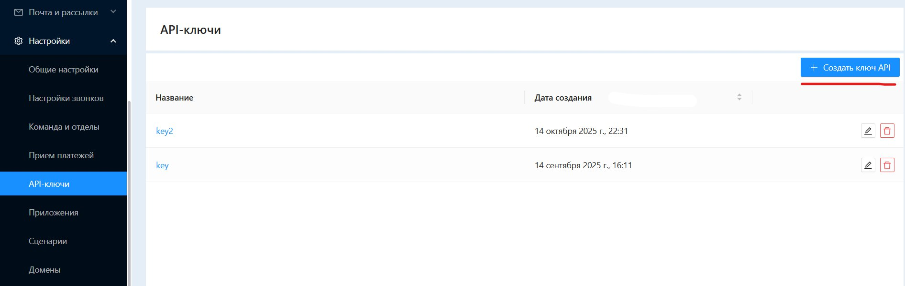
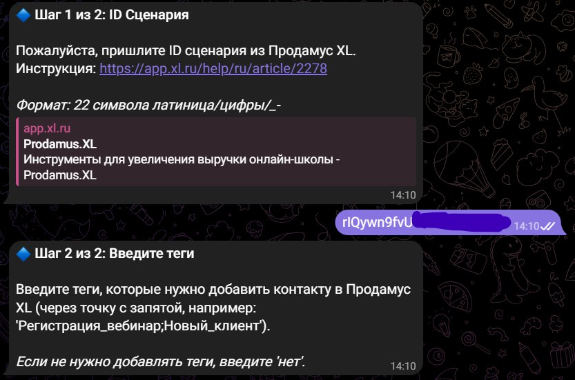
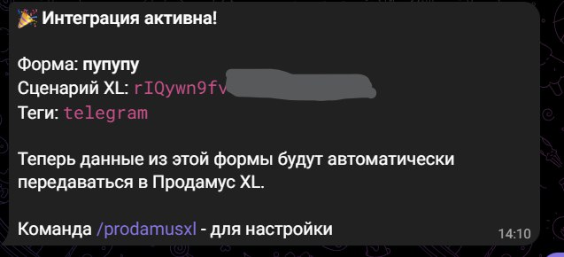
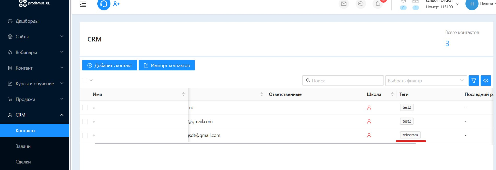

#### **1\. Подготовьте сценарий в Продамус XL:**

1. **Создайте новый сценарий или используйте существующий.**

   {width=1858px height=676px}

2. **Скопируйте ID сценария (scenarioId), он понадобится в NotiBot.**

   {width=1243px height=531px}

   :::lab 

   Если вы хотите, чтобы теги, отправленные из NotiBot, автоматически добавлялись к контакту в CRM, то настройте в сценарии действие "Добавить теги"

   {width=741px height=391px}

   :::

#### **2\. Настройте интеграцию в NotiBot:**

1. Подготовка

   -  Перейдите в админку бота, подключенного к @NotibotruBot:

      **Главная -> Инструменты -> Формы**.

   -  Создайте новую форму с полями, которые вы захотите передавать в Продамус XL

2. В боте, в котором находятся нужные формы, выполните команду /prodamusxl.

   {width=825px height=437px}

   :::tip 

   Если интеграция ещё не настроена, бот запросит API ключ Продамус XL. Следуйте инструкциям и введите его.

   {width=1892px height=600px}

   :::

3. Затем бот запросит ID сценария (scenarioId), который вы скопировали на шаге 1.2. Введите его.

   {width=833px height=551px}

   :::info 

   Укажите теги, которые нужно будет добавить к контактам, созданным из этой формы (через точку с запятой, например, Тег1;Тег2). Их мы заранее указали в сценарии prodamus.

   :::

4. Выберите форму, которую нужно интегрировать.

   {width=637px height=290px}

#### **3\. Результат:**

После заполнения указанной формы в NotiBot, данные будут автоматически отправлены в Продамус XL.

Продамус XL запустит соответствующий сценарий, создаст/обновит контакт и, при наличии настройки, применит теги.

{width=1900px height=652px}

:::info 

Для изменения тегов интеграцию необходимо создать заново

:::