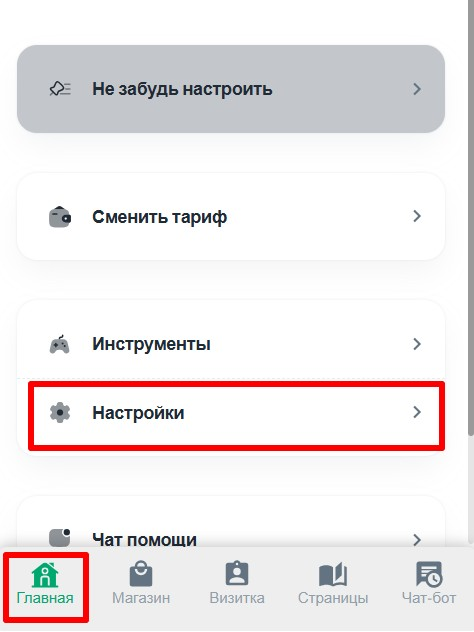
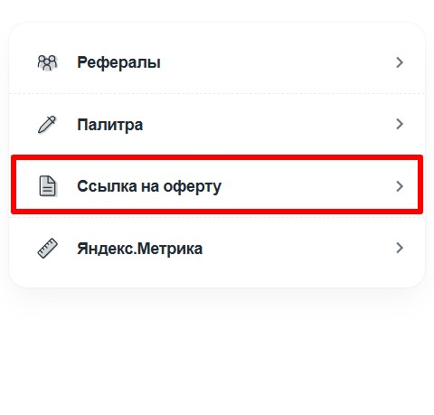
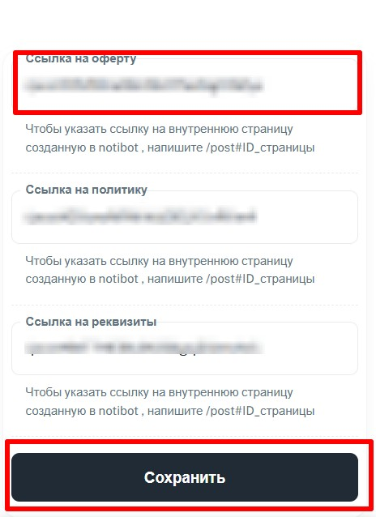

{width=469px height=118px}

:::note 

Если вы разместите ссылку на сторонний ресурс, то при нажатие человек перейдет по вашей ссылке и тем самым покинет приложения. Чтобы этого не произошло, предлагаем создавать страницы с текстом оферты в редакторе приложения

:::

1. Создаем страницу с офертой (как создать страницу можно посмотреть [тут](./stranicy/nastroyka))

2. Заходим в раздел ГЛАВНАЯ - НАСТРОЙКИ

   {width=474px height=632px}

3. Нажимаем ССЫЛКА НА ОФЕРТУ

   {width=480px height=459px}

4. Добавляем ссылки на нужные страницы

   {width=464px height=638px}

Если вы разместите ссылку на сторонний ресурс, то при нажатие человек выйдет из приложения  перейдет по вашей ссылке. Чтобы этого не произошло, предлагаем создавать страницы с текстом оферты в редакторе приложения