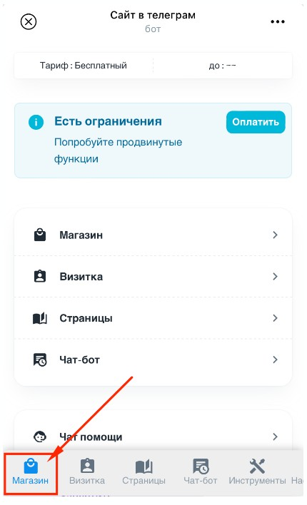
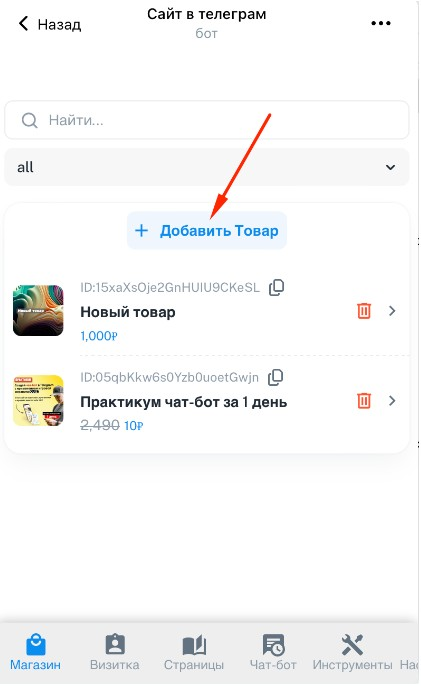
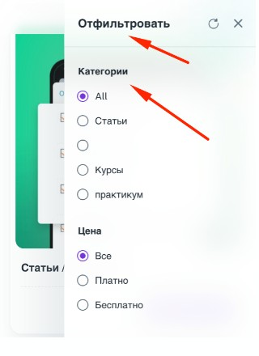
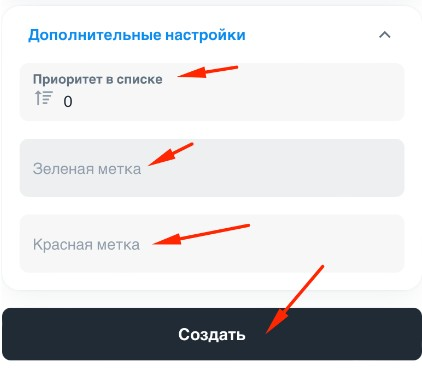

**Содержание:**

-  Как добавить товар

-  Другие настройки товара

-  Описание и категория товара

-  Порядок отображения товаров в каталоге

## Как добавить товар

1. Запустите админку, для этого отправьте своему боту (который подключен к Notibot) команду /admin -> появится кнопка Админка

   {width=413px height=354px}

2. Откроется приложение Админка. Перейдите в раздел **"Магазин"**

   {width=430px height=708px}

   

3. Перейдите в раздел **"Товары"**

   {width=421px height=694px}

4. Нажмите кнопку **"Добавить товар"**

   {width=421px height=686px}

**Напишите название товара и цену , нажмите кнопку "Создать" -> товар создан**

**Готово!!!**

## **Другие настройки товара**

{width=415px height=690px}

1. **Показывать в списке** Если ползунок выключен, то товар будет доступен только по ссылке и не будет отображаться в каталоге и визитке

2. **Название** Название, которое увидят ваши клиенты в приложении

3. **Цена продажи** (число) сумма за которую клиент сможет купить товар

4. **Скидка** Используется для того чтобы показать перечеркнутую цену. Например если вы продаете товар за 1000 рублей, но хотите показать, что старая цена 2000р, тогда в Цену продажи укажите - 1000, а в скидку 2000

## **Описание и категория товара**

**Чтобы настроить описание и категорию -> Нажмите на вкладку "Настройки"**

{width=423px height=685px}

**Где используются Описание / Короткое описание и Категория смотри ниже:**

1. Короткое описание

2. Описание (здесь можно использовать обычное **форматирование** Telegram markdown. Подробнее про форматирование [здесь](https://markdown-editor.andona.click/) )

   {width=302px height=569px}

**Категории товаров**

В каталоге (витрине) можно фильтровать товары по категориям. Чтобы это работало , при создании товара укажите категорию

{width=320px height=440px}

Чтобы объединить несколько товаров в одну категорию впишите поле Категория у каждого из товаров одинаковое слово. ( *Например : Курсы* )

## **Порядок отображения товаров в каталоге**

Откройте вкладку **"Дополнительные настройки"** и укажите номер в поле **"Приоритет в списке"**

:::note 

Чем больше число тем выше в списке будет отображаться товар

:::

{width=422px height=370px}