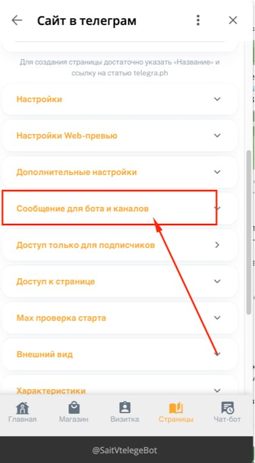
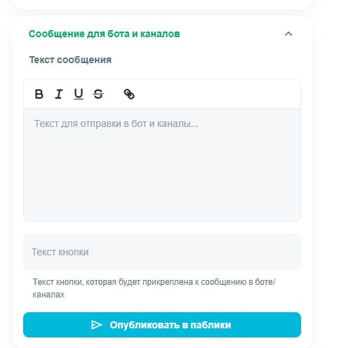

:::quote 

**Важное уточнение:**

В MAХ **нет автоматического запуска бота** при открытии приложения.

Поэтому мы используем альтернативный механизм:

**блокируем доступ к странице, если пользователь не подписан на бота.**

:::

---

## **📌 Принцип работы**

1. Пользователь переходит по **ссылке на страницу** в MAХ

2. Система **проверяет подписку** на вашего бота

3. Если пользователь **НЕ подписан** -> его **перекидывает в бота**

4. В боте он видит ваше настроенное сообщение, например:

   :::quote 

   *«Чтобы посмотреть информацию, нажмите на кнопку»*.

   :::

5. После нажатия он **подписывается** и возвращается к контенту.

---

## **🛠 Пошаговая настройка**

### **Шаг 1. Настройте сообщение в Notibot**

1. **Зайдите в админку** вашего бота (Notibot).

2. Перейдите в раздел:

   `Страницы → Выберите нужную страницу`.

3. Найдите блок:

   **«Сообщения для ботов и каналов»**.

   {width=419px height=761px}

   

4. Настройте текст сообщения, которое увидит неподписанный пользователь.

   {width=500px height=496px}

   **Пример текста:**

   ```
   🔐 Для доступа к контенту подпишитесь на нашего бота.
   
   👇 Нажмите на кнопку ниже, чтобы продолжить.
   ```

5. Нажмите **«Сохранить»**.

---

### **Шаг 2. Опубликуйте сообщение в канале/боте**

1. В том же разделе нажмите кнопку

   **«Опубликовать в паблике»**.

2. Выберите **нужный канал или бота**, через который будет проходить проверка.

---

### **Шаг 3. Скопируйте ссылку на страницу в MAХ**

1. Откройте нужную страницу в Notibot

2. Скопируйте её **полную ссылку** для MAХ

   Обычно она выглядит так:

   ```
   https://max.ru/id325908456914_3_bot?startapp=a_1vu1cu6VsFsicFkCnwBF93_lp
   ```

---

### **Шаг 4. Измените параметр** `startapp` **на** `start`

**Важно:**

Чтобы проверка подписки работала корректно в MAХ -- нужно заменить параметр `?startapp=` на `?start=`.

**Пример:**

```
https://max.ru/id325908456914_3_bot?start=a_1vu1cu6VsFsicFkCnwBF93_lp
```