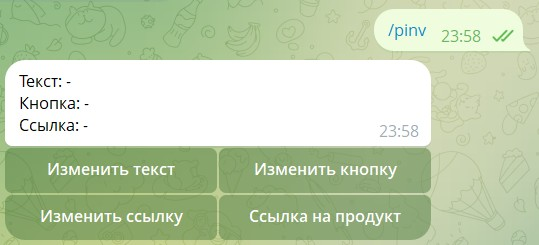
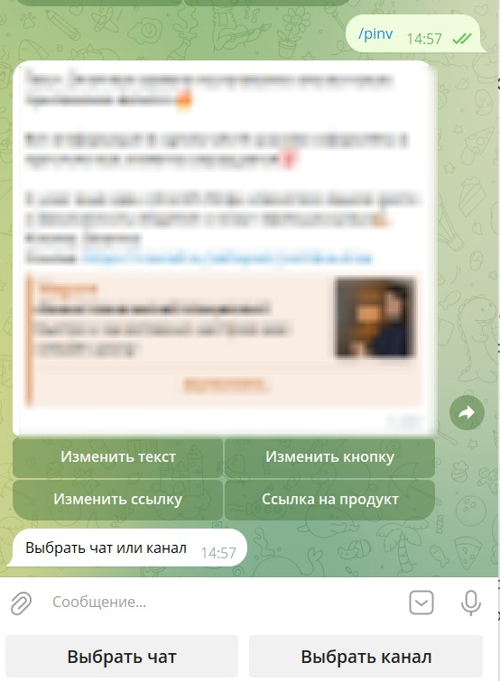
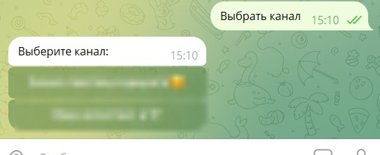

#### **1\. Подготовка (требуется один раз)**

✅ **Добавьте бота в админы канала:**

-  Зайдите в **"Управление каналом"** --> **"Администраторы"** --> **"Добавить администратора"**

-  Введите @username\_бота (например, `@YourNotiBot`)

-  Выдайте права

   {width=440px height=327px}

---

#### **2\. Создание закрепленного поста с кнопкой**

1. **Отправьте команду в бота:**

   -  Перейдите в чат с вашим ботом (который подключен к `@NotibotruBot`)

   -  Введите:

      ```
      /pinv
      ```

      {width=539px height=245px}

2. **Настройте пост:**

   -  **Измените текст сообщения** --> кнопка **"Изменить текст"**

   -  **Задайте название кнопки** --> кнопка **"Изменить кнопку"**

   -  **Укажите ссылку** (страница Notibot, ссылка на визитку и т.д.) --> кнопка **"Изменить ссылку"**

3. **Выберите канал/чат для публикации:**

   -  Нажмите **"Выбрать канал" или "Выбрать чат"**

      {width=554px height=755px}

   -  Выберите канал/чат, где хотите разместить сообщение

      {width=547px height=224px}

4. **Отправка и закрепление:**

   -  После подтверждения пост **автоматически опубликуется и закрепится** в выбранном канале/чате

---

**Готово!** Теперь в вашем канале есть закрепленное сообщение с кнопкой. 🚀