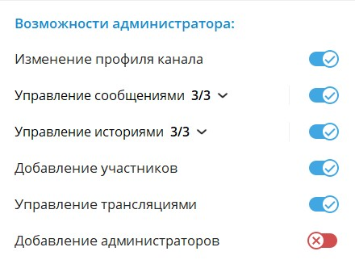
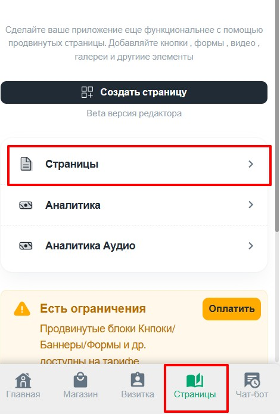
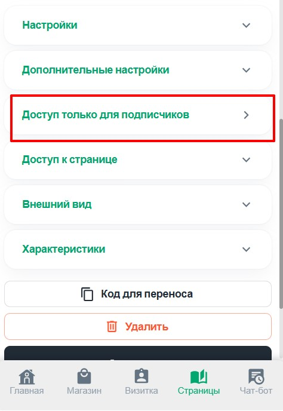
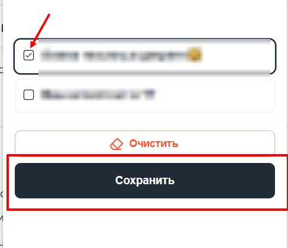
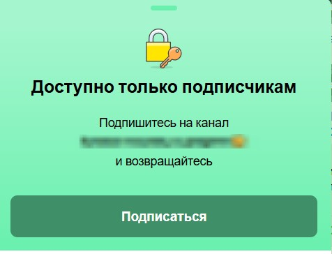

#### **1\. Подготовка (требуется один раз)**

1. **Добавьте бота в админы канала:**

   -  Зайдите в **"Управление каналом"** --> **"Администраторы"** --> **"Добавить администратора"**

   -  Введите @username\_бота (например, `@YourNotiBot`)

   -  Выдайте права

      {width=440px height=327px}

---

#### **2\. Настройка ограниченного доступа**

1. **Выберите страницу:**

   -  Перейдите в **"Страницы"** --> откройте нужную страницу (или создайте новую)

      {width=470px height=699px}

2. **Активируйте ограничение:**

   -  Найдите пункт **"Доступ только для подписчиков"**

      {width=474px height=688px}

      

   -  Выберите ваш канал из списка

   -  Нажмите **"Сохранить"**

      {width=487px height=420px}

---

#### **3\. Как это работает**

-  **Для подписчиков:**

   Страница открывается как обычно.

-  **Для неподписанных пользователей:**

   Автоматически появляется сообщение:

{width=476px height=364px}