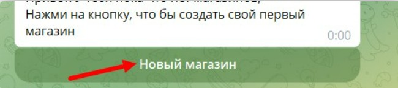

## **Для исполнителя (архитектора/разработчика)**

### **Процесс передачи:**

1. **Клиент самостоятельно создаёт магазин**

   -  Заходит в бот `@NotibotruBot`

   -  Нажимает **«Создать новый магазин»**

2. **Клиент вводит токен бота**

   -  Вы предоставляете клиенту **токен бота** (созданного вами через `@BotFather`)

   -  Клиент вставляет его при создании магазина

3. **Клиент добавляет вас как менеджера**

   -  В боте клиента отправляется команда:

      ```
      /get_manager_url
      ```

   -  Бот присылает клиенту ссылку

   -  Клиент эту ссылку отправляет вам

   -  Вам нужно будет только перейти по этой ссылке

4. **Вы работаете в боте клиента**

   -  После добавления в менеджеры вы получаете доступ

   -  Производите все необходимые настройки

5. **Передача прав на бота в BotFather после завершения проекта**

   -  В `@BotFather` отправьте команду:

      ```
      /mybots
      ```

   -  Выберите нужного бота -> **«Bot Settings»** -> **«Transfer Ownership»**

   -  Передайте права клиенту

---

## **Для заказчика (инструкция от исполнителя)**

:::quote 

📨 **Шаблон сообщения для отправки клиенту:**

:::

---

**Добрый день! Для начала работы нам нужно создать магазин и выдать доступы. Вот пошаговая инструкция:**

---

### **✅ Инструкция для заказчика**

**1\. Зайдите в бота Notibot:**

```
https://t.me/NotibotruBot
```

Отправьте команду: **/start**

**2\. Создайте новый магазин:**

-  Нажмите кнопку **«Создать новый магазин»**

{width=650px height=145px}

**3\. Отправьте токен бота:**

```
[ВСТАВЬТЕ СЮДА ТОКЕН ОТ БОТА, КОТОРЫЙ ВЫ СОЗДАЛИ ДЛЯ ПРИЛОЖЕНИЯ КЛИЕНТА]
```

**4\. Зайдите в созданный магазин:**

-  Нажмите на появившийся магазин (**\[пишите название магазина\]**)

**5\. Перейдите по ссылке:**

-  Откройте ссылку, которая появилась после создания магазина

**6\. Запустите бота и добавьте менеджеров:**

-  В боте отправьте команду:

   ```
   /get_manager_url
   ```

-  Бот присылает вам ссылку

-  Вы эту ссылку отправляете исполнителю, которого хотите сделать менеджером

-  Человек переходит по ссылке и становится менеджером вашего магазина

**7\. Готово!** После этого исполнитель сможет приступить к настройке вашего мини-приложения.