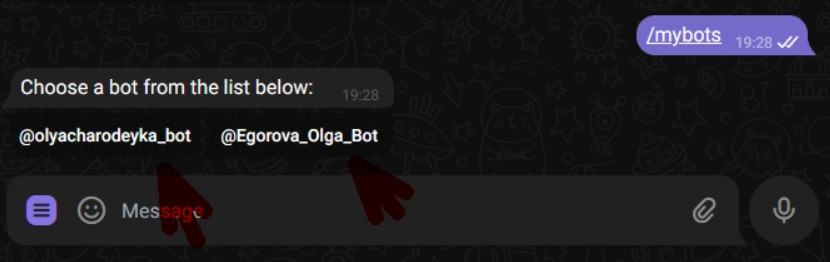
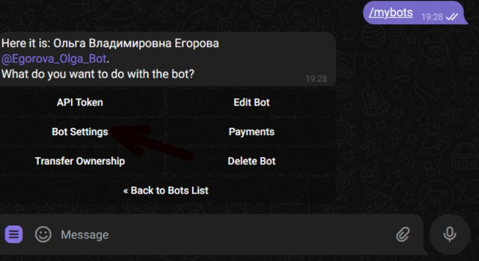
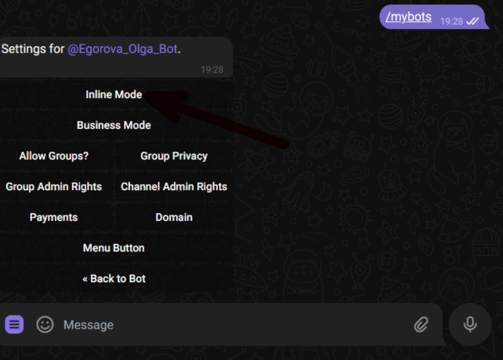
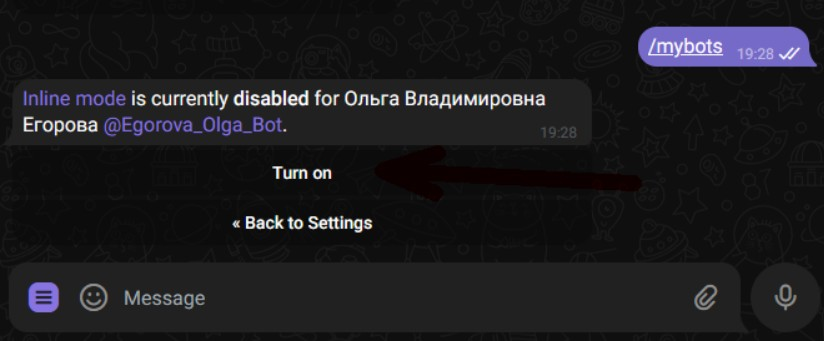
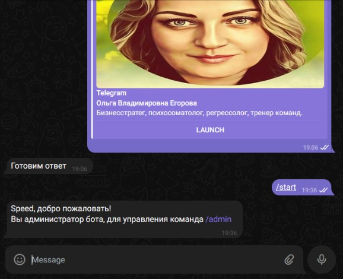
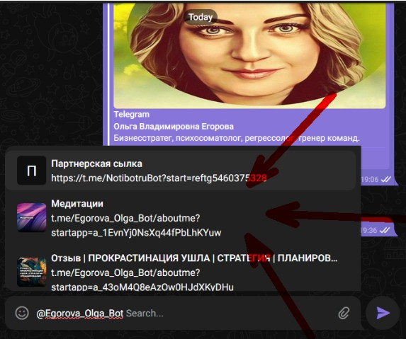
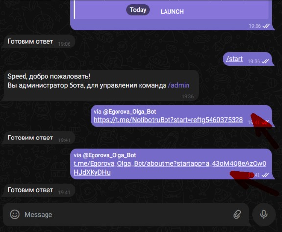

#### **1\. Включение Inline-режима через @BotFather**

1. **Откройте чат с** [**@BotFather**](https://t.me/BotFather).

2. Отправьте команду:

   ```  
   /mybots  
   ```

3. Выберите нужного бота (например, `@Egorova_Olga_Bot`).

   {width=830px height=262px}

4. Перейдите в **Bot Settings** --> **Inline Mode**.

   {width=815px height=445px}

   {width=820px height=587px}

5. Нажмите **Turn on**.

   {width=824px height=341px}

---

#### **2\. Как получить ссылки на страницы/товары**

1. **Начните диалог с ботом**:

   -  Напишите `/start` в чате с `@Egorova_Olga_Bot`.

      {width=578px height=470px}

2. **Активируйте Inline-поиск**:

   -  Потом пишем в своем боту:

      ```  
      @Egorova_Olga_Bot__  (два пробела после @username)  
      ```

   -  Появится список **внутренних страниц, товаров или визитки** бота.

      {width=573px height=479px}

3. **Выберите нужную ссылку**:

   -  Нажмите на результат -- ссылка автоматически вставится в чат.

   -  Теперь её можно копировать и использовать где угодно.

      {width=576px height=474px}


**Готово!** Теперь вы можете быстро делиться ссылками на контент бота. 🚀