Согласно 152-ФЗ [**«О персональных данных»**](https://sudact.ru/law/federalnyi-zakon-ot-27072006-n-152-fz-o/) все, кто осуществляет обработку персональных данных, должны **уведомлять об этом Роскомнадзор**, чтобы зарегистрироваться в качестве оператора персональных данных.

Важно сделать это до того, как вы начнете сбор личных данных в мини аппе, т. к. за несвоевременную регистрацию в Роскомнадзоре **предусмотрены штрафы**.

## **Способы отправки уведомления**

Прежде чем перейти к заполнению формы, выберите удобный способ её отправки на [**странице**](https://pd.rkn.gov.ru/operators-registry/notification/form/):

1. **В бумажном виде.** Заполненную форму потребуется распечатать и направить в территориальный орган по месту регистрации оператора.

2. **В электронном виде с использованием усиленной квалифицированной электронной подписи.** Заполненную форму потребуется подписать электронной подписью перед отправкой на сайте. Для создания и проверки подписи установите плагин [**«КриптоПро ЭЦП Browser plug-in»**](https://www.cryptopro.ru/products/cades/plugin) и настройте работу с ним.

3. **В электронном виде с использованием средств аутентификации ЕСИА.** Если у вас есть подтвержденная учетная запись на портале «Госуслуги», вы можете зайти в свой аккаунт на портале, заполнить форму и направить её в электронном виде.

:::note 

Если вы подаете уведомление за организацию, ваша учетная запись должна быть привязана к данной организации на портале «Госуслуги».

:::

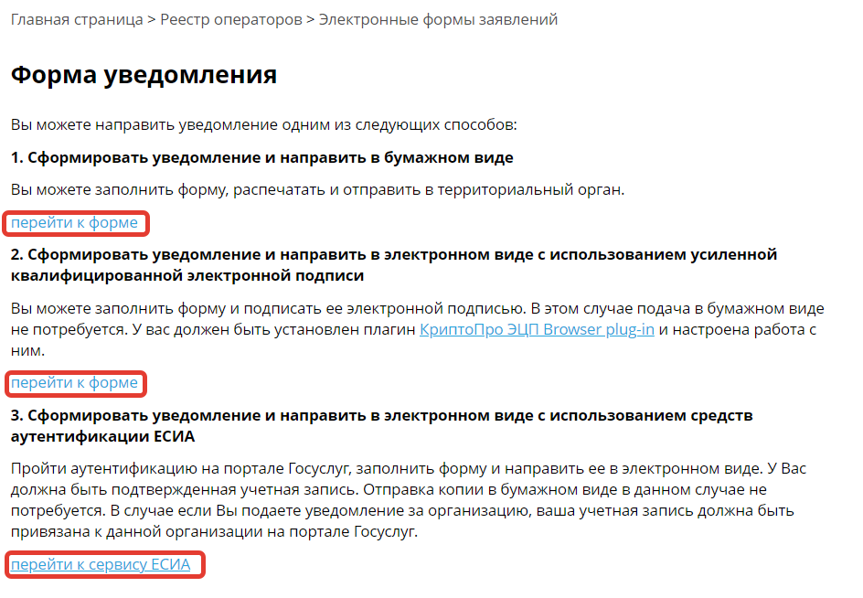{width=944px height=654px}

После выбора подходящего способа отобразятся поля формы для заполнения.

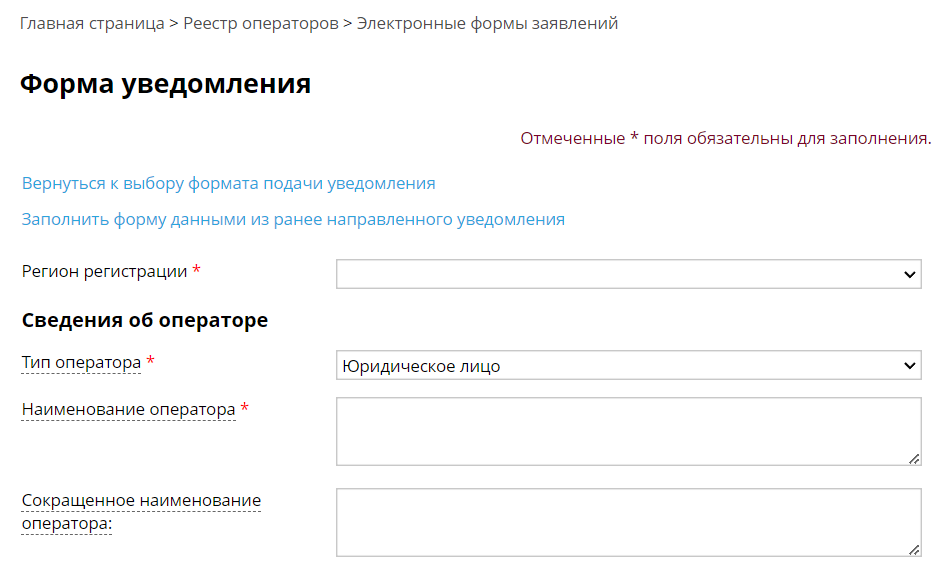{width=947px height=579px}

## **Регион регистрации и сведения об операторе**

В поле **«Регион регистрации»** укажите субъект Российской Федерации, на территории которого зарегистрирована ваша организация в качестве юридического лица (ЮЛ), индивидуального предпринимателя (ИП) или самозанятого.

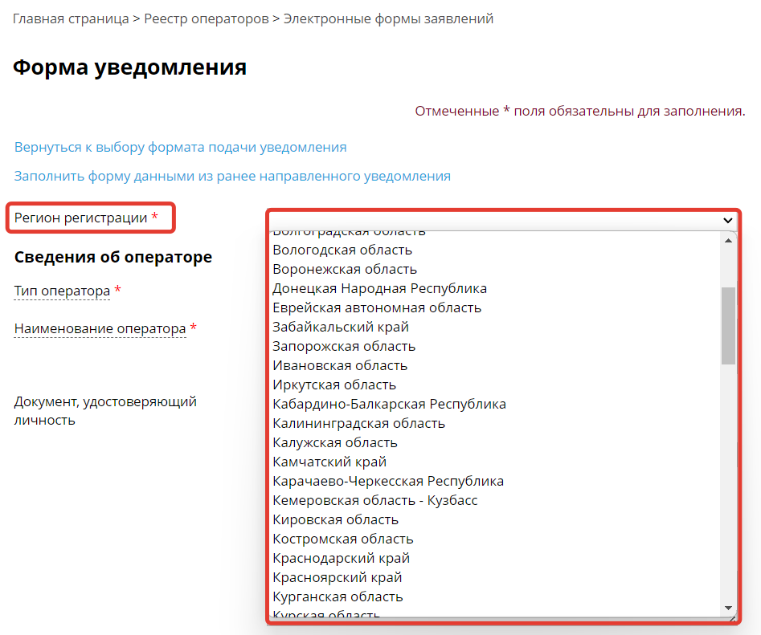{width=947px height=791px}

В разделе **«Сведения об операторе»** заполняется информация о вас (ЮЛ, ИП или самозанятом)

:::note 

Информацию необходимо указывать без сокращений -- согласно паспортным данным и данным регистрации в налоговой инспекции и действующей классификации.

:::

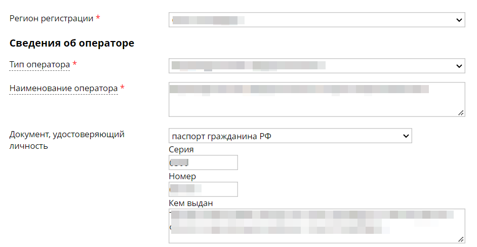{width=942px height=488px}

При выборе варианта **«Другой документ гражданина РФ»** вручную укажите тип документа. Например: заграничный паспорт гражданина РФ или удостоверение военнослужащего.

{width=944px height=463px}

В подразделе **«Адрес оператора»** укажите индекс и кликните на «Выбрать», чтобы заполнить свой адрес проживания. Нажмите «Ок» после заполнения.

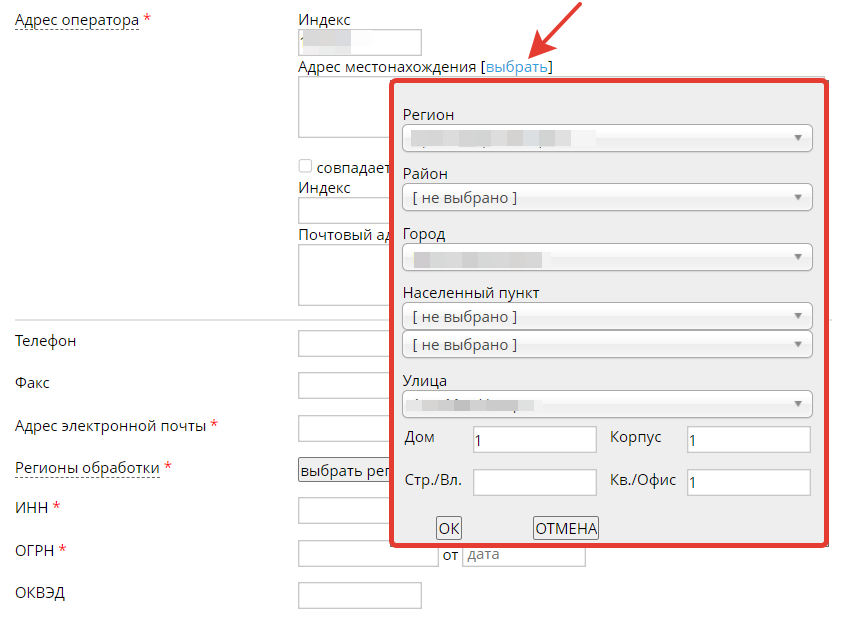{width=843px height=618px}

Если ваш почтовый адрес совпадает с местом проживания, поставьте галочку, чтобы данные автоматически подставились из предыдущих полей.

Если адреса не совпадают, кликните на «Выбрать», заполните поля и нажмите «Ок».

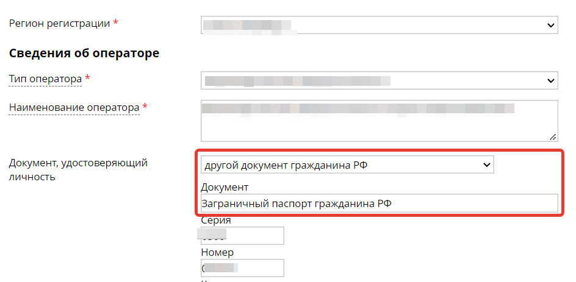{width=844px height=323px}

Укажите свой адрес электронной почты и при необходимости добавьте телефон и факс.

В поле **«Регионы обработки»** укажите все субъекты Российской Федерации, где могут проживать пользователи вашего мини приложения. Можно поставить отметку «Все субъекты Российской Федерации», чтобы не перечислять все возможные регионы.

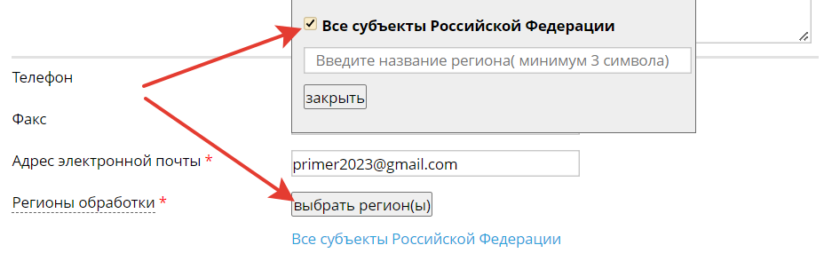{width=937px height=294px}

Если у вас ИП или Юр.лицо, то также заполните ИНН и ОГРН/ОГРНИП.

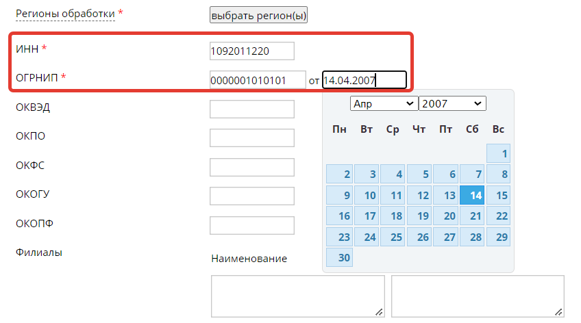{width=848px height=472px}

Пример полного заполнения раздела **«Сведения об операторе»** для самозанятого.

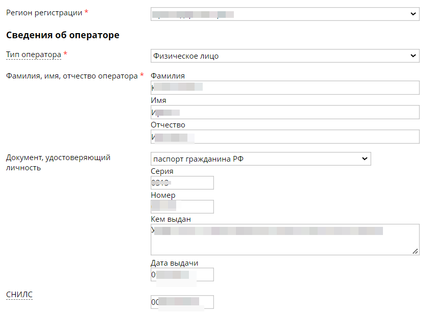{width=846px height=614px}

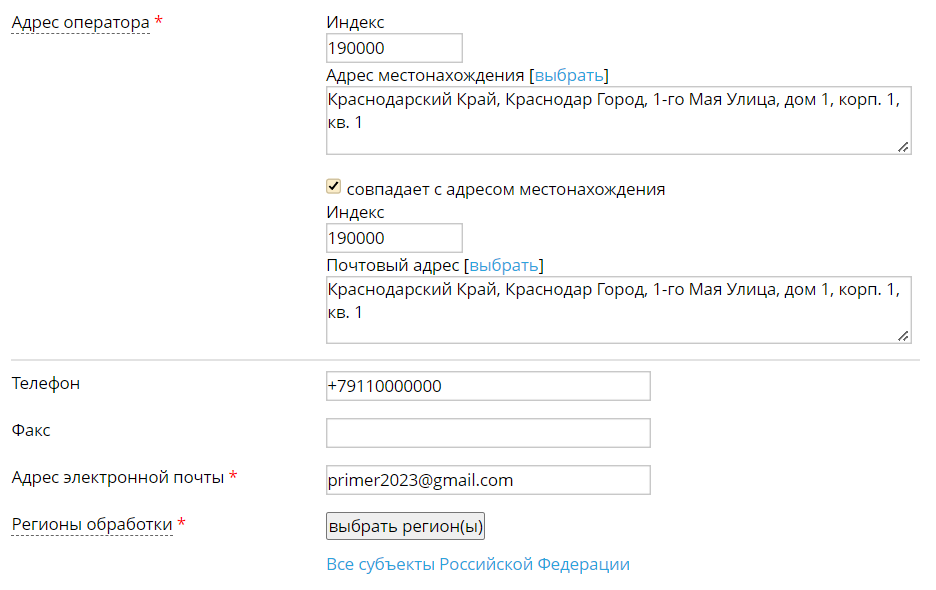{width=936px height=590px}

## **Цели обработки персональных данных**

В поле **«Цель обработки ПД»** выберите «иная».

В дополнительном поле укажите следующие пункты:

-  оказание услуг клиентам,

-  установление обратной связи с клиентами.

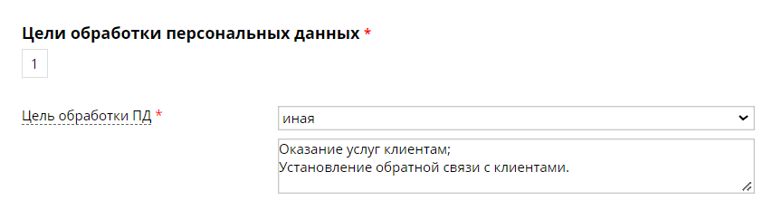{width=854px height=232px}

Если вы выступаете в качестве ЮЛ или ИП, у которого есть сотрудники, добавьте дополнительную цель «ведение кадрового и бухгалтерского учёта».

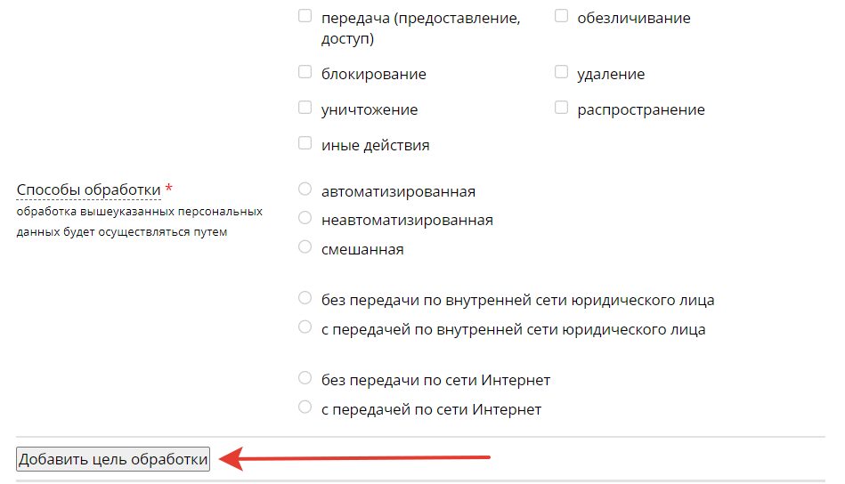{width=949px height=544px}

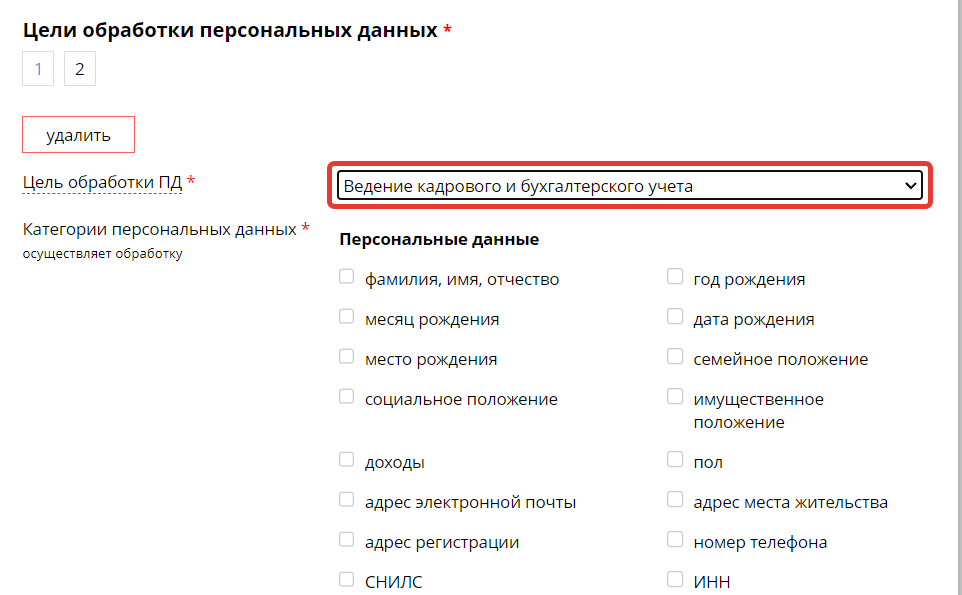{width=962px height=595px}

Если у вашей школы есть лицензия на образовательную деятельность, добавьте еще одну цель -- «Обеспечение соблюдения законодательства РФ в сфере образования».

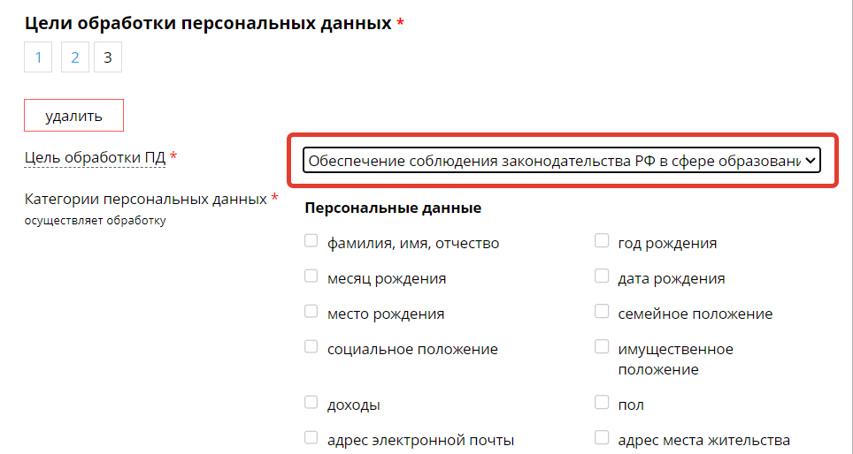{width=964px height=514px}

:::info 

Дальнейшая информация заполняется одинаково для каждой добавленной вами цели.

:::

В подразделе **«Категории персональных данных»** необходимо отметить всю информацию, которую вы собирает от своих клиентов для обработки.

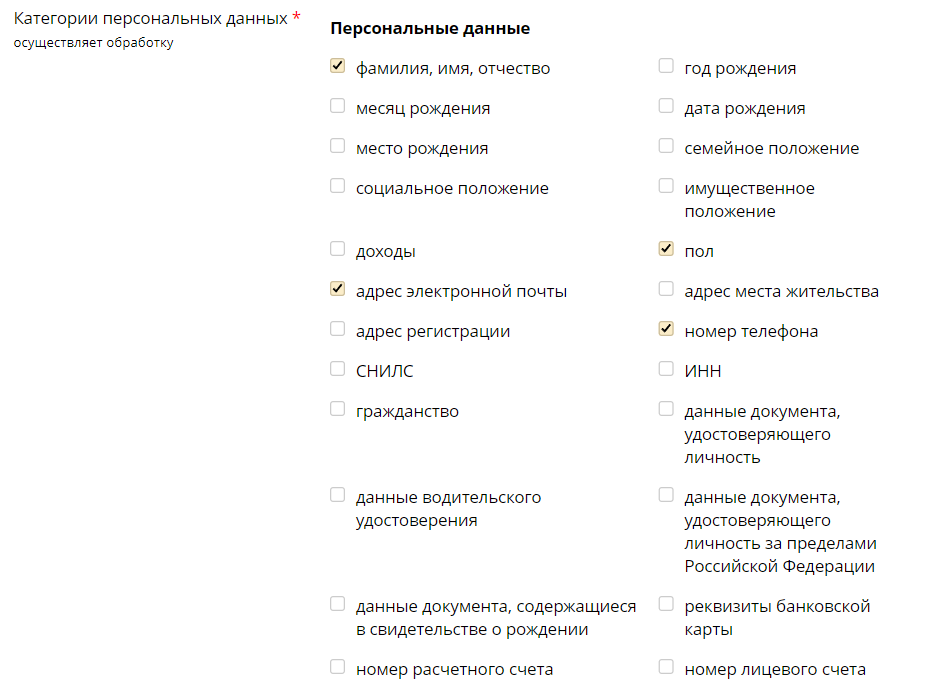{width=935px height=689px}

В качестве **категории субъектов** укажите «Клиенты». Если у вашего ИП или ЮЛ есть сотрудники, также выберите категорию «Работники».

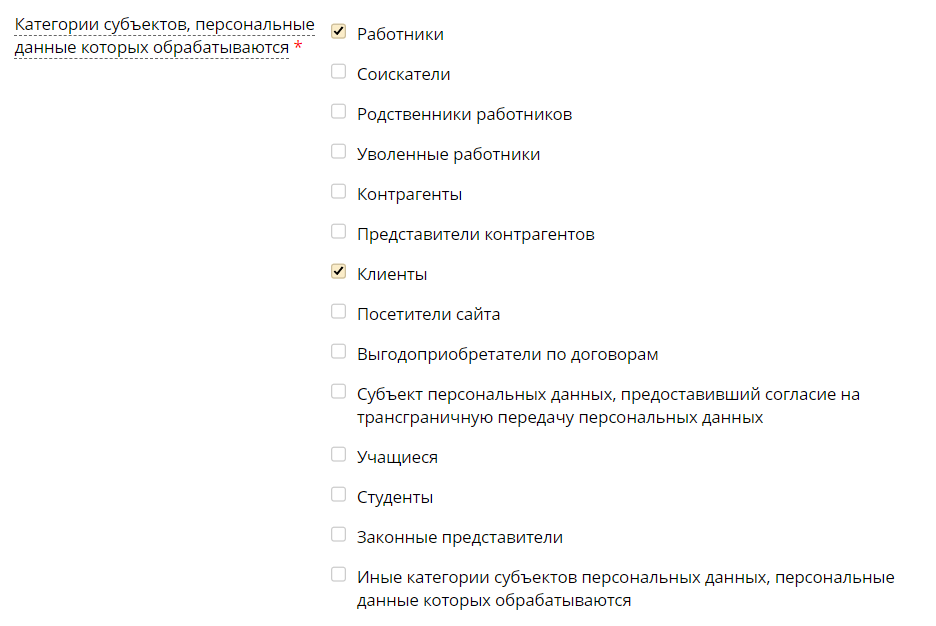{width=936px height=626px}

В подразделе **«Правовое основание обработки персональных данных»** выберите следующий вариант:

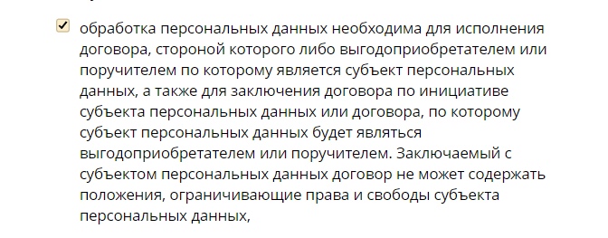{width=672px height=263px}

В подразделе **«Перечень действий»** нужно выбрать все действия, которые вы осуществляет с персональными данными. Укажите следующие:

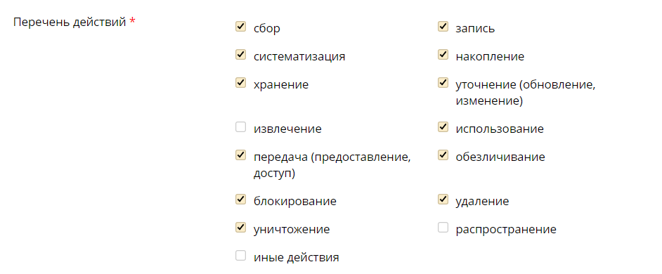{width=942px height=390px}

В подразделе **«Способы обработки»** нужно указать, каким образом ваша школа обрабатывает персональные данные.

Выберите следующие способы:

-  смешанная,

-  с передачей по внутренней сети юридического лица,

-  с передачей по сети Интернет.

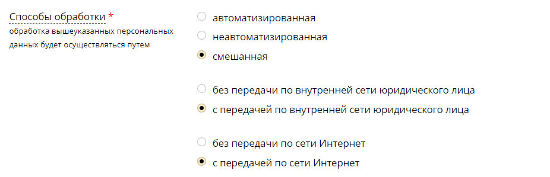{width=926px height=299px}

В качестве **мер**, предусмотренных статьями 18.1. и 19 Федерального закона «О персональных данных», можно указать следующие:

-  издание оператором документов, определяющих политику оператора в отношении обработки персональных данных;

-  применение правовых, организационных и технических мер по обеспечению безопасности персональных данных;

-  осуществление внутреннего контроля и (или) аудита соответствия обработки персональных данных законодательству;

-  определение угроз безопасности персональных данных при их обработке в информационных системах персональных данных;

-  обнаружение фактов несанкционированного доступа к персональным данным и принятие мер, в том числе мер по обнаружению, предупреждению и ликвидации последствий компьютерных атак на информационные системы персональных данных и по реагированию на компьютерные инциденты в них;

-  контроль за принимаемыми мерами по обеспечению безопасности персональных данных и уровня защищенности информационных систем персональных данных.

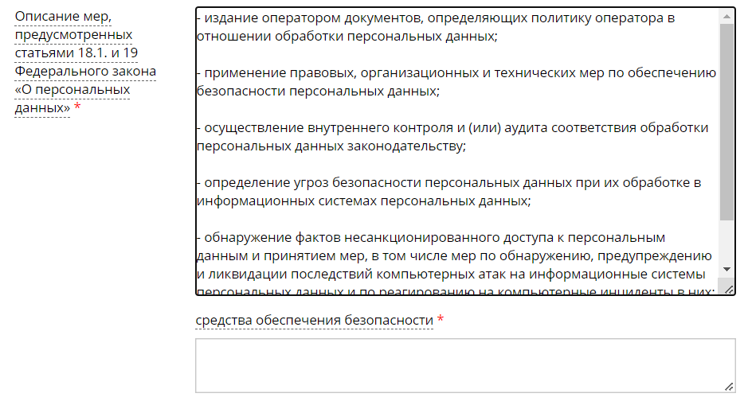{width=939px height=514px}

Если у вас (ИП или ЮЛ ) есть сотрудники в найме, также добавьте следующие меры:

-  назначение ответственного лица за обработку персональных данных;

-  установление правил доступа к персональным данным, обрабатываемым в информационной системе персональных данных, а также обеспечение регистрации и учета всех действий, совершаемых с персональными данными в информационной системе персональных данных;

-  применение организационных и технических мер по обеспечению безопасности персональных данных при их обработке в информационных системах персональных данных, необходимых для выполнения требований к защите персональных данных, исполнение которых обеспечивает установленные Правительством Российской Федерации уровни защищенности персональных данных.

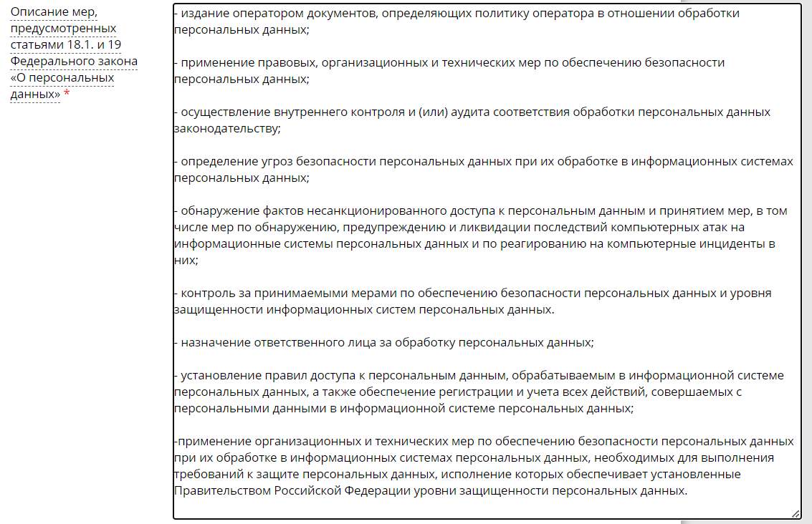{width=1133px height=732px}

В поле **«Средства обеспечения безопасности»** укажите технические средства, которые обеспечивают безопасность персональных данных при их обработке. Например:

-  использование антивирусных средств защиты информации (перечислите программы, которые используются);

-  .

   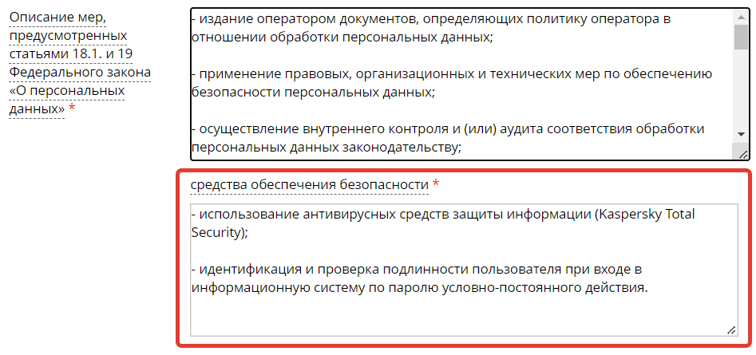{width=947px height=445px}

В поле **«Использование шифровальных (криптографических) средств»** выберите «не используются».

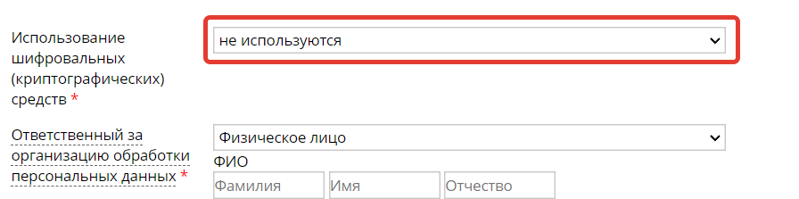{width=896px height=223px}

В подразделе **«Ответственный за организацию обработки персональных данных»** выберите лицо, на которого возложена ответственность за организацию обработки персональных данных:

-  если вы выступаете в качестве самозанятого или ИП без сотрудников, то выберите вариант «Физическое лицо», укажите свои ФИО и контактные данные;

-  если вы выступаете в качестве ЮЛ или ИП, у которого есть сотрудники, то выберите вариант «Физическое лицо» и укажите данные ответственного сотрудника;

-  если обработка персональных данных поручена другой компании, то выберите вариант «Сторонняя организация» и заполните реквизиты организации.

:::lab 

ФИО ответственного и его контактные данные будут доступны всем желающим в реестре операторов Роскомнадзора.

:::

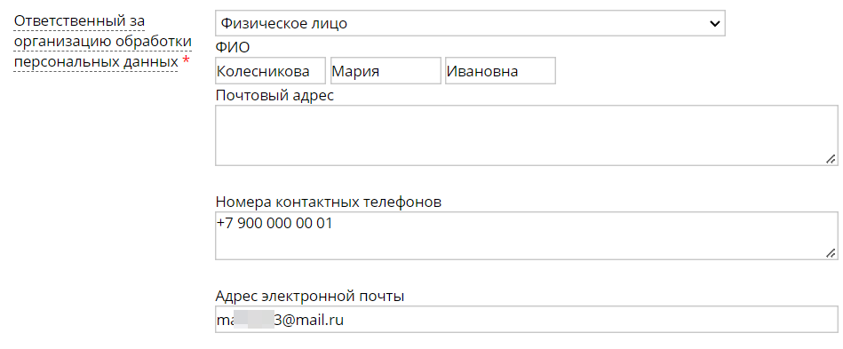{width=949px height=393px}

В поле **«Дата начала обработки персональных данных»** укажите дату начала обработки персональных данных.

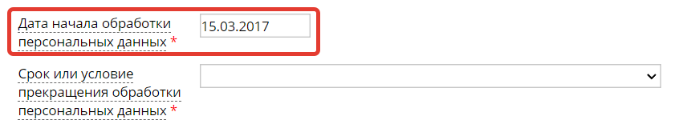{width=866px height=160px}

В поле **«Срок или условие прекращения обработки персональных данных»** выберите «Условие окончания», а ниже укажите «Прекращение деятельности организации».

В поле **«Осуществление трансграничной передачи персональных данных»** выберите «не осуществляется».

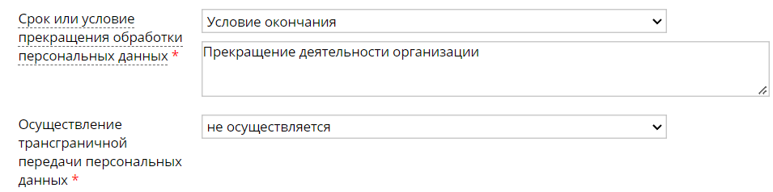{width=955px height=238px}

## **Сведения о местонахождении базы данных, содержащей персональные данные граждан РФ**

В данном разделе указывается информация о серверах Notibot

Дата-центр находится по адресам: 

Владимирская область -- г. Владимир, мкр. Энергетик, ул. Поисковая 1 к. 2;

Рязанская область -- г. Сасово, ул. Пушкина 21;

Калужская область -- г. Калуга, 1-й Автомобильный пр-д 8.

Заполните **«Сведения об организации, ответственной за хранение данных»**, как указано в примере ниже:

-  «Тип организации» -- юридическое лицо;

-  «Организационно-правовая форма» -- общество с ограниченными возможностями;

-  «Наименование организации» -- ООО «Яндекс.Облако»;

-  «ОГРН» -- 1187746678580;

-  «ИНН» -- 7704458262;

-  «Страна местонахождения организации, ответственной за хранение данных» -- Россия;

-  «Адрес местонахождения организации, ответственной за хранение данных» --  город Москва, ул. Льва Толстого, д. 16, помещ. 528 (юр. адрес организации).

В качестве **лица, имеющего доступ к персональным данным**, укажите свои данные, как оператора.

## **Сведения об обеспечении безопасности персональных данных**

В данном разделе указываются меры, которые предпринимает ваша школа, чтобы соблюдать требования, установленные [**постановлением**](https://base.garant.ru/70252506/#friends) Правительства Российской Федерации от 01.11.2012 № 1119 «Об утверждении требований к защите персональных данных при их обработке в информационных системах персональных данных».

Укажите следующие меры:

-  обеспечена сохранность носителей персональных данных;

-  используются средства защиты информации, прошедшие процедуру оценки соответствия требованиям законодательства Российской Федерации в области обеспечения безопасности информации, в случае, когда применение таких средств необходимо для нейтрализации актуальных угроз.

Если вы выступаете в качестве ЮЛ или ИП с сотрудниками, то также добавьте:

-  утвержден руководителем оператора документ, определяющий перечень лиц, доступ которых к персональным данным, обрабатываемым в информационной системе, необходим для выполнения ими служебных (трудовых) обязанностей.

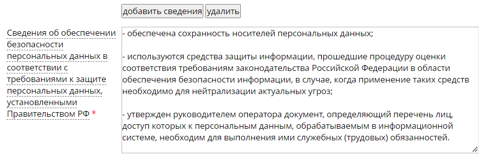{width=947px height=326px}

Заполните информацию об исполнителе. Исполнителем является лицо, заполняющее форму уведомления в Роскомнадзор. Это может быть не ответственный за обработку персональных данных, а совсем другой человек, фактически заполнивший уведомление.

:::note 

Если планируется подача уведомления в электронном виде с использованием ЭЦП, необходимо указывать данные лица, которому принадлежит ЭЦП.

:::

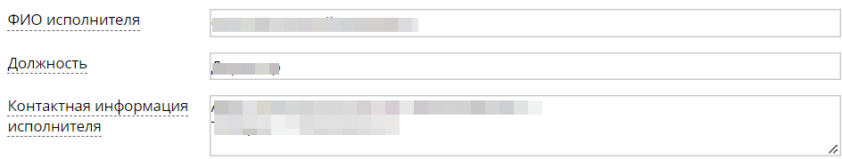{width=944px height=179px}

После заполнения формы уведомления поставьте галочки в опциях ниже, подпишите документ и отправьте выбранным способом.

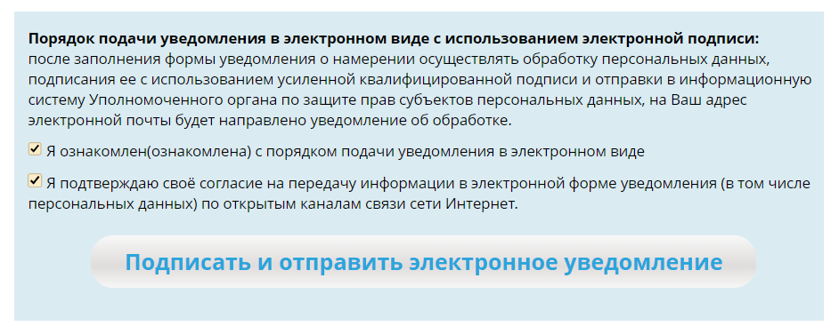{width=942px height=376px}

Запишите в блокнот сформированные код/номер уведомления и ключ. Они потребуются в дальнейшем для проверки статуса уведомления.

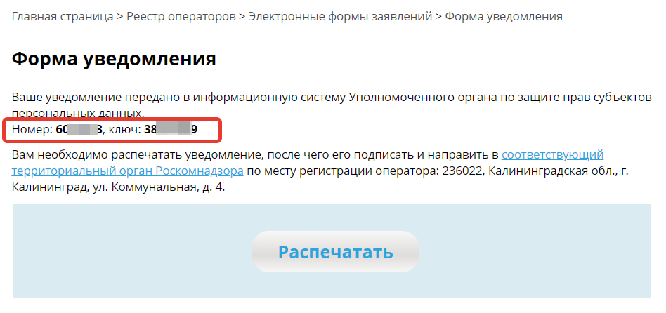{width=948px height=446px}

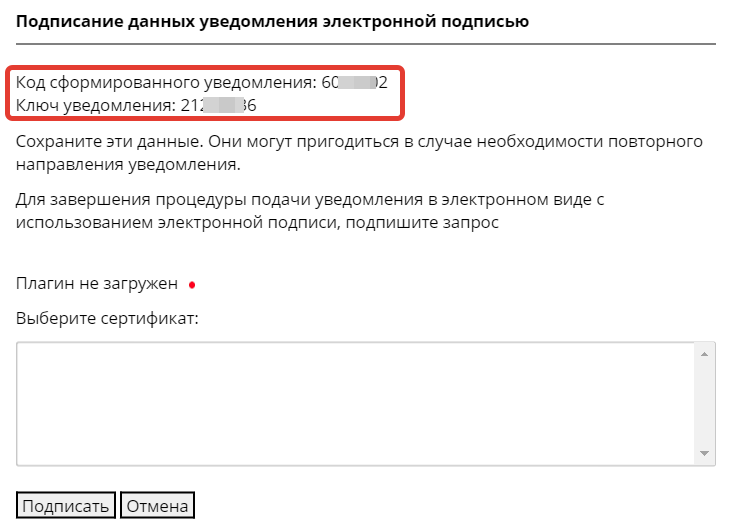{width=736px height=529px}

Отправленная заявка рассматривается в течение 30 дней, после чего организация вносится в [**реестр операторов**](https://pd.rkn.gov.ru/operators-registry/operators-list/).

Проверить состояние отправленного уведомления можно по [**ссылке**](https://pd.rkn.gov.ru/operators-registry/notification_check/) с помощью номера и кода, который вы получили после отправки уведомления.

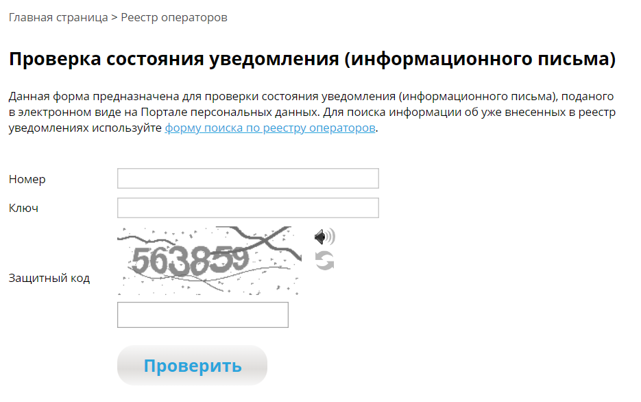{width=935px height=586px}

Если спустя указанный срок организация не внесена в реестр операторов, вы можете обратиться в [**электронную приемную**](https://rkn.gov.ru/treatments/ask-question/) Роскомнадзора для уточнения информации.