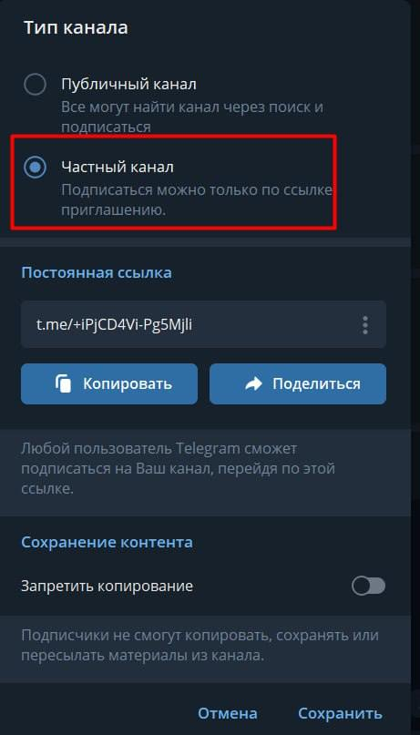
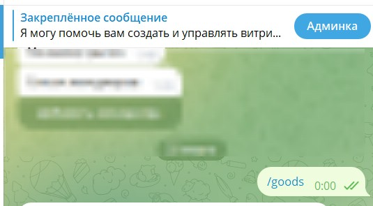
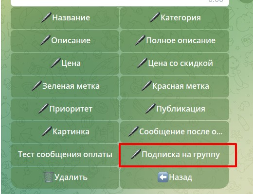
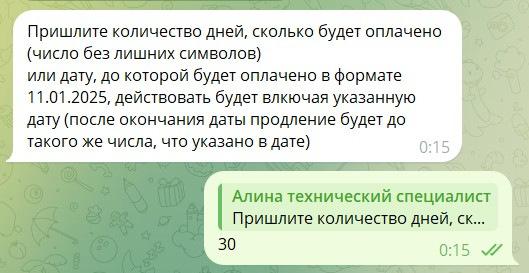
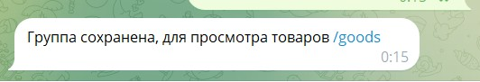

1. Добавляем товар в приложении [инструкция](./tovary/kak-dobavit-tovar)

2. Назначаем бота, который подключен к Нотиботу, админом канал

3. Переходите в канал и делаете настройки как на скрине

   {width=461px height=807px}

4. Возвращаемся в бот, который подключен к нотиботу, и отправляем команду /goods

   {width=535px height=295px}

5. Выбираете нужный вам товар и в меню нажимаете кнопку ПОДПИСКА НА ГРУППУ

   {width=520px height=400px}

6. Выбираете группу

   {width=490px height=199px}

7. Пишите количество дней

   {width=529px height=273px}

8. Группа подключена

   {width=532px height=91px}