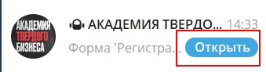
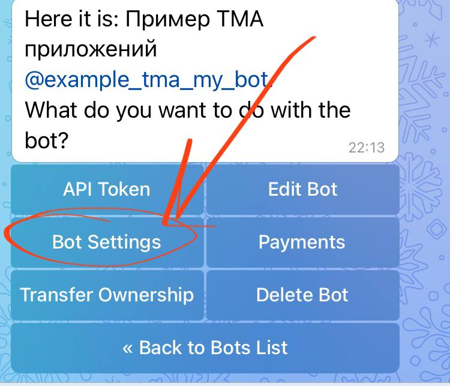
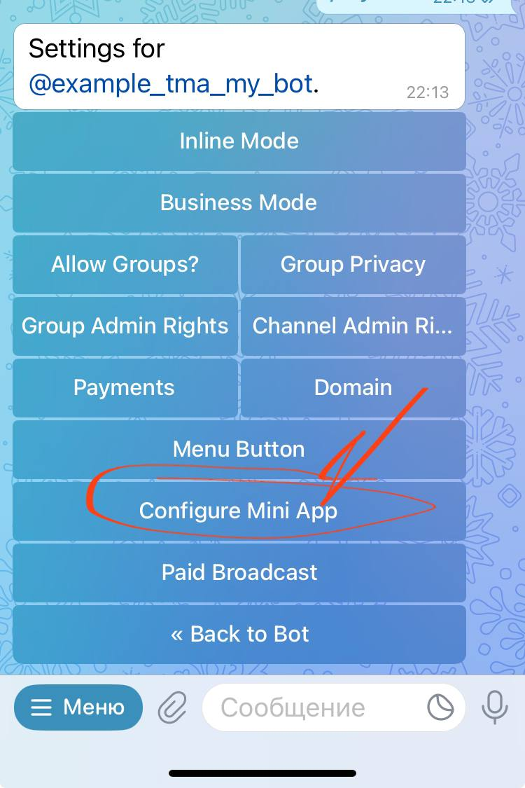
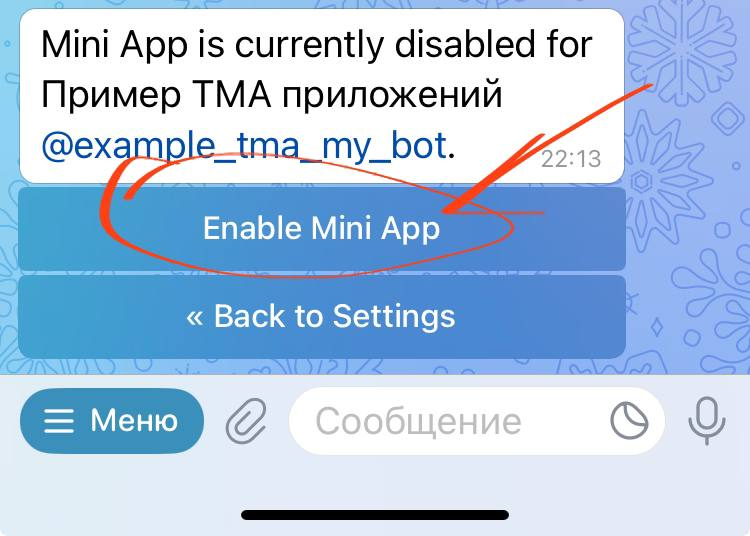

Как настроить кнопку “Открыть” рядом с названием приложения

{width=339px height=92px}

1. В строке поиска по чатам наберите @botfather или перейдите по этой ссылке <https://t.me/botfather> (будьте внимательны у бота должна быть голубая галочка)

2. Пишете команду /mybots

3. Выбираете нужный бот и нажимаете Bot Settings

   {width=750px height=643px}

4. Потом выбираете Configure Mini App

   {width=750px height=1125px}

5. Нажимаете кнопку Enable Mini App

   {width=750px height=536px}

6. Далее берете ссылку из своего бота, которую вы устанавливаете для создания ссылки aboutme

