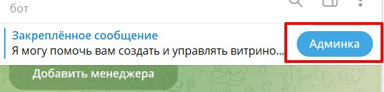
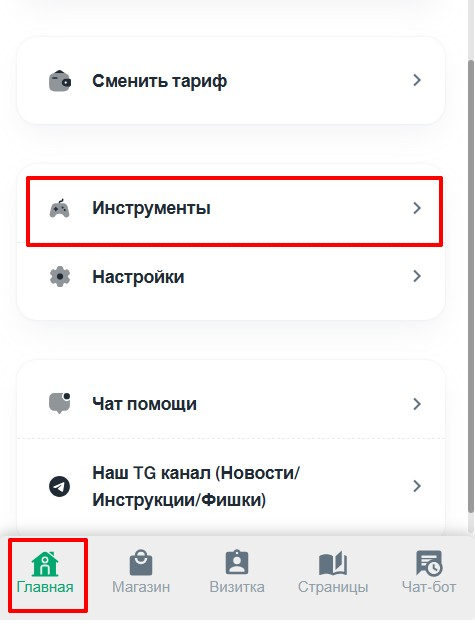
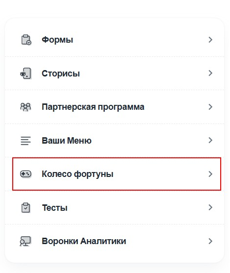
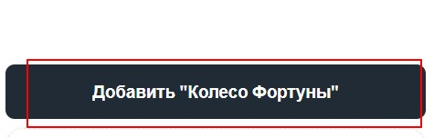
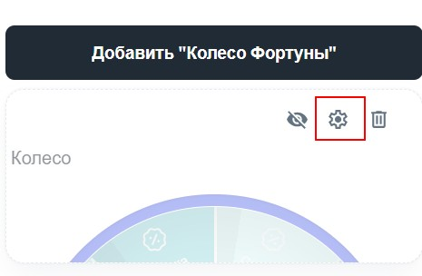
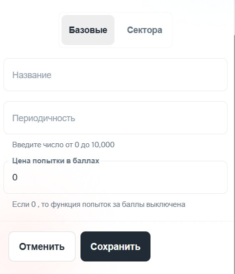
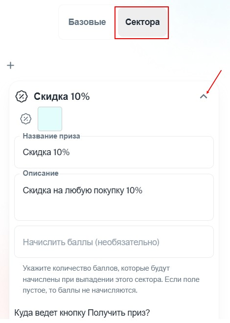
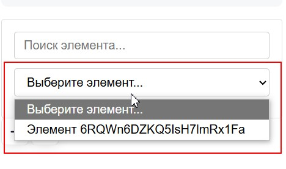

#### **1\. Создание Колеса Фортуны**

1. **Переход в настройки:**

   -  Зайдите в **Админку** --> **Главная** --> **Инструменты**.

      {width=555px height=133px}

      {width=475px height=638px}

   -  Выберите **«Колесо фортуны»**.

      {width=470px height=557px}

   -  Нажмите кнопку **«Добавить “Колесо фортуны»** 

      {width=475px height=152px}

   -  И переходим в настройки

      {width=465px height=304px}

---

#### **2\. Базовые настройки**

{width=470px height=547px}

-  **Название колеса:**\
   Введите уникальное название для вашего колеса.

-  **Периодичность:**\
   Укажите интервал между попытками **в минутах** (например: 60 = 1 час).

-  **Цена попытки (опционально):**\
   Установите стоимость одной попытки в баллах.

:::lab 

**Примечание по работе колеса:**

-  **Без платных попыток:**\
   `Крутит → Ожидает интервал → Снова может крутить`

-  **С платными попытками:**\
   `Крутит → Проверка баланса → Хватает баллов: крутит / Не хватает: ждет интервал`

:::

---

#### **3\. Настройка секторов**

{width=470px height=660px}

1. **Добавление секторов:**

   -  Используйте готовые шаблоны или создайте новые сектора.

2. **Параметры каждого сектора:**

   -  **Цвет:** Выберите цвет сектора

   -  **Название:** Введите название приза/действия

   -  **Описание:** Добавьте описание (по желанию)

   -  **Баллы:** Укажите количество начисляемых баллов (оставьте пустым, если не нужно начислять)

   -  **Действие при выигрыше:**

      -  Предварительно создайте страницы для призов

      -  Выберите куда ведет кнопка «Получить приз»

   -  **Удаление:** При необходимости удалите сектор

3. **Сохранение:**

   -  Не забудьте нажать кнопку **«Сохранить»**.

---

#### **4\. Размещение Колеса на странице**

1. **Перейдите в раздел** [**«Страницы»**](https://help.notibot.ru/wiki/stranicy)

2. **Создайте новую или отредактируйте существующую страницу**

3. **Добавление колеса:**

   -  Нажмите **«Добавить»** --> выберите **«Колесо фортуны»**

      [image:./koleso-fortuny-9.jpeg:::4.150197628458498,27.68729641693811,95.8498023715415,57.00325732899023:::506px:307px]

      [image:./koleso-fortuny-8.jpeg:::3.048780487804878,21.49122807017544,96.95121951219512,75.43859649122807:::492px:456px]

   -  Выберите созданное вами колесо из списка

      {width=468px height=277px}

4. **Сохранение изменений:**

   -  Нажмите кнопку **«Сохранить»** для применения изменений

---

**Готово!** Ваше Колесо Фортуны настроено и доступно на выбранной странице. 🎡

