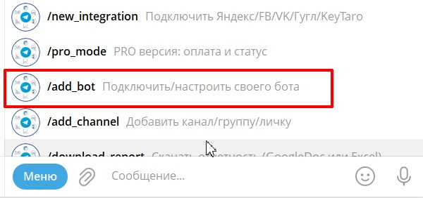
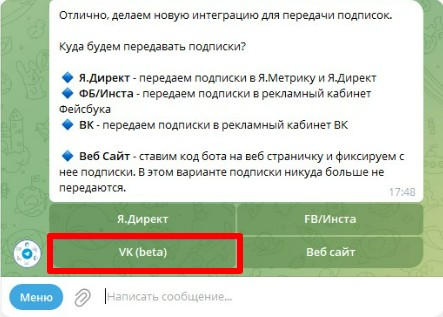
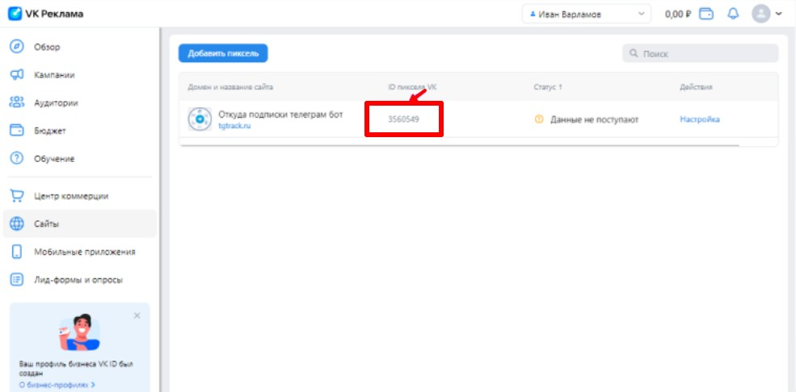
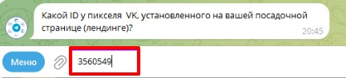
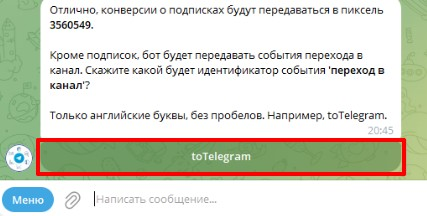
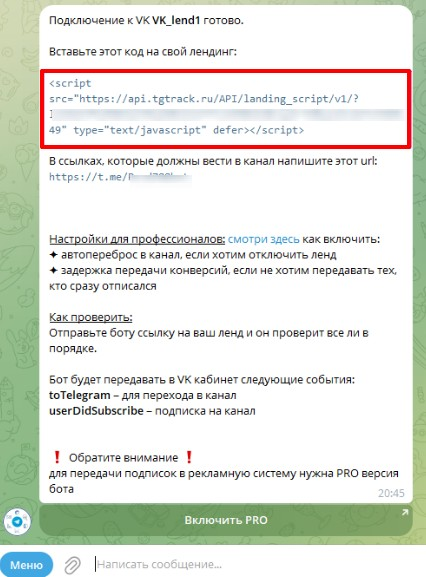
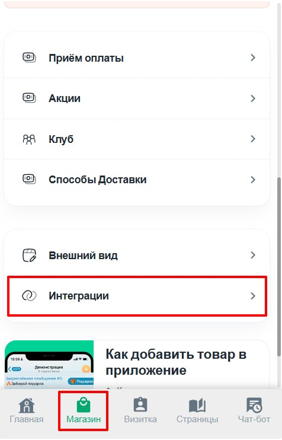
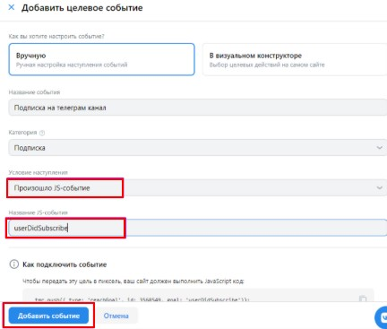

## **Шаг 1. Подготовка**

1. **Требования:**

   -  Активная **Pro-версия Notibot**

   -  Активная **Pro-версия «Откуда подписки бот»** (без этого цели не будут передаваться)

   -  Рабочий бот, подключённый к Notibot

2. **Что понадобится:**

   -  Токен бота (из @BotFather), который уже подключён к вашему мини-приложению Notibot

   -  **Лендинг** - страница, на которую ведёт VK Реклама

   -  **ID у пикселя VK**, установленного на вашем сайте

**Что такое пиксель**

Пиксель VK рекламы -- код, который добавляется на ваш сайт и отслеживает действия пользователей. С пикселем рекламу можно сделать более целевой и эффективной: показывать её только тем, кто с большей вероятностью совершит покупку.

:::tip 

Если у вас ещё нет пикселя, зайдите в ваш рекламный кабинет VK Рекламы и создайте его: [Как создать новый пиксель](https://ads.vk.com/help/articles/pixel)

:::

После того, как пиксель создан, появится код пикселя, который нужно установить на ваш сайт. [Как установить пиксель на сайт](https://ads.vk.com/insights/chto-takoe-piksel-vk-reklamy#how-install)

---

## **Шаг 2. Настройка «Откуда подписки бот»**

1. **Подключите бота:**

   -  Перейдите в @tgTrack_bot

   -  Отправьте команду `/menu` -> «Подключить/настроить своего бота».

      {width=600px height=282px}

   -  Вставьте **токен вашего бота** (который подключён к Notibot).

   -  Скопируйте выданный **ключ API** (понадобится позже).

2. **Интеграция с VK Реклама**

   -  В том же боте выберите **/new_integration** -> **«Подключить Яндекс/FB/VK/Гугл»**.

      {width=599px height=277px}

   -  Тип подключения VK (beta)

      {width=443px height=317px}

   -  Выберите что будем подключать к VK Реклама (в нашем случае выбираем бота, котрого подключали)

   -  Введите название ссылки (например, «VK Реклама»)

   -  Скопируйте ID пикселя в рекламном кабинете VK

      {width=985px height=486px}

      Отправьте боту, когда он попросит

      {width=432px height=98px}

      

   -  Укажите какой будет идентификатор цели в пикселе для нажатия кнопки «перейти в канал».

      {width=427px height=216px}

   -  Укажите какой будет идентификатор цели в Пикселе для подписки. Значение по умолчанию `userDidSubscribe`. Если он вас устраивает, нажмите на кнопку под сообщением или введите свое значение.

   -  Установите код на ваш сайт: скопируйте код из сообщения бота (он вам понадобится на шаге 3)

      {width=426px height=577px}

      

---

## **Шаг 3. Настройка Notibot**

**Добавьте API-ключ и скрипт:**

-  В Notibot: **Магазин -> Интеграции -> tgTrack**.

   {width=476px height=742px}

   [image:./nastroyka-svyazki-otkuda-podpiski-bot-notibot-16.jpg:::0,6.980273141122914,99.78260869565217,42.03338391502276:::460px:659px:center]

-  В поле **«API-ключ»** вставьте ключ из «Откуда подписки бот» (Шаг 2).

-  В поле **«Скрипт для лендинга»** вставьте скрипт, который пришёл от @tgtrack после настройки интеграции с VK Рекламой.

   {width=445px height=565px}

-  Сохраните изменения.

---

## **Шаг 4. Используйте правильную ссылку**

-  **Не используйте прямую ссылку на визитку или бота.** 

-  **Используйте Web URL страницы Notibot:**

   1. Откройте нужную страницу в Notibot.

   2. Нажмите кнопку **«Web»** -> скопируйте ссылку.

   3. **Пример:** [`https://list.notibot.ru/web/0ftgJhgyDnPdqLetjfFjyri/page/0ftgFrtyDnPdqLetjfFjyri`](https://list.notibot.ru/web/0ftgJhgyDnPdqLetjfFjyri/page/0ftgFrtyDnPdqLetjfFjyri)

      {width=471px height=736px}

-  Эту ссылку используйте в VK Реклама как посадочную.

---

## **Шаг 5. Оптимизация веб-страницы**

-  У человека есть **2-3 секунды**, чтобы принять решение.

-  Сделайте короткий, цепляющий оффер:

   -  Чёткий заголовок.

   -  Призыв к действию.

   -  Кнопка «Продолжить в Telegram» (появится автоматически).

-  Дизайн должен быть адаптирован под мобильные устройства.

---

## **Шаг 6. Запуск и аналитика**

Зайдите в настройки пикселя VK и создайте 2 цели с такими же идентификаторами, как вы указали в шаге 2:

-  Подписка на телеграм канал

-  Условие наступления: Произошло событие `JavaScript`

-  Название JS события: `userDidSubscribe`

   {width=432px height=367px}

---

## **Важные моменты**

-  **Pro-версии обязательны** для работы интеграции.

-   **Используйте Web URL.** 

   Если  используете свой лендинг, то просто вставляете скрипт тот же который получили при настройки VK Рекламы

-  Перед запуском трафика проверьте, пожалуйста, подключение. Пришлите боту ссылку на ленд. Бот проверит и пришлёт отчёт, всё ли в порядке.