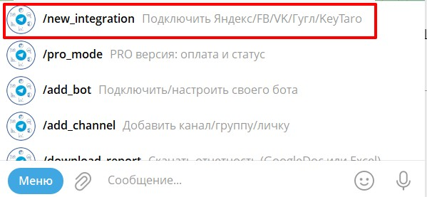
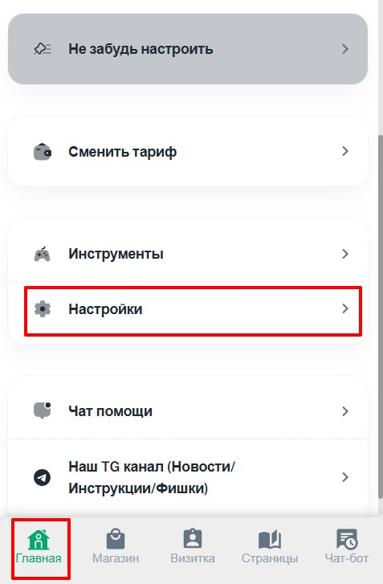
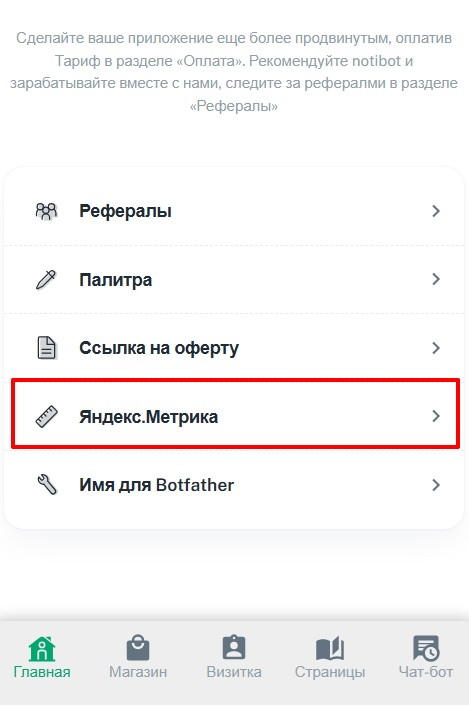
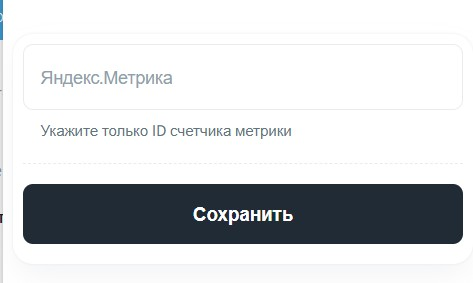
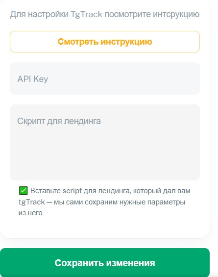
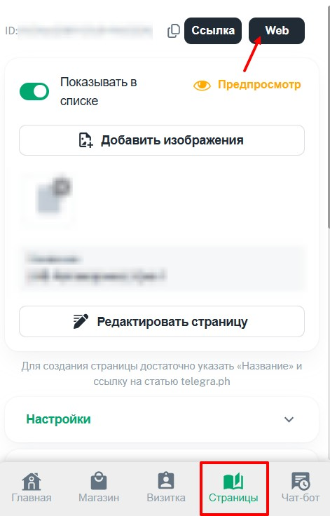

## **Шаг 1. Подготовка**

1. **Требования:**

   -  Активная **Pro-версия Notibot**.

   -  Активная **Pro-версия «Откуда подписки бот»** (без этого цели не будут передаваться).

   -  Рабочий бот, подключённый к Notibot.

2. **Что понадобится:**

   -  Токен бота (из @BotFather), который уже подключён к вашему мини-приложению Notibot.

   -  Аккаунт в Яндекс.Директ (с доступом к Яндекс.Метрике).

   -  Готовая страница в Notibot (для использования её **Web URL**).

---

## **Шаг 2. Настройка «Откуда подписки бот»**

1. **Подключите бота:**

   -  Перейдите в @tgTrack_bot

   -  Отправьте команду `/menu` -> «Подключить/настроить своего бота».

      {width=600px height=282px}

   -  Вставьте **токен вашего бота** (который подключён к Notibot).

   -  Скопируйте выданный **ключ API** (понадобится позже).

2. **Интеграция с Яндекс.Директ:**

   -  В том же боте выберите **«Подключить Яндекс»** -> **«Яндекс.Директ»**.

      {width=599px height=277px}

   -  Выберите бота из списка.

   -  Введите название ссылки (например, «Яндекс.Директ»).

   -  **Важно:** Вам потребуется **номер счётчика Яндекс.Метрики** (см. Шаг 3).

---

## **Шаг 3. Настройка Яндекс.Метрики**

1. **Создайте или откройте счётчик:**

   -  Войдите в Яндекс.Метрику.

   -  Создайте новый счётчик (если нет готового).

   -  В поле «Адрес сайта» вставьте **Web URL страницы Notibot** (без `https://`).

2. **Получите номер счётчика:**

   -  Скопируйте **ID счётчика** (цифры).

   -  Вставьте его в «Откуда подписки бот» при подключении Яндекс.Директ.

3. **Автоматическое создание целей:**

   -  После интеграции в «Откуда подписки бот» нажмите **«Telegram»** для автосоздания целей в Метрике.

   -  Появятся две цели:

      -  `toTelegram` -- клик по кнопке «Продолжить в Telegram» на веб-странице.

      -  userDidSubscribe -- факт подписки в мини-приложение (главная цель).

---

## **Шаг 4. Настройка Notibot**

1. **Добавьте счётчик Метрики:**

   -  В админке Notibot: **Главная -> Настройки -> Яндекс.Метрика**.

      {width=477px height=727px}

      {width=469px height=706px}

   -  Вставьте **номер счётчика**, сохранённый на Шаге 3.

   {width=473px height=283px}

2. **Добавьте API-ключ и скрипт:**

   -  В Notibot: **Магазин -> Интеграции -> tgTrack**.

      {width=476px height=742px}

      [image:./nastroyka-svyazki-otkuda-podpiski-bot-notibot-7.jpg:::0,6.980273141122914,99.78260869565217,42.03338391502276:::460px:659px:center]

   -  В поле **«API-ключ»** вставьте ключ из «Откуда подписки бот» (Шаг 2).

   -  В поле **«Скрипт для лендинга»** вставьте скрипт, который пришёл от @otkuda_podpiski_bot после настройки интеграции с Яндексом.

      {width=445px height=565px}

   -  Сохраните изменения.

---

## **Шаг 5. Используйте правильную ссылку**

-  **Не используйте прямую ссылку на визитку или бота.** Яндексу это может не понравиться.

-  **Используйте Web URL страницы Notibot:**

   1. Откройте нужную страницу в Notibot.

   2. Нажмите кнопку **«Web»** -> скопируйте ссылку.

   3. **Пример:** [`https://list.notibot.ru/web/0ftgJhgyDnPdqLetjfFjyri/page/0ftgFrtyDnPdqLetjfFjyri`](https://list.notibot.ru/web/0ftgJnyqDnPdqLetToCyri/page/0v5hasC88Y1Zv2l4Ye53OQ)

      {width=471px height=736px}

-  Эту ссылку используйте в Яндекс.Директ как посадочную.

-  Вы можете настроить отображение WEB страниц, подробнее [тут](./web-rezhim-stranic)

---

## **Шаг 6. Оптимизация веб-страницы**

-  У человека есть **2-3 секунды**, чтобы принять решение.

-  Сделайте короткий, цепляющий оффер:

   -  Чёткий заголовок.

   -  Призыв к действию.

   -  Кнопка «Продолжить в Telegram» (появится автоматически).

-  Дизайн должен быть адаптирован под мобильные устройства.

---

## **Шаг 7. Запуск и аналитика**

1. **Настройте кампанию в Яндекс.Директ:**

   -  Используйте веб-URL страницы.

   -  В целях выберите `userDidSubscribe` (подписка в мини-приложение).

2. **Отслеживайте результаты:**

   -  В **«Откуда подписки бот»** видна детальная аналитика:

      -  Источник трафика (Яндекс.Директ).

      -  Конкретные кампании и креативы.

      -  Статистика по подписчикам.

   -  В **Яндекс.Метрике** отслеживайте конверсии по целям.

---

## **Важные моменты**

-  **Pro-версии обязательны** для работы интеграции.

-  Яндекс может блокировать прямые ссылки на Telegram-бота или мини-приложение. **Используйте Web URL.**

-  Для глубоких целей (например, отправка формы или покупка) в Метрике создавайте цели типа **«JavaScript событие»** с параметром `order{ID товара}` или `form{ID_ФОРМЫ}`.

-  Всегда **тестируйте связку** перед запуском на большие бюджеты.