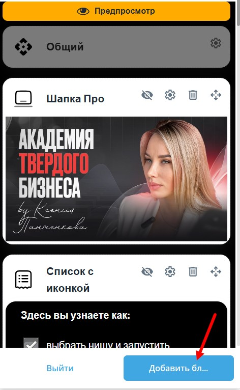

1. **Что такое визитка?**

   -  Визитка -- это ваш "сайт" или витрина, где представлены ваши товары, полезные материалы или любая другая информация, которую вы хотите показать новым подписчикам.

   -  Примеры для вдохновения: интерфейсы приложений Яндекса, Тинькофф и других сервисов, с которыми пользователи взаимодействуют ежедневно (заказ товаров, вызов такси, просмотр сторис и т.д.).

2. **Как попасть в настройки визитки:**

   -  Откройте своего бота.

   -  Нажмите кнопку **“Админка”**.

   -  Выберите раздел **“Визитка”**.

   -  Нажмите **“Добавить блок”**, чтобы начать создание или редактирование визитки.

   {width=472px height=766px}

3. **Совет по созданию визитки:**

   -  Используйте привычный и удобный интерфейс, похожий на те, которые уже знакомы вашим пользователям (например, как в популярных приложениях).

   -  Сделайте визитку простой, понятной и визуально привлекательной.

      

Блоки базово:

-  Шапка про - базово

-  Сетка категорий

-  Список с иконками

-  Карточки

Формы

-  Типы, создать

-  добавить на страницу

-  Форма с проверкой, баллы

-  Сообщение после

Страницы

-  Настройки: категории, видимость, шапка-обложка

-  Обзор блоков

-  Кнопки

Товары: категории, скидки, видимость, сообщение после покупки