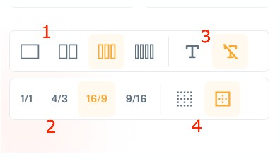
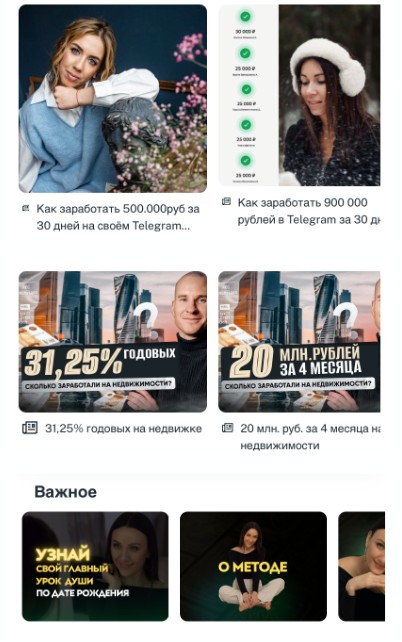

Данный блок позволяет разместить в визитке в виде карточек с горизонтальной прокруткой превью к вашим страницами (статьями) и товарам.

Предварительно надо добавить товары и страницы в соответствующих разделах. Хотя блок позволяет сделать это прямо находясь в нем (видео 2)

В видео показал как добавлять данный блок, ниже покажу примеры использования

### Как добавить блок

[video:https://drive.google.com/file/d/10uxb-7taox72CZDapq0ekqIqe0LOGuGi/view?usp=sharing:]

### **Как добавить страницу прямо из блока**

[video:https://drive.google.com/file/d/1c9DyLwauX2AMh6TvXTCj2FgRFzRDS70h/view?usp=sharing:]

### **Настройка внешнего вида карточек**

{width=396px height=225px}

1. Количество карточек видимых на экране без прокрутки

2. Соотношение сторон обложки карточки. Например 1/1 - это квадрат. 16/9 это прямоугольник, а 9/16 это формат сторис

3. Отображать название страницы /товара в карточке или нет

4. Рамка у карточки - вкл./выкл.

### Примеры

{width=402px height=642px}