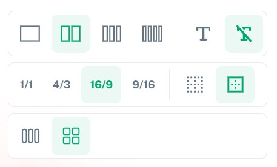

В этом блоке вы можете создать карточки категорий и указать заголовок этого блока (по желанию).

#### Настройки блока:

1. Укажите название блока (если необходимо)

2. Добавьте карточки категорий

   {width=461px height=667px}

   

3. Настройте отображение карточек

   {width=457px height=276px}

#### Настройки карточки:

1. Добавьте изображение в шапку карточки.

2. Настройте действия, которые будут выполняться при нажатии на карточку:

   -  Открытие категории товаров или статей.

   -  Запуск Сторис.

   -  Отображение всплывающего окна с текстом (текст можно отредактировать с использованием Markdown)

{width=479px height=524px}

