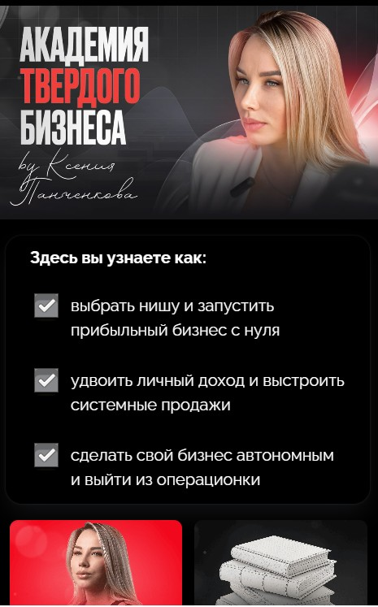

В этом блоке вы можете:

1. **Изменить фон:**

   -  Вы можете заменить фон, добавив свое изображение или просто изменить цвет фона.

   -  Настроить размер изображения, чтобы оно идеально подходило под блок.

      {width=471px height=707px}

2. **Добавить текст:**

   -  Настроить размер текста.

   -  Используйте подложку для текста (при необходимости).

   -  Выберите цвет текста, чтобы он гармонировал с фоном.

      {width=472px height=691px}

3. **Настроить список и кнопки:**

   -  Добавьте список, если это необходимо

      {width=470px height=709px}

   -  Настроить кнопки (например, измените их текст, цвет и расположение)

      {width=469px height=707px}

#### Примеры



---

*  

   {width=465px height=747px}

*  

   [image:./shapka-pro-4.jpeg:::0,0,99.97295964298222,81.17469879518072:::465px:742px]


