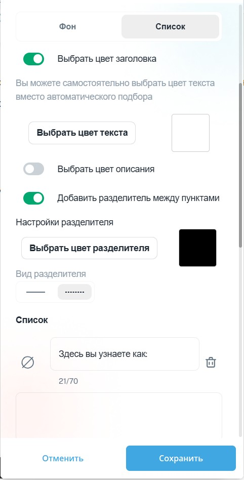

1. **Настройка внешнего вида блока:**

   -  Установите **радиус блока** (скругление углов).

   -  Настройте **фон блока**:

      -  Используйте изображение в качестве фона.

      -  Либо выберите цвет фона (вручную или из готовых вариантов).

         {width=460px height=740px}

2. **Настройка списка:**

   -  Добавьте **иконку** для каждого пункта списка (или уберите иконки, если они не нужны).

   -  Разделите текст на **заголовок** и **описание**.

   -  Выберите **цвет заголовка**.

   -  Выберите **цвет описания**.

3. **Настройка разделителей:**

   -  Добавьте **разделитель** между пунктами списка.

   -  Выберите **тип разделителя**:

      -  Пунктир.

      -  Сплошная линия.

   -  Настройте **цвет разделителя**.

{width=482px height=948px}