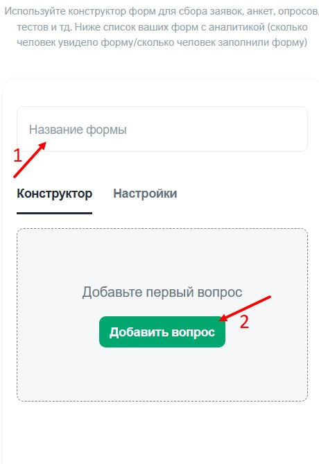

### Типы форм:

1. **Обычная форма:**

   -  Пользователь видит **весь список вопросов** сразу.

   -  Все поля для заполнения отображаются на одной странице.

2. **Квиз-форма:**

   -  Это **многошаговая форма**.

   -  Пользователь видит **один вопрос за раз**.

   -  После ответа на вопрос появляется **следующий вопрос**.

### **Создание формы:**

1. Переходим в своего бота (который подключён к [@NotibotruBot](https://t.me/NotibotruBot)) и нажимаем АДМИНКА

   {width=538px height=142px}

   

2. Выбираем вкладку ГЛАВНАЯ и ИНСТРУМЕНТЫ

   {width=477px height=818px}

3. Далее выбираем ФОРМЫ

   {width=465px height=662px}

4. Нажимаете СОЗДАТЬ ФОРМУ

   {width=480px height=259px}

5. Вводите название формы и нажимаете добавить вопрос

   {width=460px height=669px}

6. Выбираем необходимый нам тип вопроса

   {width=561px height=640px}

   Например выбираем ТЕЛЕФОН

   {width=574px height=635px}

   Вводим необходимый текст и сохраняем изменения

   {width=581px height=307px}

   

   Далее можно добавить еще вопрос, например ВЫБОР ИЗ СПИСКА

   {width=575px height=645px}

   Вводим заголовок вопроса и возможные варианты ответов и сохраняем изменения.

   {width=550px height=719px}

   Далее если необходимо делаем вопрос обязательным

   {width=555px height=751px}

   Вы также можете редактировать и удалять вопросы

   {width=527px height=367px}

7. Во вкладке НАСТРОЙКИ:

   Вы можете изменить вид формы.

   {width=522px height=678px}

   

   Ввести тест, который появится после заполнения данной формы.

   Для оформления текста используем язык разметки MARKDOWN

   {width=566px height=735px}

   

   И настроить нужна ли проверка данного теста и начислять ли баллы за заполнения формы.

   {width=555px height=712px}

### Добавление формы на страницу:

1. На страницы нажимаете плюсик

   {width=471px height=118px}

2. И выбираете ФОРМА

   {width=449px height=313px}

3. Из списка выбираете форму

   {width=478px height=420px}

Так же можете настроить фон формы и типы границ