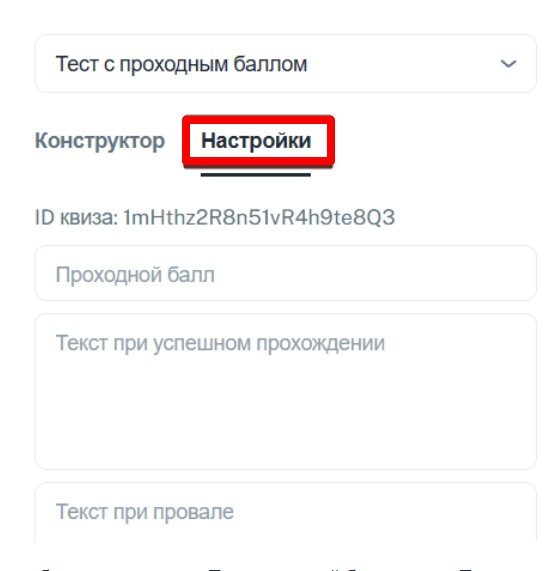

1. Переходим в своего бота (который подключён к [@NotibotruBot](https://t.me/NotibotruBot)) и нажимаем АДМИНКА

   {width=538px height=142px}

2. Выбираем вкладку ГЛАВНАЯ и ИНСТРУМЕНТЫ

   {width=477px height=818px}

3. Далее выбираем ТЕСТЫ

   {width=588px height=632px}

4. Нажимаете СОЗДАТЬ КВИЗ

   {width=589px height=529px}

5. Вводите название квиза и нажимаете добавить вопрос

   {width=545px height=552px}

6. Выбираем необходимый нам тип вопроса

   {width=566px height=302px}

   

   Например: **Множественный выбор**

   Вводим текст вопроса и возможные варианты ответов

   {width=556px height=428px}

   Выбираем правильные ответы и присваиваем баллы за каждый ответ.

   {width=597px height=499px}

   При необходимости можно установить таймер для вопроса, в секундах

   {width=582px height=252px}

   После заполнения всех полей нажимаем сохранить изменения

   Делаем наш вопрос обязательным

   {width=577px height=522px}

   Добавим вопрос **Выбор из списка**

   {width=538px height=236px}

   Также вводим вопрос и возможные варианты ответов, отмечая правильный

   {width=541px height=651px}

   Присваиваем баллы за правильный ответ, при необходимости устанавливаем таймер для вопроса, в секундах и сохраняем изменения

   {width=590px height=336px}

   Добавим вопрос **Текстовое поле**

   {width=560px height=318px}

   Вводим наш вопрос, правильный ответ и присваиваем баллы за правильный ответ.

   {width=545px height=241px}

   При необходимости можно установить таймер для вопроса, в секундах

   [image:./testy-13.jpeg:::0,60.391566265060234,99.90893293580862,39.45783132530121:::580px:668px]

   

7. **Переходим во вкладку Настройки**

   {width=548px height=571px}

   

   Выбираем тип теста: Тест с шкалой баллом или Тест с проходным баллом

   {width=550px height=274px}

   

   При выборе ТЕСТ С ПРОХОДНЫМ БАЛЛОМ,  нужно выставить проходной балл и текст, который будет приходить, если тест пройдет  успешно или провален.

   {width=578px height=656px}

   

   При выборе ТЕСТ С ШКАЛОЙ ОЦЕНКИ, необходимо выставить диапазоны и текст для него.

   {width=552px height=642px}

8. И далее сохраняем квиз

   

