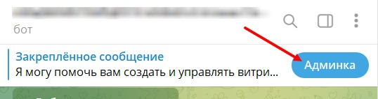

### **Как попасть в настройки визитки:**

-  Откройте своего бота, который подключён к [@NotibotruBot](https://t.me/NotibotruBot)

-  Нажмите кнопку **“Админка”**.

   {width=538px height=142px}

-  Выберите раздел **“Визитка”**.

   [image:./nastroyki-vizitki.jpeg:::1.2396694214876034,0,96.48760330578511,100:::484px:516px]

-  Нажмите **“Добавить блок”**, чтобы начать создание или редактирование визитки.

   [image:./nastroyka-vizitki.jpeg:::0,28.313253012048197,99.9663897337867,71.53614457831326:::472px:766px]

### **Как перемещать блоки в визитке**

[video:https://drive.google.com/file/d/10WqzD1wPjQkqgIYQ7RG7uNG_zNXTuI5y/view?usp=sharing:]

### **Как скрыть блоки в разделе визитка**

[video:https://drive.google.com/file/d/1euNTxTAgvtbQ2Egui-HG3dnYBd3VKmAZ/view?usp=sharing:]

#### Примеры визиток:

{width=800px height=600px}