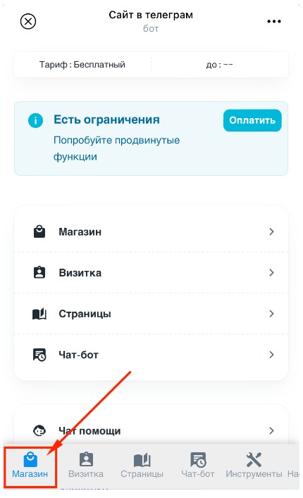
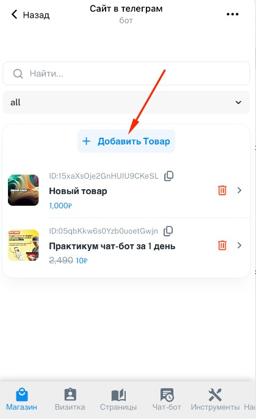

1. Запустите админку, для этого отправьте своему боту (который подключен к Notibot) команду /admin -> появится кнопка Админка

   {width=413px height=354px}

2. Откроется приложение Админка. Перейдите в раздел **«Магазин»**

   {width=430px height=708px}

3. Перейдите в раздел **«Товары»**

   {width=421px height=694px}

4. Нажмите кнопку **«Добавить товар»**

   {width=421px height=686px}

**Напишите название товара и цену , нажмите кнопку «Создать» -> товар создан**

**Готово!!!**