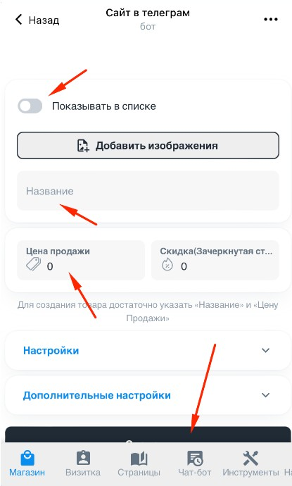

{width=415px height=690px}

1. **Показывать в списке** Если ползунок выключен, то товар будет доступен только по ссылке и не будет отображаться в каталоге и визитке

2. **Название** Название, которое увидят ваши клиенты в приложении

3. **Цена продажи** (число) сумма за которую клиент сможет купить товар

4. **Скидка** Используется для того чтобы показать перечеркнутую цену. Например если вы продаете товар за 1000 рублей, но хотите показать, что старая цена 2000р, тогда в Цену продажи укажите - 1000, а в скидку 2000

