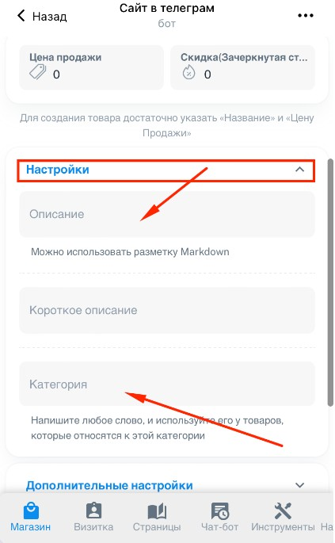
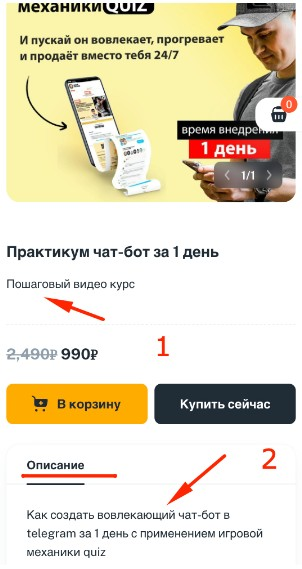
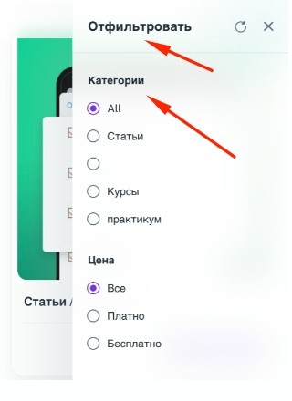

#### **Чтобы настроить описание и категорию -> Нажмите на вкладку «Настройки»**

{width=423px height=685px}

#### **Где используются Описание / Короткое описание и Категория смотри ниже:**

1. Короткое описание

2. Описание (здесь можно использовать обычное **форматирование** Telegram markdown. Подробнее про форматирование [здесь](https://markdown-editor.andona.click/) )

   {width=302px height=569px}

#### **Категории товаров**

В каталоге (витрине) можно фильтровать товары по категориям. Чтобы это работало , при создании товара укажите категорию

{width=320px height=440px}

Чтобы объединить несколько товаров в одну категорию впишите поле Категория у каждого из товаров одинаковое слово. ( *Например : Курсы* )