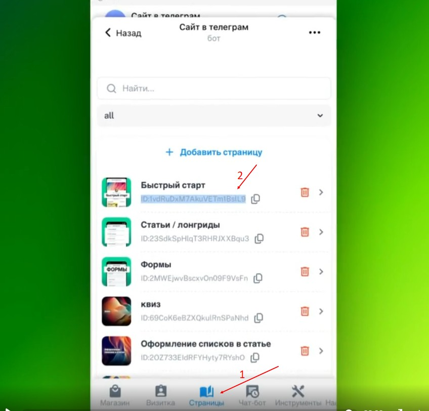
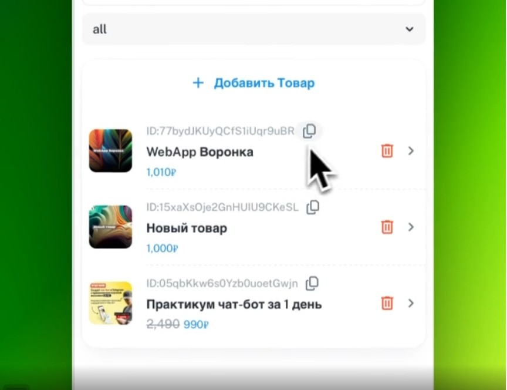

Страницы позволяют создать уникальное приложение, за счет произвольного наполнения каждый страницы и переадресации (навигации) между ними.

Так как страницы это часть мини-приложения и это не является обычным сайтом , поэтому и прямых ссылок типа <https://domen.ru/page_1> использовать мы не можем.

Конечно у нас есть ссылки на статьи и товары (*типа* [*https://t.me/вашбот/aboutme?startapp=a_IDстатьи*](https://t.me/вашбот/aboutme?startapp=a_IDстатьи)), которые можно получить в админке, **но они** предназначены для внешнего запуска в телеграм - они **тоже не подходят для внутренней навигации.**

**Но мы можем делать переадресации с одной страницы на другую, используя кнопки и ссылки**

:::info Подробнее

Итак, **создавая кнопку в** [**telegra.ph**](http://telegra.ph), укажите **ссылку следующего типа** [\*\*https://t.me/post#\*\****ID\_страницы***](https://t.me/post#ID_страницы)

:::

где ID\_страницы надо заменить на id страницы

:::info 

**post# - на статью**

**good# - на товар**

:::

## **Как получить ID страницы?**

{width=848px height=812px}

## **Как получить ID товара?**

{width=864px height=664px}

:::tip 

**ВАЖНО!**

Все созданные статьи по умолчанию появляются в каталоге товаров (витрине) , возможно вы не захотите, чтобы они там отображались, поэтому скройте их

:::

## **Как скрыть статью из общего каталога товаров**