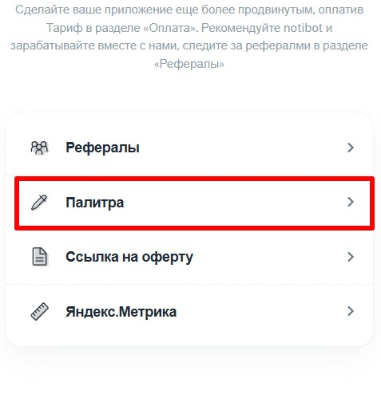
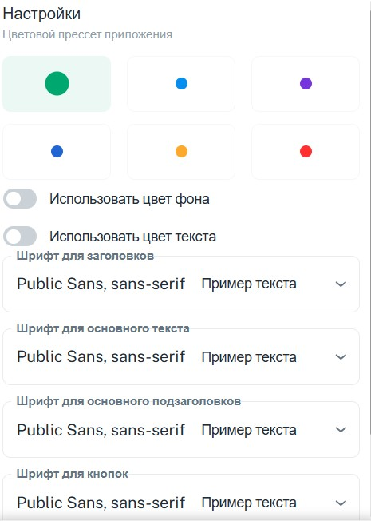

1. Переходим в своего бота (который подключён к [@NotibotruBot](https://t.me/NotibotruBot)) и нажимаем АДМИНКА

   {width=538px height=142px}

2. Выбираем вкладку ГЛАВНАЯ и НАСТРОЙКИ

   {width=474px height=632px}

3. Выбираем ПАЛИТРА

   {width=477px height=494px}

4. Выбираем цветовую палитру и шрифт

   {width=465px height=652px}

