1. Переходим в своего бота (который подключён к [@NotibotruBot](https://t.me/NotibotruBot)) и нажимаем АДМИНКА

   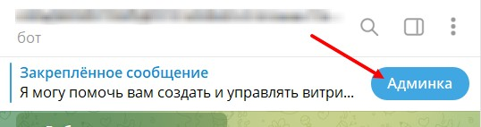{width=538px height=142px}

2. Выбираем вкладку ГЛАВНАЯ и ИНСТРУМЕНТЫ

   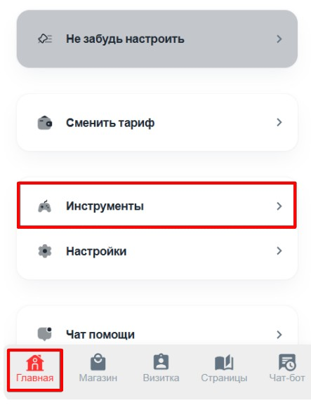{width=443px height=580px}

3. Переходим в ВОРОНКУ АНАЛИТИКИ

   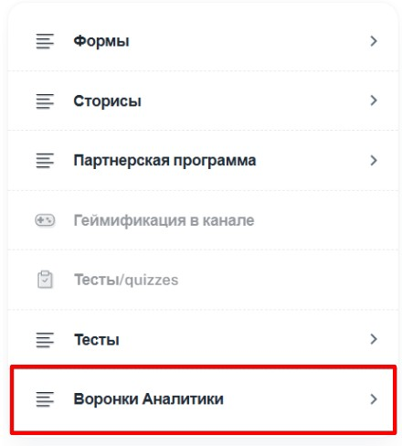{width=440px height=488px}

4. Нажимаем СОЗДАТЬ ВОРОНКУ

   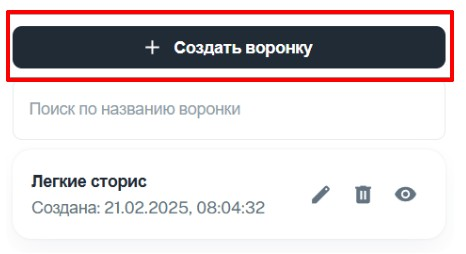{width=466px height=254px}

5. Вводим название ВОРОНКИ (чтобы было вам понятно)

   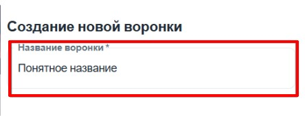{width=444px height=170px}

6. Далее добавляем необходимые Вам шаги для отслеживания аналитики

   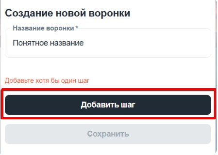{width=449px height=320px}

   **ШАГ ТОВАР:** выбираем ТОВАР далее ВЫБЕРИТЕ ЭЛЕМЕНТ (какой именно товар нужно отслеживать) и какое действие (посмотрел, заказал или купил)

   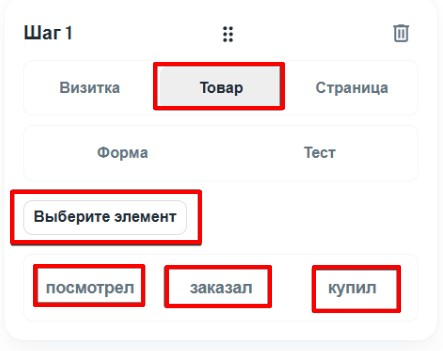{width=443px height=351px}

   **ШАГ СТРАНИЦА:** выбрать СТРАНИЦА и ВЫБИРИТЕ ЭЛЕМЕНТ (на какой странице именно отслеживать)

   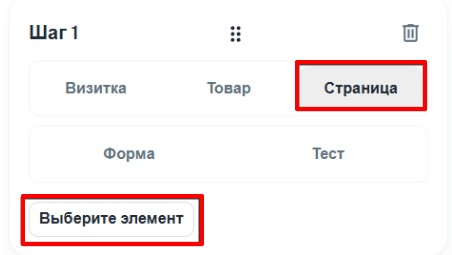{width=452px height=255px}

   **ШАГ ФОРМА:** выбираем ФОРМА далее ВЫБЕРИТЕ ЭЛЕМЕНТ (какую именно форму нужно отслеживать) и какое действие (открыл или заполнил)

   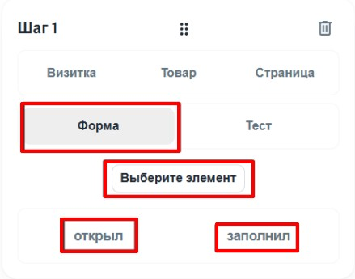{width=439px height=345px}

   **ШАГ ТЕСТ**: выбираем ТЕСТ далее ВЫБЕРИТЕ ЭЛЕМЕНТ (какой именно тест нужно отслеживать) и какое действие (открыл или завершил)

   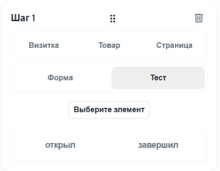{width=433px height=336px}

7. Чтобы добавить следующий шаг нажимаем ДОБАВИТЬ ШАГ

   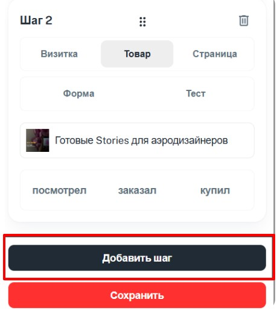{width=459px height=521px}

8. После того как все шаги добавлены нажимаем СОХРАНИТЬ

   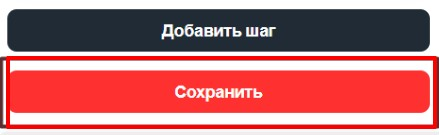{width=439px height=135px}

Таких шагов может быть несколько, например ШАГ 1 - ОТКРЫЛ СТРАНИЦУ; ШАГ 2 - ПОСМОТРЕЛ ТОВАР; ШАГ 3 - ЗАКАЗАЛ ТОВАР ШАГ 4 - КУПИЛ ТОВАР.

Тем самым мы будем видеть сколько человек И и откуда зашло на страницу, сколько из них посмотрели товар, и сколько заказали и купили.

### РАЗБОР ВОРОНКИ АНАЛИТИКИ

После сохранения вы увидите свою воронку и сможете анализировать шаги, для этого переходим в нужную воронку

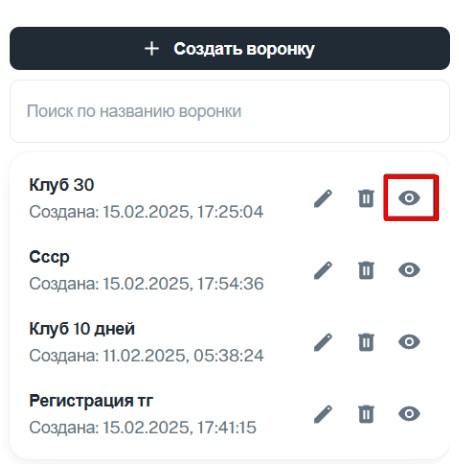{width=459px height=474px}

И выставляем период, который нам необходим

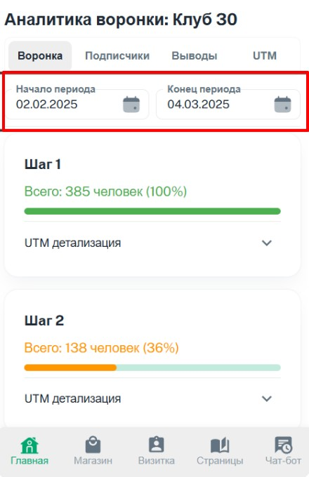{width=440px height=680px}

И смотри сколько по какой воронки зашло человек

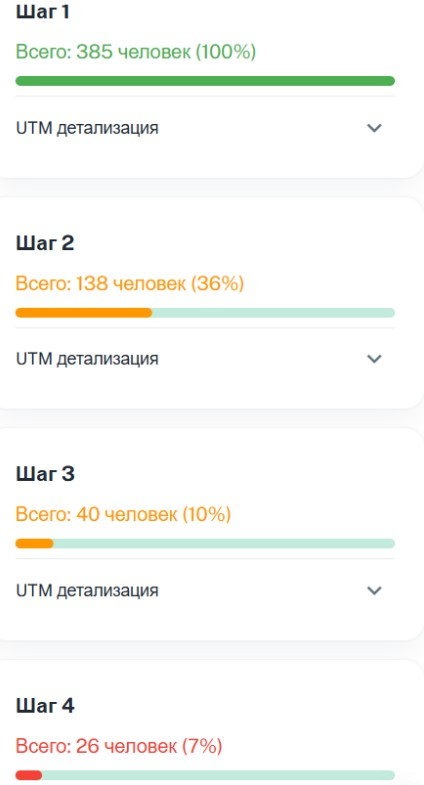{width=424px height=785px}

Также во вкладке Подписчики вы можете с помощью фильтров посмотреть необходимую информацию (по меткам, шагам и по имени)

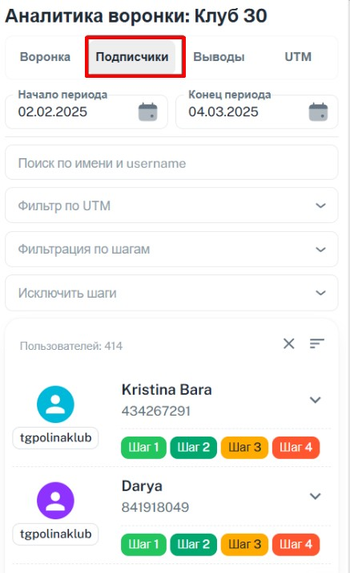{width=437px height=714px}

С помощью воронки аналитики вы всегда сможете следить, кто откуда пришел или на каком этапе человек остановился.

