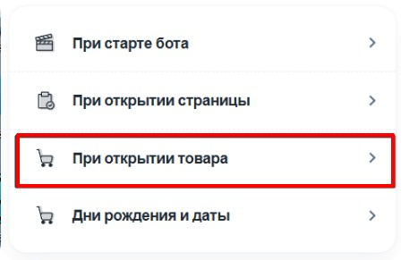
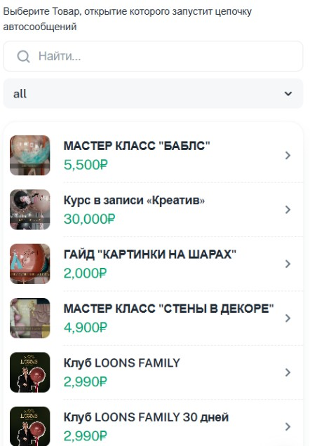

1. Переходим в своего бота (который подключён к [@NotibotruBot](https://t.me/NotibotruBot)) и нажимаем АДМИНКА

   {width=538px height=142px}

2. Выбираем вкладку ЧАТ-БОТ

   {width=475px height=657px}

3. Нажимаем Автосообщения

   {width=479px height=281px}

4. Далее есть несколько вариантов рассылки , которые получит клиент при открытии приложения или запуска бота, посмотрел товар, но не купил его.

   {width=465px height=312px}

5. **При старте бота** 

   Нажимаем ПРИ СТАРТЕ БОТА

   {width=469px height=313px}

   Нажимаем ДОБАВИТЬ

   {width=459px height=116px}

   Вводим название (оно только для нас)

   {width=461px height=562px}

   Далее пишем текст, который получит клиент, после старта бота.

   {width=454px height=552px}

   Также можно добавить изображение

   {width=467px height=543px}

   И кнопки для перехода на страницы приложения или ваш ТГ канал

   {width=458px height=456px}

   Вводим текст, который будет на кнопке и ссылку, куда будет вести эта кнопка.

   {width=468px height=322px}

   Можно включить необходимые вам кнопки и нажимаем СОЗДАТЬ

   {width=425px height=319px}

   И после не забыть активировать данную рассылку.

   {width=453px height=256px}

   

6. **Рассылка при открытии страницы**

   Нажимаем ПРИ ОТКРЫТИИ СТРАНИЦЫ

   {width=449px height=279px}

   Выбираем страницу, после открытия которой будет приходить сообщение.

   {width=441px height=556px}

   И нажимаем ДОБАВИТЬ

   {width=459px height=116px}

   Вводим название рассылки

   {width=460px height=316px}

   Устанавливаем время отправления автосообщения после открытия страницы.

   {width=463px height=326px}

   Настраиваем ДОП.УСЛОВИЯ ОТПРАВКИ

   {width=436px height=734px}

   {width=444px height=298px}

   Далее пишем текст, который получит клиент, после посещения страницы

   {width=454px height=552px}

   Также можно добавить изображение

   {width=467px height=543px}

   И кнопки для перехода обратно на нужную нам страницу

   {width=458px height=456px}

   

   Вводим текст, который будет на кнопке и ссылку, куда будет вести эта кнопка.

   {width=468px height=322px}

   И после не забыть активировать данную рассылку, переключатель находится в самом верху

   {width=451px height=322px}

7. **Рассылка при открытии товара.**

   Нажимаем ПРИ ОТКРЫТИИ ТОВАРА

   {width=457px height=291px}

   Выбираем необходимый товар из списка

   {width=442px height=636px}

   И нажимаем ДОБАВИТЬ

   {width=448px height=128px}

   Далее все настройки как и рассылка  при открытии страницы

