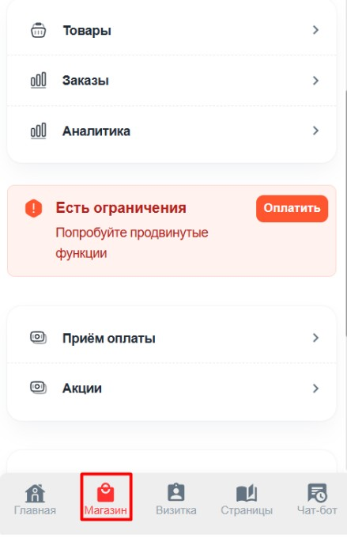

:::info 

**Важно:** Перед подключением вы должны быть зарегистрированы в данной платежной системе.

:::

1. Переходим в своего бота (который подключён к [@NotibotruBot](https://t.me/NotibotruBot)) и нажимаем АДМИНКА

   {width=538px height=142px}

2. Выбираем вкладку МАГАЗИН

   {width=439px height=680px}

3. Выбираем прием оплаты

   {width=444px height=683px}

4. Переходим в Автоматические платежи

   {width=439px height=269px}

   **Примеры подключений:**

   **Подключение** [**Prodamus**](./prodamus)

   **Подключение** [**ЮMoney**](./new-article)

   Также есть другие автоматические способы оплаты, которые вы также можете использовать

5. Ручной способ оплаты

   Для этого выбираем Ручной способ оплаты

   {width=409px height=268px}

   Здесь мы пишем сообщение в ручную, куда будут клиенты переводить денежные средства.

   **ВАЖНО:** После оплаты они должны будут отправить Вам чек в ЛС, поэтом обязательно напишите об этом.

   {width=457px height=766px}

   Если Вам необходимо, чтобы клиент оставил заявку, то необходимо заполнить графу Оставить заявку.

   {width=445px height=322px}

   И далее сохранить изменения

