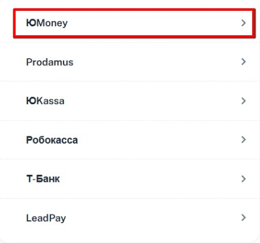
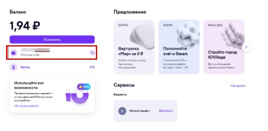
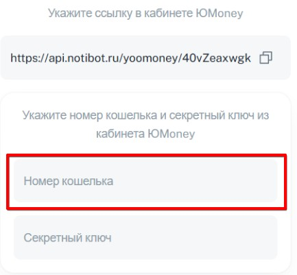
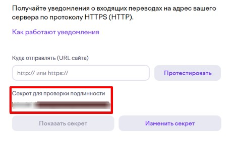
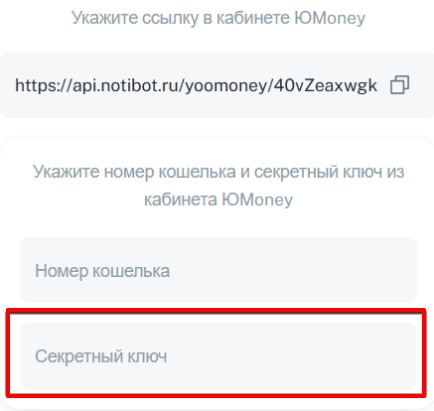
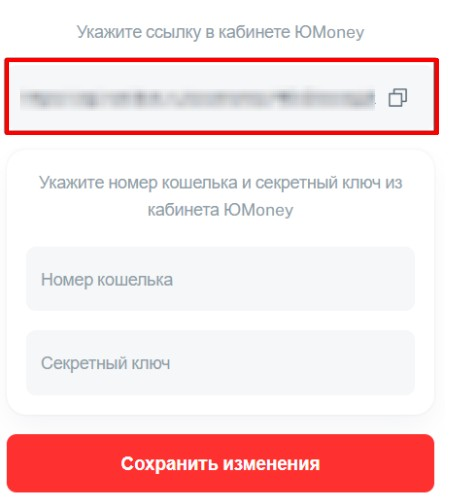
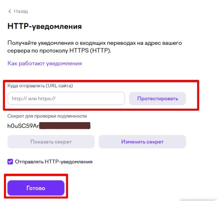

1\. Выбираем нашу платежную систему **ЮMoney**

{width=434px height=406px}

2\. Заходим в свой кабинет в  ЮMoney и копируем номер кошелька

{width=444px height=217px}

3\. Вставляем этот номер в мини-приложение

{width=433px height=401px}

4\. Переходим по ссылке <https://yoomoney.ru/transfer/myservices/http-notification> и попадаем в окно с настройками  ЮMoney, где копируем секретный код

{width=462px height=291px}

5\. Вставляем в мини-приложение

{width=434px height=411px}

6\. Далее из мини-приложения копируем ссылку

{width=449px height=504px}

7\. И вставляем в кабинет  ЮMoney и нажимаем ГОТОВО

{width=441px height=407px}

8\. Готово