1. Переходим в своего бота (который подключён к [@NotibotruBot](https://t.me/NotibotruBot)) и нажимаем АДМИНКА

   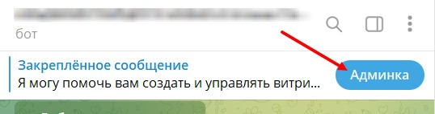{width=538px height=142px}

2. Выбираем вкладку ЧАТ-БОТ

   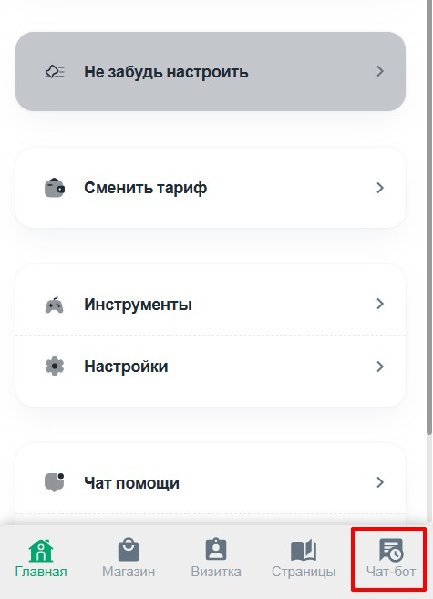{width=475px height=657px}

3. Нажимаем Автосообщения

   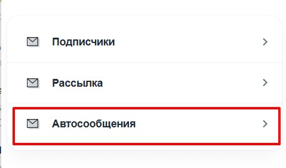{width=479px height=281px}

4. И нажимаем ПРИ СТАРТЕ БОТА

   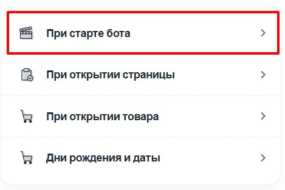{width=469px height=313px}

5. Нажимаем ДОБАВИТЬ

   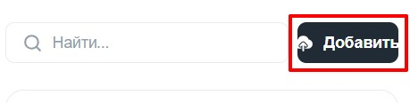{width=459px height=116px}

6. Вводим название (оно только для нас)

   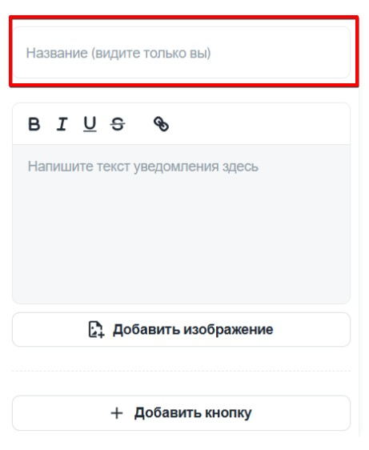{width=461px height=562px}

7. Далее пишем текст, который получит клиент, после старта бота

   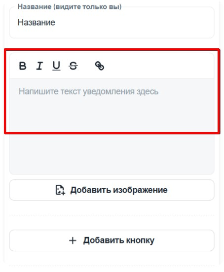{width=454px height=552px}

8. Также можно добавить изображение

   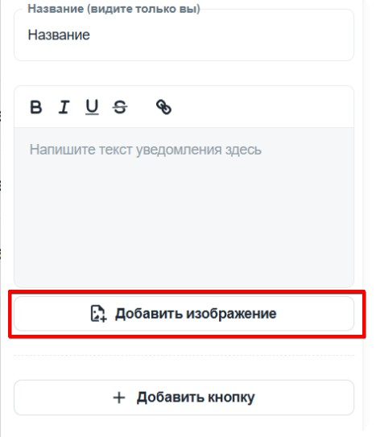{width=467px height=543px}

9. И кнопки для перехода на страницы приложения или ваш ТГ канал

   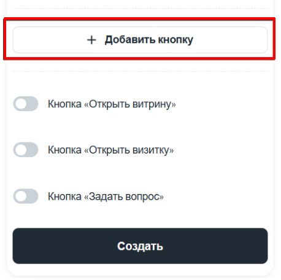{width=458px height=456px}

10. Вводим текст, который будет на кнопке и ссылку, куда будет вести эта кнопка.

    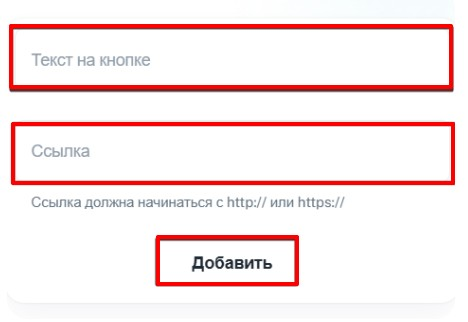{width=468px height=322px}

11. Можно включить необходимые вам кнопки и нажимаем СОЗДАТЬ

    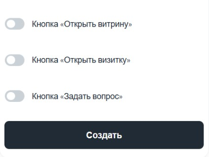{width=425px height=319px}

12. И после не забыть активировать данную рассылку.

    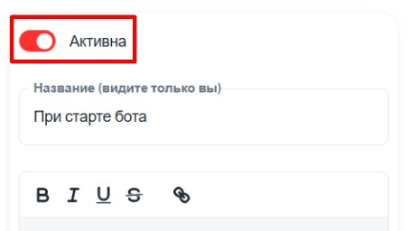{width=453px height=256px}

    

:::lab 

Помните что при старте бота должна быть активна хотя бы одна рассылка, если активных рассылок не будет, то бот отправить стандартное сообщение

:::

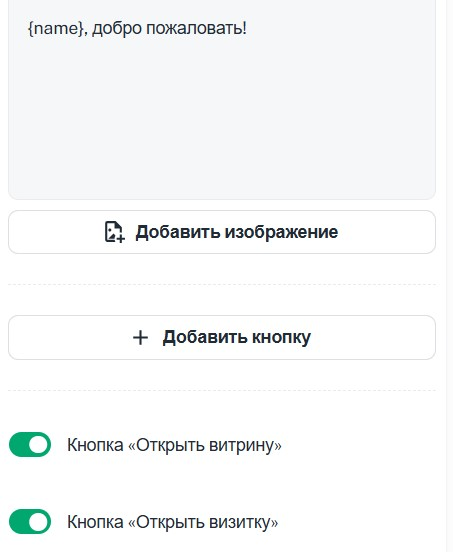{width=453px height=552px}