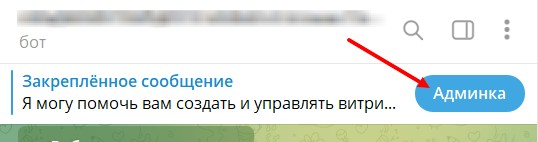

1. Переходим в своего бота (который подключён к [@NotibotruBot](https://t.me/NotibotruBot)) и нажимаем АДМИНКА

   {width=538px height=142px}

2. Выбираем вкладку ЧАТ-БОТ

   {width=475px height=657px}

3. Нажимаем Рассылка

   {width=442px height=210px}

4. Добавляем новую рассылку

   {width=457px height=312px}

5. Делаем рассылку АКТИВНОЙ, вводим НАЗВАНИЕ (удобное для вас) и день и время отправки.

   -  Время выставляем минимум за 15 минут до старта, т.е. если рассылка нужна в 15:15, то рассылка должна быть сделана не позднее 15:00

      {width=452px height=270px}

6. Настраиваем ДОП.УСЛОВИЯ ОТПРАВКИ

   {width=436px height=734px}

7. Вводим текст для рассылки и добавляем изображение. 

   {width=453px height=344px}

8. Добавляем КНОПКУ

   [image:./sozdanie-rassylok.jpeg:::0,0,100,25.219298245614034:::458px:456px]

9. Вводим текст, который будет на кнопке и ссылку, куда будет вести эта кнопка.

   {width=468px height=322px}

10. Выключаем все кнопки и нажимаем СОЗДАТЬ

    {width=425px height=319px}

11. Готово. Появляется ваша рассылка. Нажав на конвертик будет отправлен тест для проверки

    {width=411px height=191px}

12. Также рассылку можно РЕДАКТИРОВАТЬ ИЛИ УДАЛИТЬ

    {width=430px height=207px}

