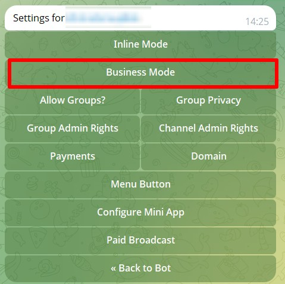
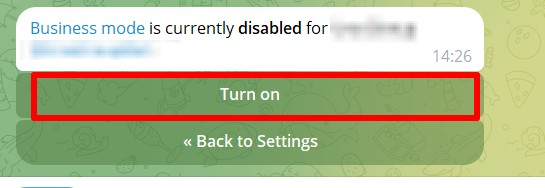
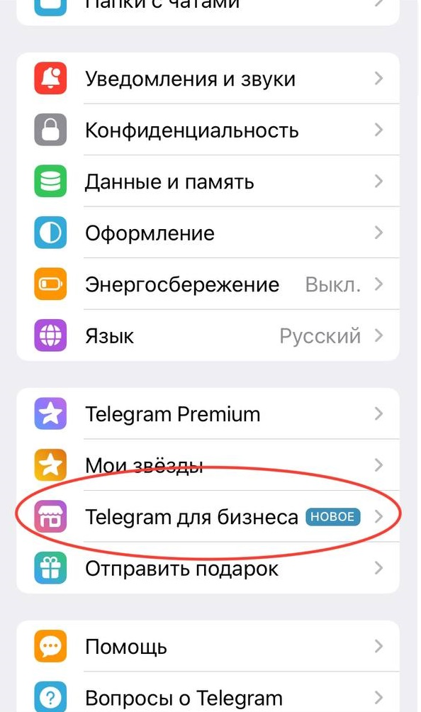
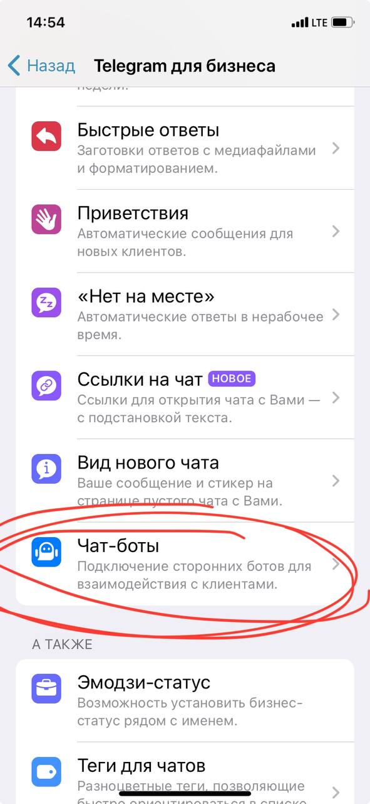
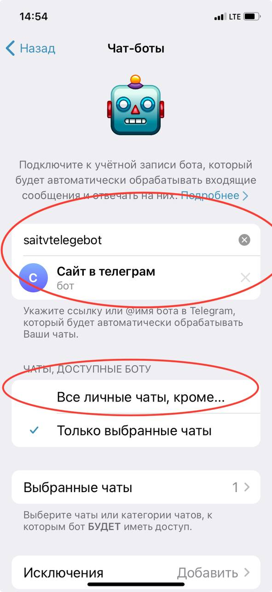
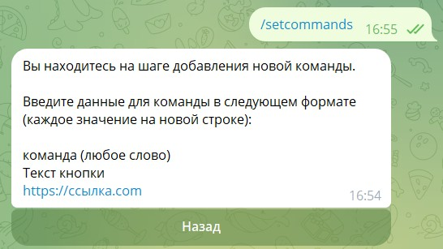
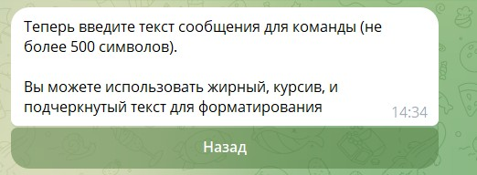
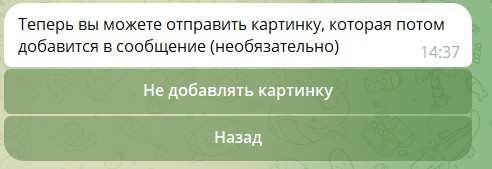
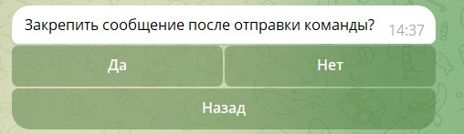

#### **1\. Включение Business Mode в боте**

1. **Откройте BotFather** (@BotFather) в Telegram.

2. Выберите нужного бота (который подключен к @NotibotruBot).

3. Отправьте команду:

   ```
   /mybots  
   ```

4. Выберите бота --> **Bot Settings** --> **Business Mode**.

   {width=479px height=477px}

5. Включите переключатель **"Turn on"**.

   {width=545px height=188px}

#### **2\. Подключение бота к Telegram Business и настройки в Notibot**

1. **В Telegram:**

   -  Откройте **Настройки** --> **Telegram для бизнеса**.

      {width=594px height=1004px}

   -  Выберите **"Чат-боты"** --> **"Добавить бота"**.

      {width=591px height=1280px}

   -  Введите @username\_бота, который подключен к @NotibotruBot

      {width=591px height=1280px}

2. **В Notibot:**

   -  Переходим в бота, который подключен к @NotibotruBot и в **Telegram Business.**

   -  Отправляем команду в чат с ботом:

      ```
      /setcommands  
      ```

   -  В ответ укажите:

      -  **Ключевое слово** (например, ключ).

      -  **Текст на кнопке**

      -  **Ссылку на страницу, которая** должна быть открыта (например, [https://t.me/вашbot/aboutme?startapp=a_7XQyEHGLckfmodpcU4DTJg_lp](https://t.me/natalyshchurovabot/aboutme?startapp=a_6XQyEHGLckfmodpcU4DTJg_lp)).

         {width=546px height=307px}

   -  **Укажите текст сообщения для команды**

      {width=522px height=192px}

   -  **Можно отправить картинку, которая будет прикреплена к сообщению**

      {width=492px height=169px}

   -  **Выбрать закреплять сообщение или нет**

      {width=508px height=147px}

   -  **Команда успешно добавлена!**