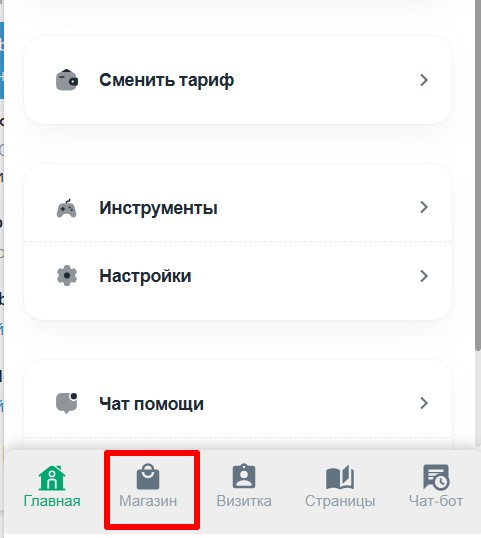
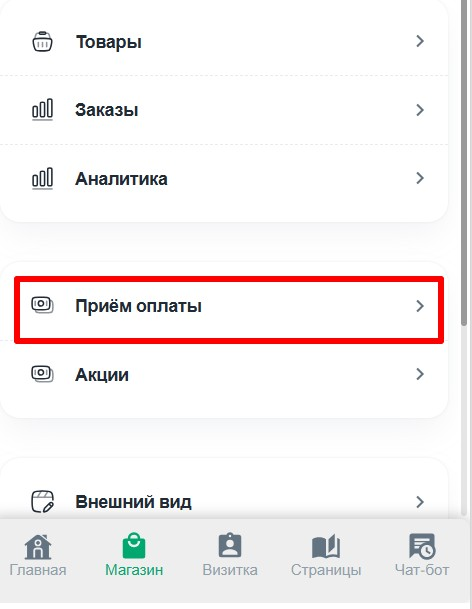
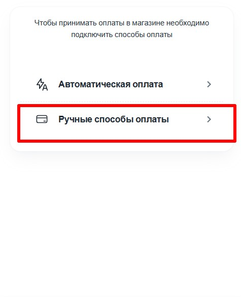
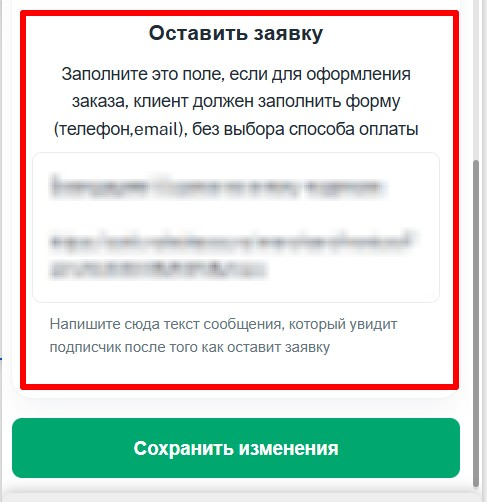
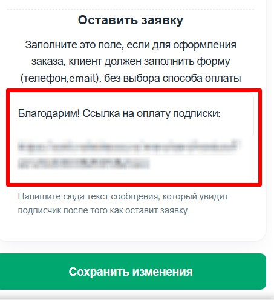

Клиент может оформить заказ на услугу без immediate оплаты, т.е. оставить заявку.

Как это настроить:

1. Переходим в своего бота (который подключён к [@NotibotruBot](https://t.me/NotibotruBot)) и нажимаем АДМИНКА

   {width=538px height=142px}

2. Перейдите в раздел **«Магазин»**

   {width=481px height=538px}

3. Перейдите в раздел **ПРИЁМ ОПЛАТЫ**

   {width=472px height=609px}

4. Выбираем РУЧНЫЕ СПОСОБЫ ОПЛАТЫ

   {width=475px height=585px}

5. Спускаемся вниз и видим раздел ОСТАВИТЬ ЗАЯВКУ

   {width=487px height=502px}

6. Напишите текст сообщения, если хотите, чтобы клиент оставлял заявку

   Данный текст клиент увидит после того как оставит заявку

{width=453px height=495px}