#### **1\. Получение данных из Notibot**

1. **Зайдите в админку бота**

   -  Откройте бота, подключенного к `@NotibotruBot`

   -  Перейдите: **Админка --> Магазин --> Прием оплат --> Автоматическая оплата --> ЮKassa**

      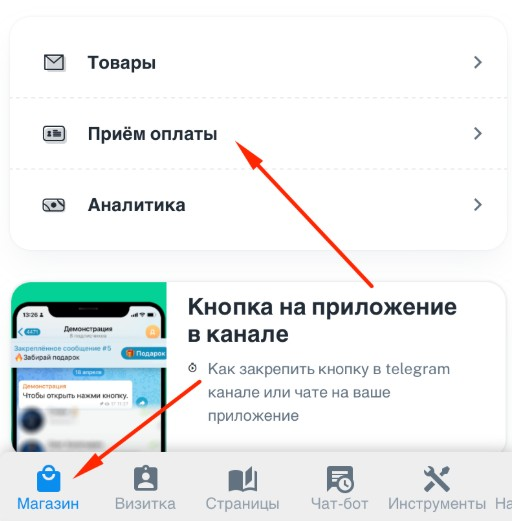{width=513px height=521px}

      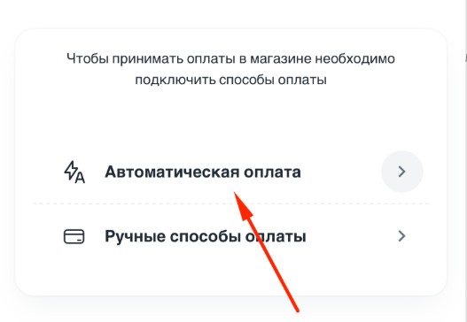{width=527px height=364px}

      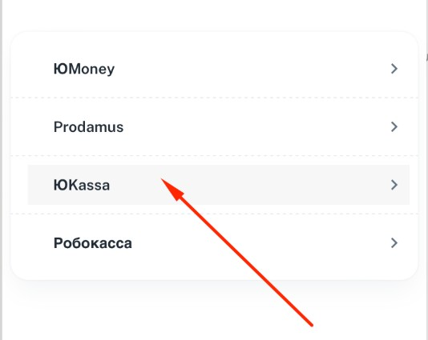{width=534px height=425px}

   -  Скопируйте **URL для уведомлений** (это webhook от Notibot)

      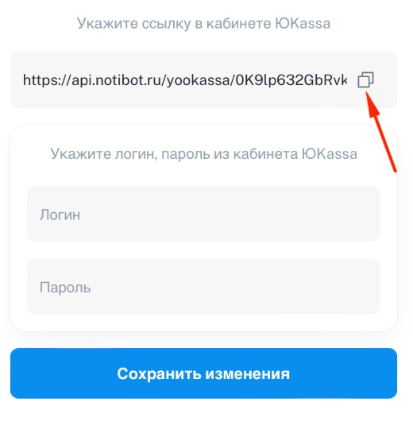{width=520px height=545px}

---

#### **2\. Настройка в личном кабинете ЮKassa**

1. **Добавление webhook:**

   -  Войдите в [кабинет ЮKassa](https://yookassa.ru/)

   -  Перейдите: **Интеграции --> HTTP-уведомления**

      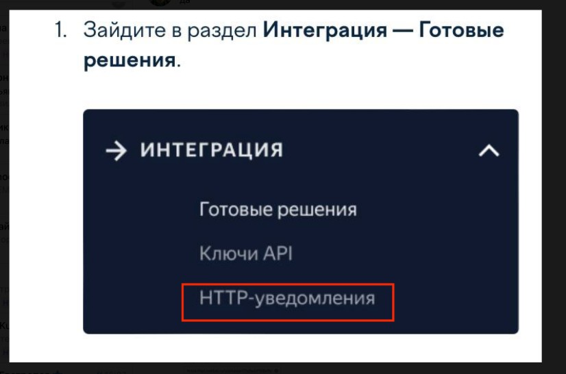{width=826px height=546px}

   -  Вставьте скопированный URL в поле **"URL для уведомлений"**

      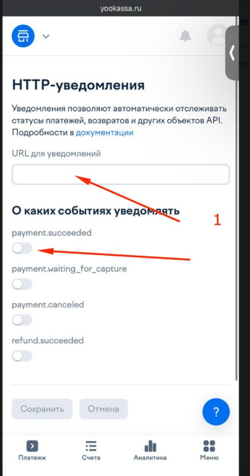{width=423px height=806px}

   -  Активируйте переключатели:

      -  **"Успешные платежи"**

      -  **"Платежи в ожидании"**

      -  **"Отмененные платежи"**

   -  Нажмите **"Сохранить"**

2. **Получение логина (shopId):**

   -  Перейдите: **Магазины --> Ваш магазин**

      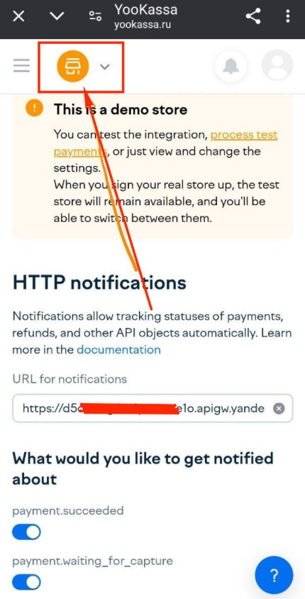{width=430px height=844px}

   -  Скопируйте **только цифры** из поля `shopId` (например, `123456`)

      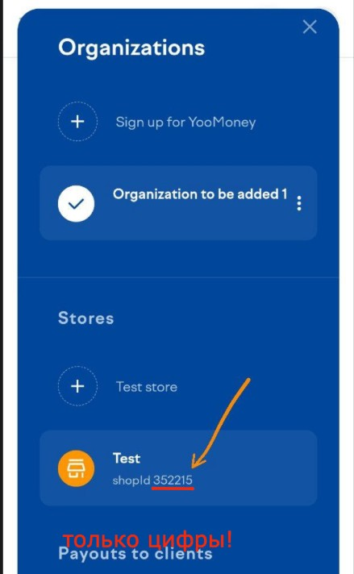{width=439px height=712px}

3. **Получение пароля (API-ключ):**

   -  Перейдите: **Интеграции --> Ключи API**

      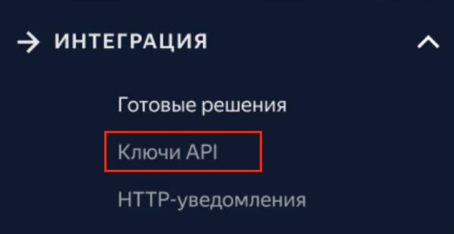{width=776px height=401px}

   -  Нажмите **"Создать ключ"** (если его нет)

   -  Скопируйте **секретный ключ** (начинается с `test_` или `live_`)

      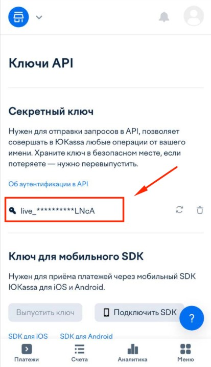{width=413px height=717px}

---

#### **3\. Подключение ЮKassa к Notibot**

1. **Вставка данных:**

   -  Вернитесь в настройки ЮKassa в Notibot

   -  Заполните поля:

      -  **Логин:** Вставьте `shopId` (цифры из п.2.2)

      -  **Пароль:** Вставьте API-ключ (из п.2.3)

         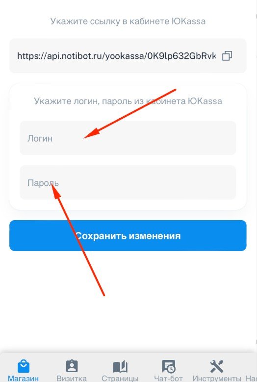{width=524px height=779px}

   -  Нажмите **"Сохранить"**

---

#### **4\. Проверка работы**

1. **Тестовый платеж:**

   -  Создайте товар в Notibot с ценой (например, 1 рубль)

   -  Оформите тестовый заказ --> оплатите через ЮKassa

   -  Убедитесь, что:

      -  Платеж отображается в **кабинете ЮKassa**

      -  Статус заказа в Notibot изменился на **"Оплачено"**

2. **Ошибки:**

   -  Если платеж не проходит, проверьте:

      -  Корректность `shopId` и API-ключа

      -  Активированы ли уведомления в ЮKassa

---

**Готово!** Теперь ваш бот принимает платежи через ЮKassa. 💳\
При проблемах пишите в поддержку `@NotibotruBot`.