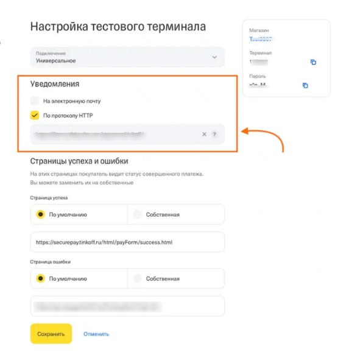

### **Подготовительный этап**

1. **Заключение договора**

   -  Оформление договора эквайринга с Т-Банком

   -  Предоставление банку ссылки на посадочную страницу, где есть описание товара, цена и подкреплена оферта

2. **Получение доступа**

   -  Активация личного кабинета Тинькофф Бизнес

   -  Получение **тестового терминала** для интеграции

### **Настройка терминала**

1. Откройте вкладку «Магазины» и создайте новый магазин

2. Заполните общую информацию о магазине

3. Перейдите в настройки магазина. На вкладке «Способ оплаты» выберите способ «Списывать сразу»

4. На вкладке «Терминал» выберите тестовый терминал и нажимаем Настроить:

   -  Включите уведомления о заказе. Нажмите на галочку «По протоколу HTTP».

      {width=555px height=578px}

   -  Укажите адрес [**https://api.notibot.ru/pays/tinkoff**](https://api.notibot.ru/pays/tinkoff)

   -  Сохранить

5. На вкладке «Терминал» в тестовом терминале скопируйте Терминал и пароль

6. Перейдите в админку своего бота, который подключен для приложения

   ```
   Админка → Магазин → Прием оплаты → Автоматическая оплата → Т-Банк
   ```

7. Вставьте скопированный Terminal ID и пароль

8. Настройте остальные поля -- режим налогообложения, передачу данных для онлайн-кассы

---

### **Тестовые платежи (ОБЯЗАТЕЛЬНО!)**

1. Откройте ваш товар в приложение и перейдите к его оформлению, дойдите до этапа оплаты

2. В Т-Бизнес на вкладке «Терминал» в тестовом терминале нажмите Тестировать

   И используйте **тестовые карты** из кабинета Тинькофф для оплаты товара

3. **Проведите 3 платежа:**

   -  **Платеж 1:** Успешный

   -  **Платеж 2:** Не получилось оплатить

   -  **Платеж 3:** Успешный с последующей **отменой** через раздел **"Операции"**

4. **Проверка:**

   -  Убедитесь, что статусы платежей отображаются в Notibot

   -  Проверьте, что уведомления приходят корректно

---

### **Переход на рабочий режим**

1. **Активация:**

   -  После успешных тестов Тинькофф активирует **рабочий терминал**

   -  Обновите данные в Notibot (новые Terminal ID и пароль)

2. **Первый реальный платеж:**

   -  Проведите платеж на **небольшую сумму** (50-100 руб.)

   -  Дождитесь модерации (до 24 часов)

   -  После одобрения платежа системой можно начинать продажи

---

### **Критически важные моменты**

1. **Тестовые платежи обязательны** -- без них терминал не активируется

2. **Точность данных** -- малейшая ошибка в Terminal ID или пароле нарушит работу

3. **Реальный платеж необходим** перед запуском полноценных продаж

---

**Готово!** После успешного прохождения всех этапов ваш магазин в Notibot готов принимать платежи через Тинькофф Эквайринг. Рекомендуем первые недели внимательно отслеживать все транзакции.

Успешных продаж!