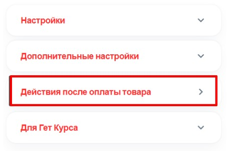
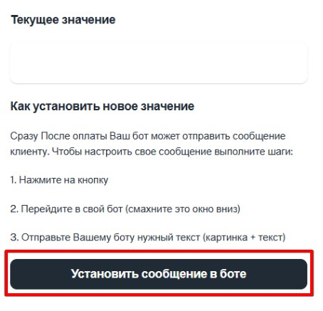
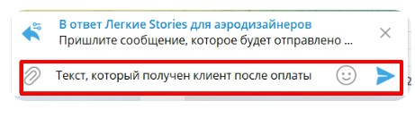
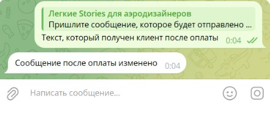
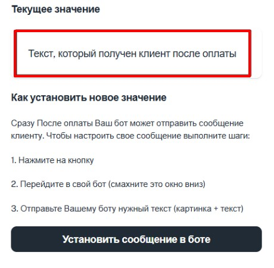
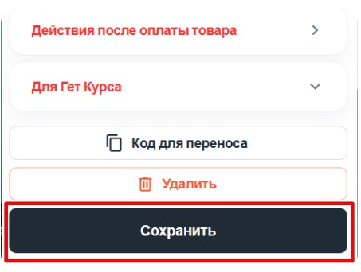

1. **Переход к настройке:**

   -  После создания товара найдите раздел **«Действия после оплаты товара»**.

   -  Перейдите внутрь этого раздела.

      {width=461px height=303px}

2. **Установка сообщения в боте:**

   -  Нажмите на кнопку **«Установить сообщение в боте»**.

      {width=454px height=437px}

   -  В ваш бот придет **служебное сообщение**.

3. **Отправка текста для клиента:**

   -  В ответ на служебное сообщение отправьте **текст**, который должен получать клиент после оплаты товара.

      {width=461px height=132px}

   -  После отправки текста вы получите подтверждение: **«Сообщение после оплаты изменено»**.

      {width=442px height=189px}

4. **Проверка сообщения в боте:**

   -  Обновите бота.

   -  Убедитесь, что в боте появилось **новое сообщение**, которое будет приходить клиенту после оплаты.

      {width=460px height=450px}

5. **Сохранение настроек:**

   -  Вернитесь назад в раздел **«Действия после оплаты товара»**.

   -  Нажмите кнопку **«Сохранить»**, чтобы применить изменения.

      {width=453px height=342px}