#### **1\. Подготовка в GetCourse**

1. **Авторизация и проверка доступа**

   -  Убедитесь, что ваш аккаунт GetCourse **активен и оплачен**.

   -  Интеграция не работает на бесплатных тарифах.

2. **Генерация секретного ключа**

   В GetCourse нет раздела меню с доступом к созданию секретный ключ для интеграции, поэтому мы создадим ссылку сами.

   -  Вручную введите в адресной строке:

      ```
      https://[ваш_аккаунт].getcourse.ru/saas/account/api  
      ```

      *Пример:* [`https://mycompany.getcourse.ru/saas/account/api`](https://mycompany.getcourse.ru/saas/account/api)

   -  Нажмите **«Сгенерировать секретный ключ»**. 

      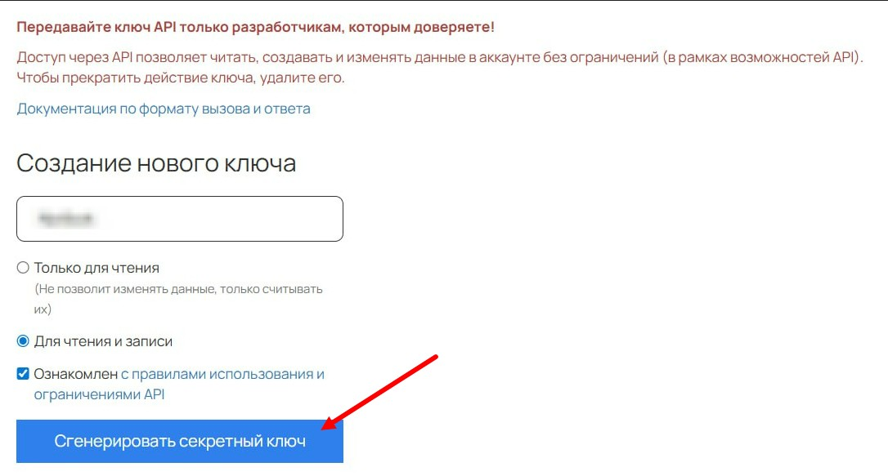{width=1086px height=583px}

   -  **Обновите страницу** -> скопируйте появившийся ключ.

      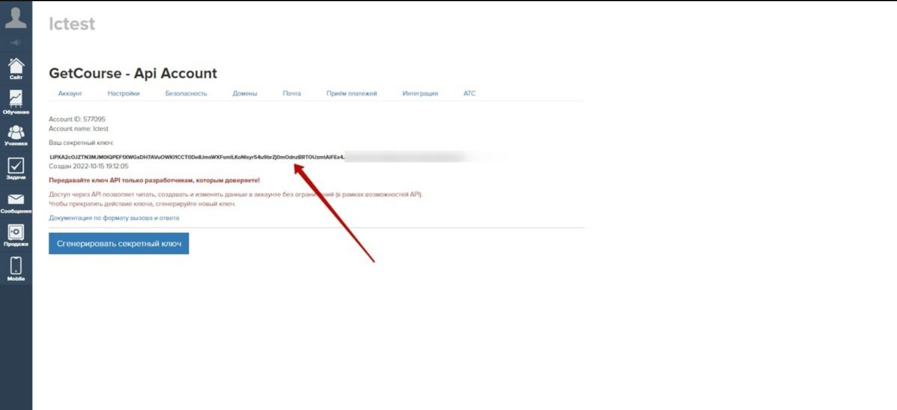{width=1497px height=685px}

3. **Создаем подписку/товар на Getcourse**:

   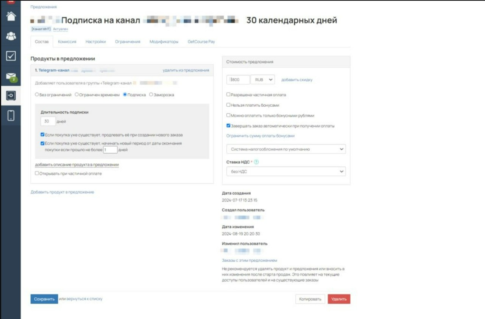{width=1281px height=844px}

   В Настройках предложения указываем Уникальный код предложения

   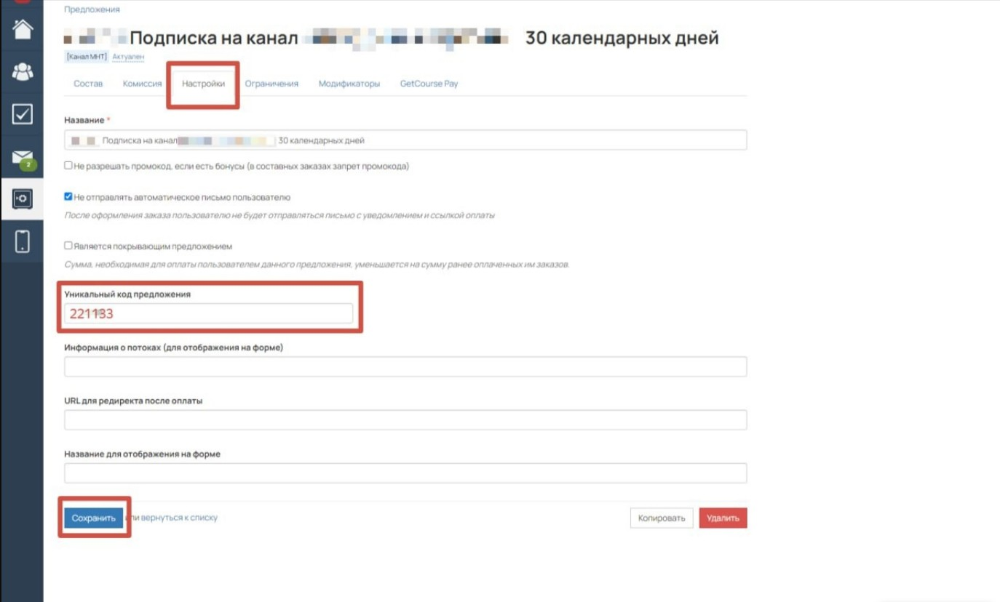{width=1374px height=828px}

---

#### **2\. Настройка в боте, подключенного к @NotibotruBot**

1. **Добавление ключа GetCourse**

   -  Перейдите в админку бота, подключенного к @NotibotruBot:

      **Магазин -> Интеграции -> GetCourse**.

      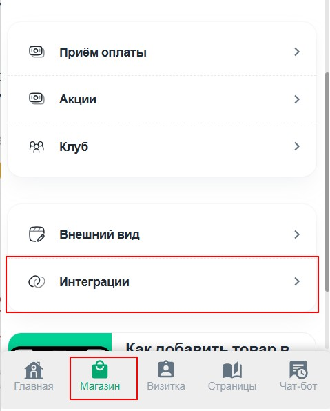{width=479px height=596px}

      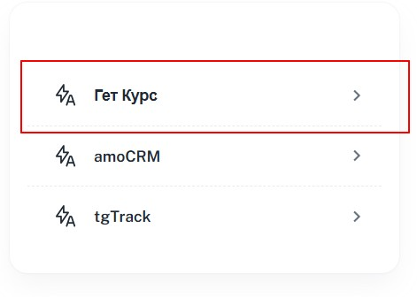{width=471px height=336px}

   -  Вставьте в поле "Логин" имя аккаунта GetCourse\
      В поле "Секретный ключ" вставляем скопированный на GetCourse API ключ и нажимаем **Сохранить изменения**.

      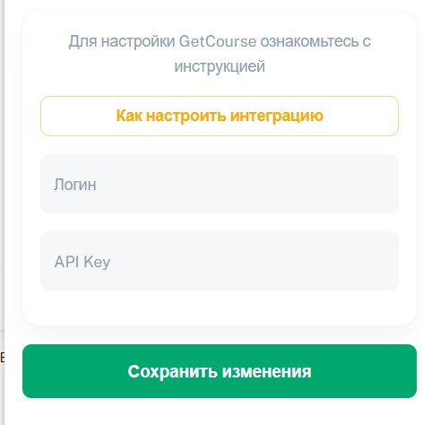{width=472px height=474px}

2. **Создание товара для GetCourse**

   -  **Магазин -> Товары -> +Добавить товар**.

   -  В разделе **«Для GetCourse»** укажите:

      -  Уникальный код предложения (как в GetCourse).

      -  Цену товара/подписки.

         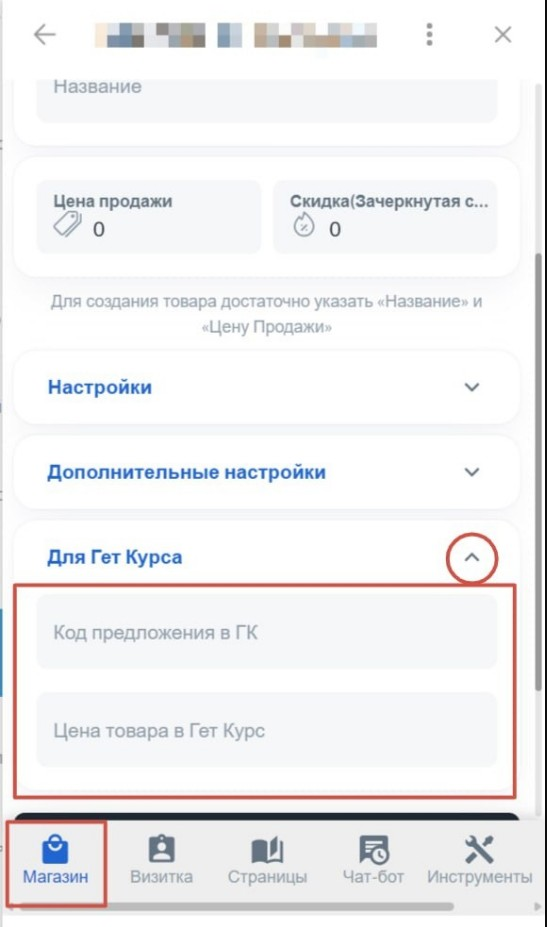{width=547px height=927px}

---

#### **3\. Настройка дополнительного поля в GetCourse**

1. **Создание поля** `zakaz_id`

   -  Раздел **Продажи -> Список заказов -> Дополнительные поля**.

      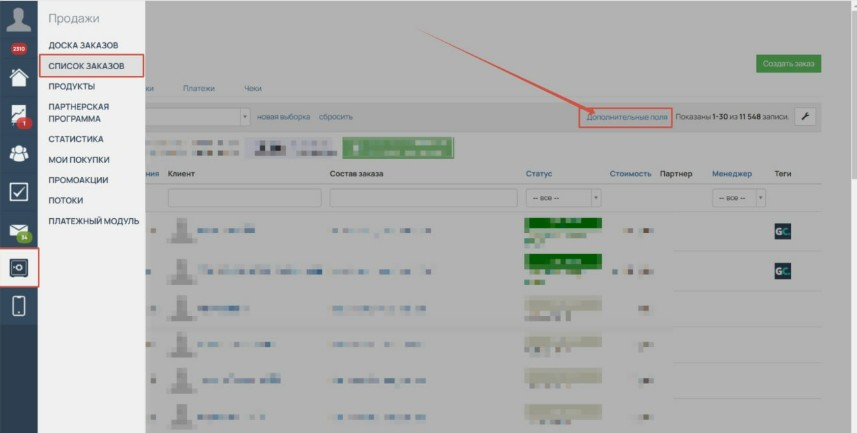{width=857px height=433px}

   -  **Добавить поле -> Тип «Строка»**.

      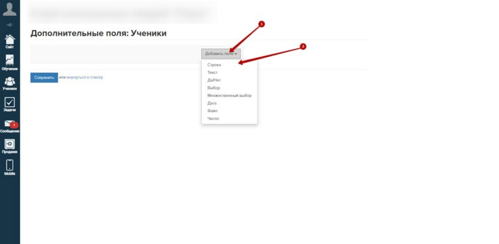{width=1406px height=689px}

   -  Заполните:

      -  Название: `zakaz_id` (обязательно!).

   -  Сохраните.

      :::lab 

      *Чтобы использовать переменные по заказу, добавьте к ним приставку object\
      Так для URL мы будем использовать переменную \{object.zakaz_id}*

      :::

---

#### **4\. Настройка процессов в GetCourse**

1. **Создание процесса для оплаченных заказов**

   -  **Задачи -> Процессы -> Создать процесс**.

      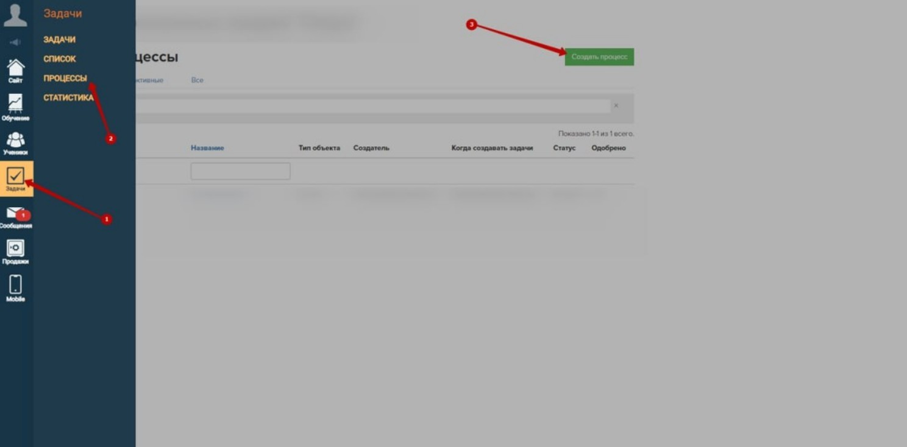{width=1488px height=734px}

      Настраиваем "Правила вхождения объекта" как указано на скриншоте

   -  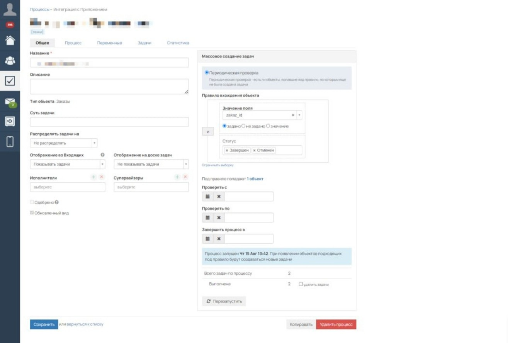{width=1315px height=888px}

      Схема процесса:

      [image:./poshagovaya-instrukciya-po-nastroyke-integracii-g-4.jpeg:::0,0,100,100:100::861px:461px:center]

      Блок Условие "Завершен?"

   -  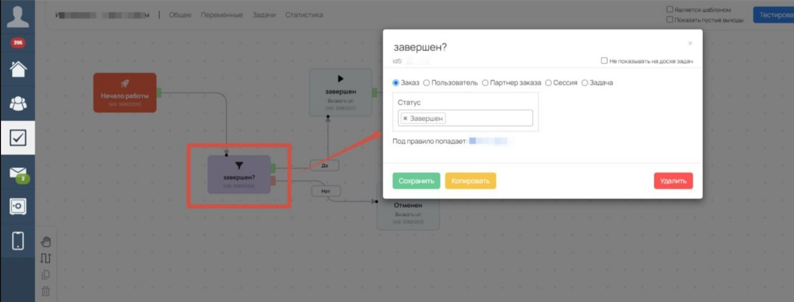{width=1597px height=609px}

      Блок Вызвать url "завершен" по зеленому выходу (Да) блока Условие

      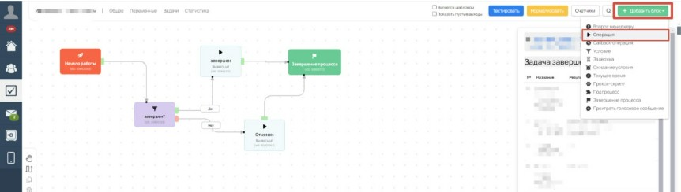{width=862px height=244px}

   -  Выберите триггер: **«Заказ завершен - оплачен»**.

      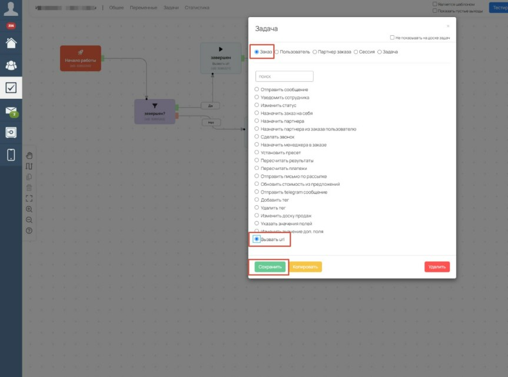{width=863px height=641px}

   -  Добавьте действие: **«Вызвать URL»**.

      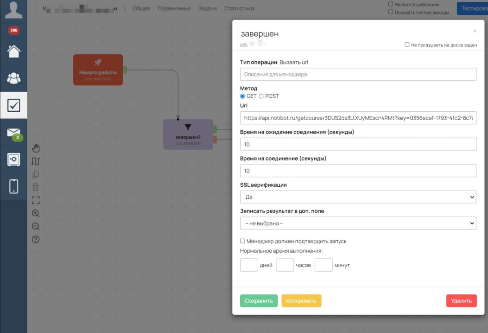{width=1199px height=820px}

2. **Получение Webhook из Notibot**

   -  Перейдите в ваше бот, который подключен к notibot и напишите ему команду:

      ```
      /getcourse
      ```

      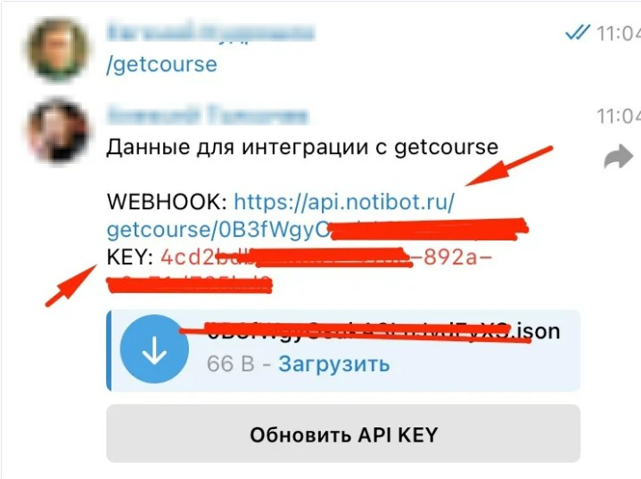{width=719px height=538px}

   -  Скопируйте:

      -  `WEBHOOK` (ссылка).

      -  `KEY` (уникальный ключ).

3. **Формирование URL**

   -  Для **оплаченных** заказов:

      ```
      [WEBHOOK]?key=[KEY]&status=payed&order_id={object.zakaz_id}
      ```

      *Пример:*

      [`https://api.notibot.ru/getcourse/3SUU2ds3LtXXyMEscn4RMt?key=0333ecef-1793-41d2-8c7a-2733821b3d34&status=payed&order_id={object.zakaz_id}`](https://api.notibot.ru/getcourse/3SUU2ds3LtXXyMEscn4RMt?key=0333ecef-1793-41d2-8c7a-2733821b3d34&status=payed&order_id=%7Bobject.zakaz_id%7D)

   -  Для **отмененных** заказов:

      ```
      [WEBHOOK]?key=[KEY]&status=cancelled&order_id={object.zakaz_id}
      ```

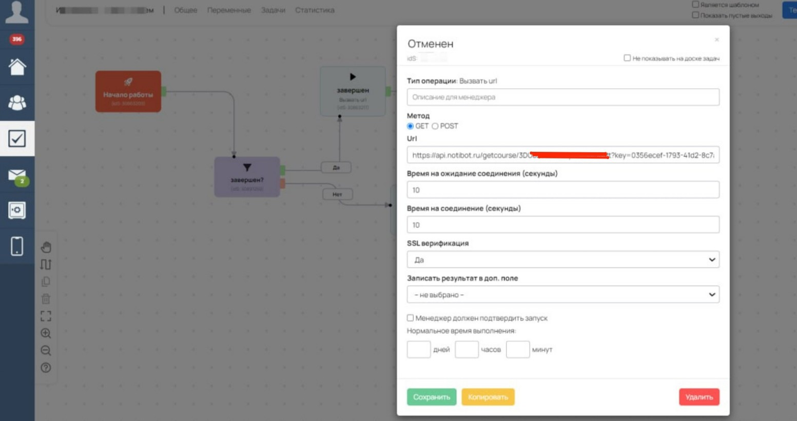{width=1553px height=821px}

---

#### **5\.** Переходим в бот Telegram, подключенный к Notibot

1. Заходим в Админка - Магазин - Товары

2. Выбираем в списке товар с оплатой в GetCourse

3. Нажимаем "Сообщение после оплаты"

4. Отправляем в бот текст о том, что оплата успешно завершена и доступ отправлен на почту.

---

#### **6\. Проверка работы**

1. **Тестовый заказ**

   -  Создайте тестовый заказ в GetCourse.

   -  Убедитесь, что:

      -  Поле `zakaz_id` заполняется.

      -  Данные передаются в Notibot (проверьте логи бота).

2. **Ошибки**

   -  Если интеграция не работает:

      -  Проверьте **корректность URL** (особенно `zakaz_id`).

      -  Убедитесь, что **ключ GetCourse** в Notibot совпадает с сгенерированным.


**Готово!** Интеграция настроена. Данные о заказах теперь автоматически передаются в Notibot. 🚀