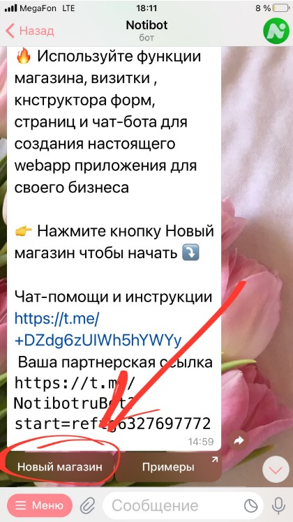
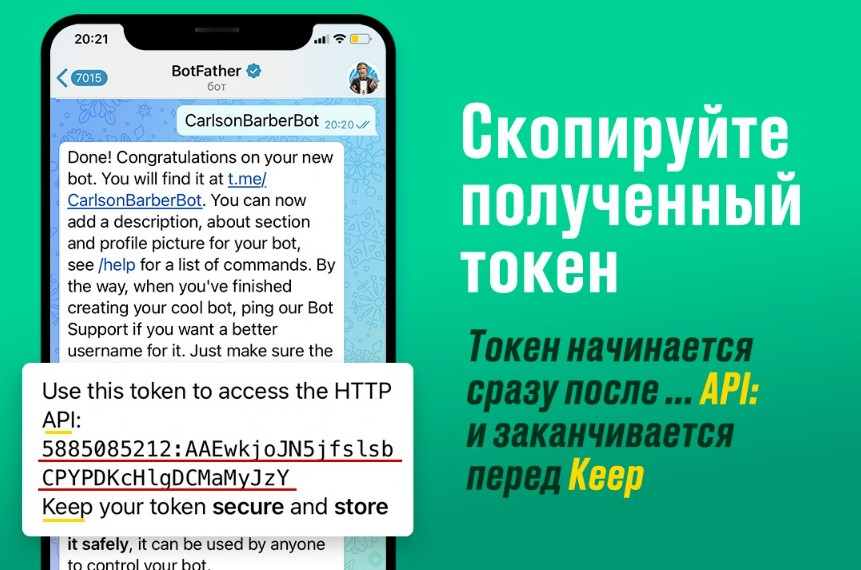
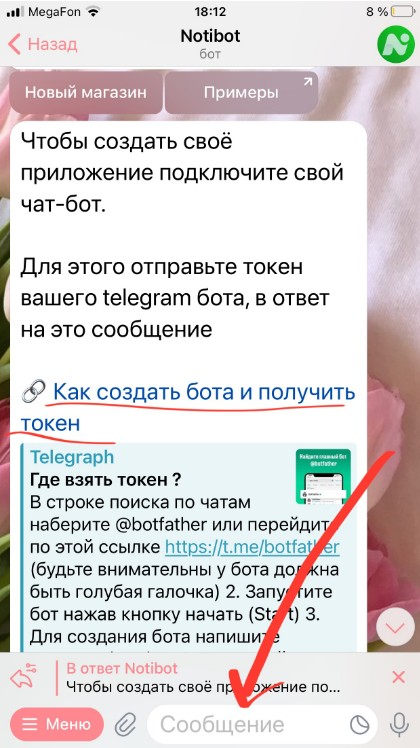
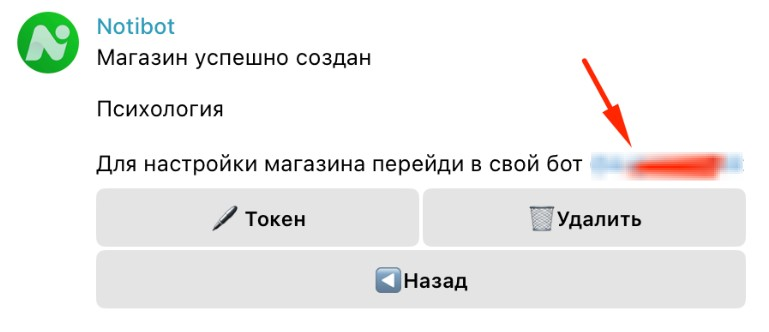

1. Запустите бот [@NotibotruBot](https://t.me/NotibotruBot)

2. Нажмите кнопку «Новый магазин»

   {width=420px height=748px}

3. Для того чтобы создать магазин Вам потребуется токен вашего чат-бота. Если у вас еще нет своего чат-бота в telegram создайте его в главном боте @botfather

   Как создать свой бот и получить токен смотри здесь

   {width=861px height=570px}

   **Скопируйте токен и отправьте в ответ на сообщение NotibotruBot**

   {width=420px height=748px}

4. Когда магазин будет создан. Бот предложит вам перейти в ваш бот (который вы подключили к Notibot) для настройки вашего приложения

   {width=769px height=332px}

Нажмите на ник своего бота (начинается с @) и переходите к инструкции: Как добавить первый товар