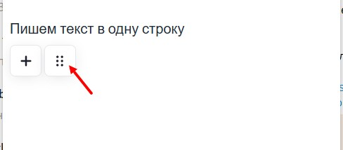
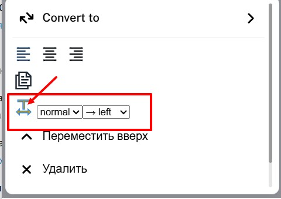
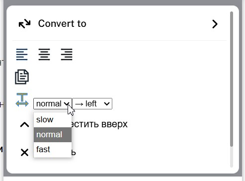
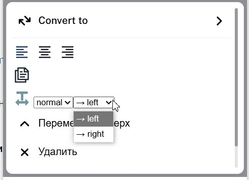

#### **1\. Создание бегущего текста**

1. **Ввод текста:**

   -  Напишите текст **в одну строку** (без переносов).

   -  Пример: `Акция! Скидка 20% только сегодня!`

2. **Преобразование в бегущую строку:**

   -  Нажмите на **6 точек (⋮⋮)** около текстового блока.

      {width=488px height=214px}

   -  Выберите **"Бегущая строка"**.

      {width=480px height=340px}

#### **2\. Настройка анимации**

1. **Скорость движения:**

   -  Выберите из вариантов:

      -  Slow (медленно)

      -  Normal (нормально)

      -  Fast (быстро)

         {width=493px height=364px}

2. **Направление движения:**

   -  ➡️ Справа налево 

   -  ⬅️ Слева направо

      {width=490px height=354px}