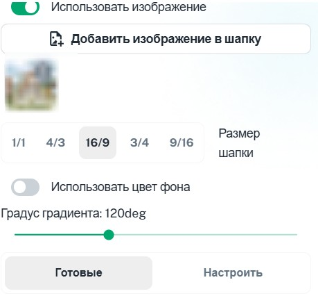
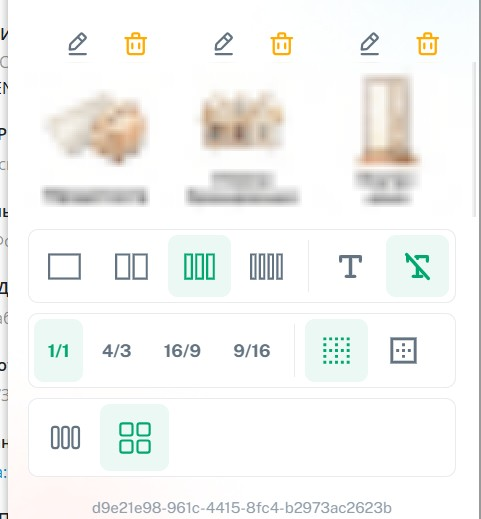
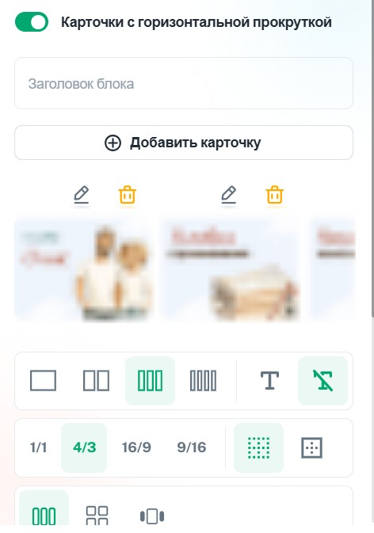
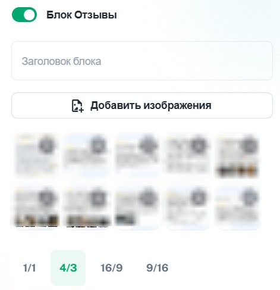

#### **1\. Общие требовнаия**

-  **Форматы:** JPG (для фото), PNG (для графики с прозрачностью)

-  **Все изображения должны быть оптимизированы по размеру:**

   • **размер файла:**

   -  Оптимально: 100-500 КБ

   -  Максимум: 3,1 МБ

   • **разрешение:**

   -  Ширина: до 800 px (система сожмет большие изображения)

   -  Высота: рассчитывается автоматически по пропорциям

-  **Точные размеры в пикселях не фиксированы** -- система автоматически масштабирует под выбранные пропорции

#### **2\. Пропорции изображений в блоках**

Доступные варианты соотношений сторон:

-  **Горизонтальные:**

   • 16:9 (широкоэкранный формат)

   • 4:3 (классический фотоформат)

-  **Квадратные:**

   • 1:1 (равносторонние)

-  **Вертикальные:**

   • 9:16 (вертикальное видео)

   • 3:4 (портретный формат)

#### **3\. Пример размеров для ключевых элементов**

**◾️ Баннер (шапка)**

-  **Размер:** 854 × 480 px (соответствует 16:9)

-  **Размер файла:** не более 300 КБ (рекомендуем до 200 КБ)

   {width=459px height=439px}

**◾️ Обложки страниц**

-  **Прямоугольная:** 400 × 300 px (соответствует 4:3)

-  **Квадратная:** 400 × 400 px (соответствует 1:1)

**◾️ Обложки для категорий**

-  **Прямоугольная:** 400 × 300 px (соответствует 4:3)

-  **Квадратная:** 400 × 400 px (соответствует 1:1)

{width=481px height=519px}

{width=472px height=673px}

{width=471px height=487px}

#### **4\. Рекомендации для дизайнера, если он еще не сталкивался с дизайном миниаппок**

-  Показать примеры (дать ссылки)

-  Обложки текстом не перегружать!

-  Помнить, что это формат мобильного телефона (учитывать при выборе размера шрифта)

#### 